# Docker For Beginners

- [Docker For Beginners](#docker-for-beginners)
  - [1) Why Docker?](#1-why-docker)
    - [1.1) What Are Containers?](#11-what-are-containers)
    - [1.2) Docker Versions](#12-docker-versions)
  - [2) Basic Docker Commands](#2-basic-docker-commands)
    - [2.1) docker run](#21-docker-run)
    - [2.2) docker attach](#22-docker-attach)
    - [2.3) docker ps](#23-docker-ps)
    - [2.4) docker stop](#24-docker-stop)
    - [2.5) docker rm](#25-docker-rm)
    - [2.6) docker exec](#26-docker-exec)
    - [2.7) docker images](#27-docker-images)
    - [2.8) docker rmi](#28-docker-rmi)
    - [2.9) docker pull](#29-docker-pull)
    - [2.10) docker inspect](#210-docker-inspect)
    - [2.11) docker logs](#211-docker-logs)
    - [2.11) docker build](#211-docker-build)
      - [2.11.1) Dockerfile](#2111-dockerfile)
      - [2.11.1.2) CMD vs ENTRYPOINT](#21112-cmd-vs-entrypoint)
    - [2.12) docker push](#212-docker-push)
    - [2.13) docker history](#213-docker-history)
  - [3) Docker Compose](#3-docker-compose)
  - [4) Docker Registry](#4-docker-registry)
  - [5) Docker Engine](#5-docker-engine)
  - [6) Docker Storage](#6-docker-storage)
  - [7) Docker Networking](#7-docker-networking)
  - [8) Container Orchestration](#8-container-orchestration)

## 1) Why Docker?

Mumshad's reasons for using Docker
* He was working on a project with a web server (NodeJS), database (MongoDB), messaging service (Redis), and an orchestrator (Ansible). It was a struggle to:
  * Get these services to work together on one O/S. As they all have different dependencies and supporting library requirements. Sometimes these are conflicting and cannot be resolved easily.
  * Get new developers to set up their own replica of this environment. A lot of time was wasted in trying to solve all the issues encountered above.

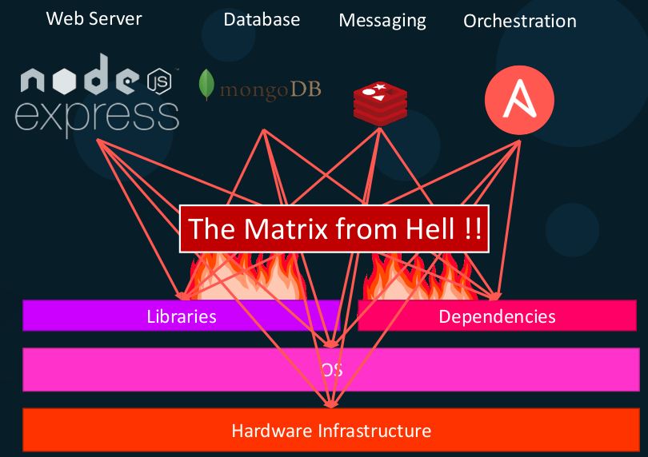

Docker solves this by
* Allowing each service to run in its own O/S inside its own container. This means that each service and its dependencies and required libraries were all separated from each other.
* Each developer could easily replicate the enivronment with some simple Docker commands.


### 1.1) What Are Containers?

* **Containers** are an isolated environment with its own resources (e.g. processes, network interfaces, storage etc) within an operating system but all containers within the same O/S share the same kernel.


* Containers are used to isolate applications from each other. Each container has its own O/S that supports the application and its dependencies.


* A container can only run on the same O/S kernel that it has. So if Docker is running on a Linux kernel, any Linux distribution can run on it. Running a Linux Docker container on Windows actually spins up a Linux VM.


* Containers are not new but Docker is a high level tool that has made them very popular.
* Docker uses LXC containers.
* Containers are more resource friendly than VMs. They are typically 100s of MB in size whereas VMs are typically GBs in size.  It is common to run containers within VMs.


* It is common to run containers inside of VMs. VMs are easy to provision in cloud environments and on premesis installations.

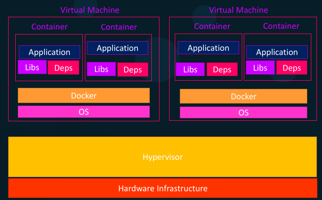

* A **Docker Image** is a template used to create a **Docker Container**. Thus like in OOP, the Docker Image is the blueprint and the Docker Container is the running instance.


* A **Dockerfile** is a file has the necessary steps to build a Docker Image and subsequent Containers.


* Traditionally a developer would hand over the operations team the compiled application and a list of instructions on how to deploy it. This would change with each environment and become complicated quickly. Now a developer just hads the operations team the Dockerfile and they are able to build the Docker Container the same way in each environment.

* Docker Images are publically available from Docker Hub. There are many images available for many types of O/S and applications.

* Docker contributes to DevOps by making it easier for operations teams to install applications that they received from development teams. The development team provies the Dockerfile and the operations team use this to deploy the application.

### 1.2) Docker Versions

* Docker has 2 versions:
1. **Community edition (CE)** is the set of free Docker products.
2. **Enterprise edition (EE)** comes with additional features that you need to pay for.

## 2) Basic Docker Commands

**NOTE:** All Docker IDs only require enough characters in them to uniquely identify the object. You don't need to user the entire ID.

### 2.1) docker run

**NOTE:** The container will only run while an application inside of them is running. This does not include shells like bash. So O/S images will exit immediately if they are only running a shell.

**NOTE:** You can use `$IMAGE_NAME` or `$IMAGE_ID` on the commands below.

* `docker run $IMAGE_NAME` will run the specified image on the current host as a container. If the current host doesn't have the image locally it will go to Docker Hub and download it. If the current host does have the image locally it will just use that image.

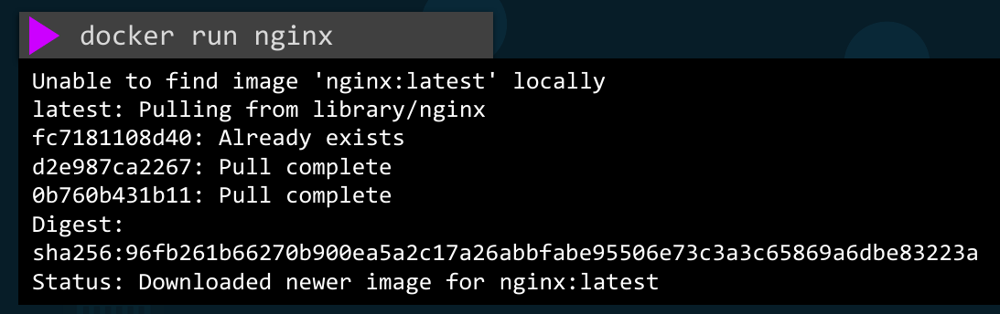

* By default `docker run $IMAGE_NAME` will run in attached mode, i.e. your terminal will be attached to stdout of the container. Use `docker run -d $IMAGE_NAME` to run in detached mode.

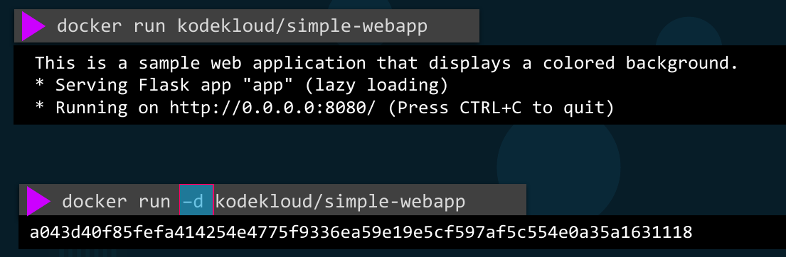

* By default Docker does not listen to stdin from the CRE host to the container. You need to use `docker run -i $IMAGE_NAME` to enable interactive mode and map the CRE host's stdin to the container's stdin.
* Use `docker run -t $IMAGE_NAME` to attach to the container's terminal.
* Often you will use `docker run -it $IMAGE_NAME` to attach to the container's terminal in interactive mode.


* When using `docker run $IMAGE_NAME` the tag `:latest` is automatically appended to the name. This will automatically use the Docker image that is associated with the latest tag which is typically the latest version.
* You can use `docker run $IMAGE_NAME:$TAG_NAME` to manually specfiy with image version (i.e. tag) to use.

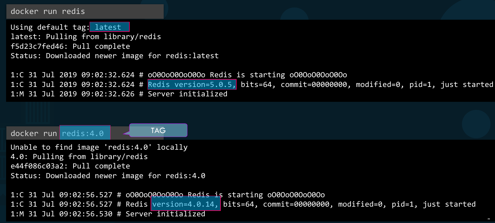

* Use `docker run $IMAGE_NAME -p $CRE_PORT:$CONTAINER_PORT` to map an available CRE host port to an available container port.
  * In this example all traffic on `$CRE_HOST_IP:$CRE_PORT` is routed to the container via `$CONTAINER_PORT`

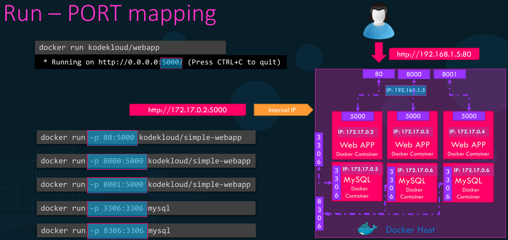

* Use `docker run $IMAGE_NAME -v $CRE_PATH:$CONTAINER_PATH` to map a CRE filesystem path to a container filesystem path. This decouples the data lifecycle from the container lifecycle. When the container is destroyed the volume and data will remain.


* Use `docker run -e $KEY=$VALUE $IMAGE_NAME` to inject an environment variable into the container.

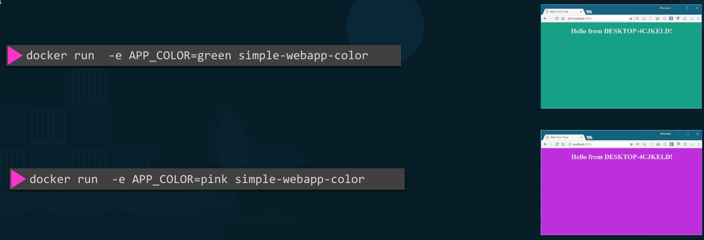

* Use `docker run $IMAGE_NAME $CMD` to specify which command to run inside the container.
* Use `docker run $IMAGE_NAME $CMD $ARGS` to specify which command to run inside the container and what arguments it takes.

**NOTE:** You can use `$CONTAINER_NAME` or `$CONTAINER_ID` on the `--link` option below.

* Use `docker run --link $CONTAINER_NAME $IMAGE_NAME $CMD` to specify which container to link to this container.

### 2.2) docker attach

**NOTE:** You can use `$CONTAINER_NAME` or `$CONTAINER_ID` on the commands below.

* Use `docker attach $CONTAINER_NAME` to attach to a detached container.

### 2.3) docker ps

**NOTE:** Each container automatically gets a random UID and name created for it.

* `docker ps` lists all the running containers and some basic information about them.
* `docker ps -a` lists all running containers and stopped containers and some basic information about them.

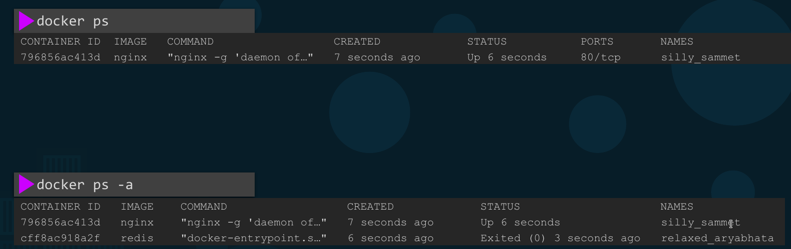

### 2.4) docker stop

**NOTE:** You can use `$CONTAINER_NAME` or `$CONTAINER_ID` on the commands below.

* `docker stop $CONTAINER_NAME` will stop a running container. These can still be viewed and take up space.


### 2.5) docker rm

**NOTE:** You can use `$CONTAINER_NAME` or `$CONTAINER_ID` on the commands below.

* `docker rm $CONTAINER_NAME` will delete a stopped container.

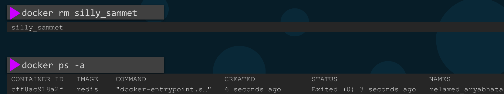

### 2.6) docker exec

**NOTE:** The container will only run while an application inside of them is running. This does not include shells like bash. So O/S images will exit immediately if they are only running a shell.

**NOTE:** You can use `$IMAGE_NAME`, `$IMAGE_ID`, `$CONTAINER_NAME`, or `$CONTAINER_ID` with the commands below.

* `docker exec $CONTAINER_NAME $CMD` executes a command on a running container.
* Using `docker exec -it $CONTAINER_ID bash` will connect to the container in interactive mode (i.e. you can type) and load a shell.

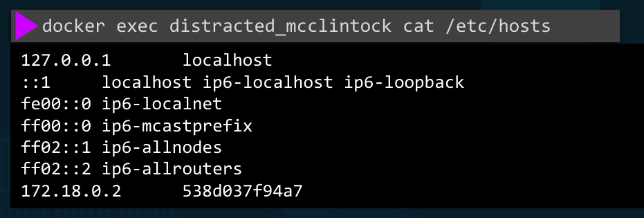

### 2.7) docker images

* `docker images` lists all local images on the system.

### 2.8) docker rmi

**NOTE:** You can use `$IMAGE_NAME` or `$IMAGE_ID` on the commands below.

* `docker rmi $IMAGE_NAME`  will delete all local images. All dependent containers must be stopped before deleting an image.
* This is a shortcut for `docker iamge rm $IMAGE_NAME`

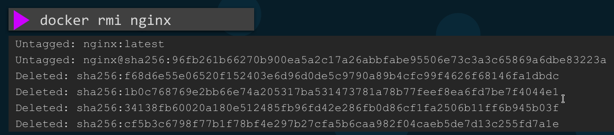

### 2.9) docker pull

* `docker pull $IMAGE_NAME` will download the specified image but not run it.

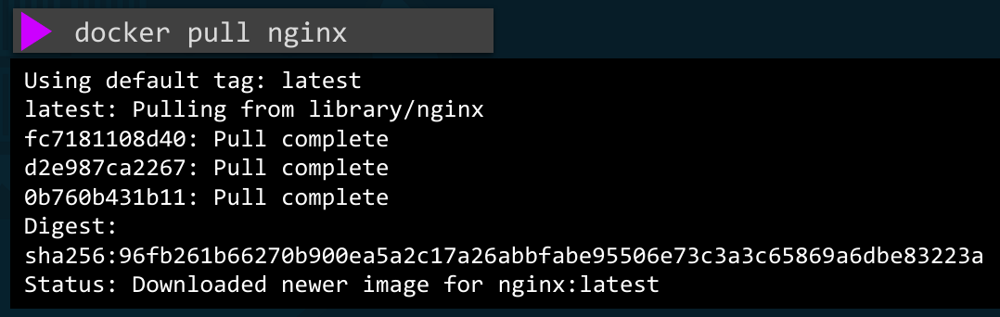

### 2.10) docker inspect

**NOTE:** You can use `$CONTAINER_NAME` or `$CONTAINER_ID` on the commands below.

* Use `docker inspect $CONTAINER_NAME` to view verbose information about a container. This is returned in a JSON format and it contains all information about a container.

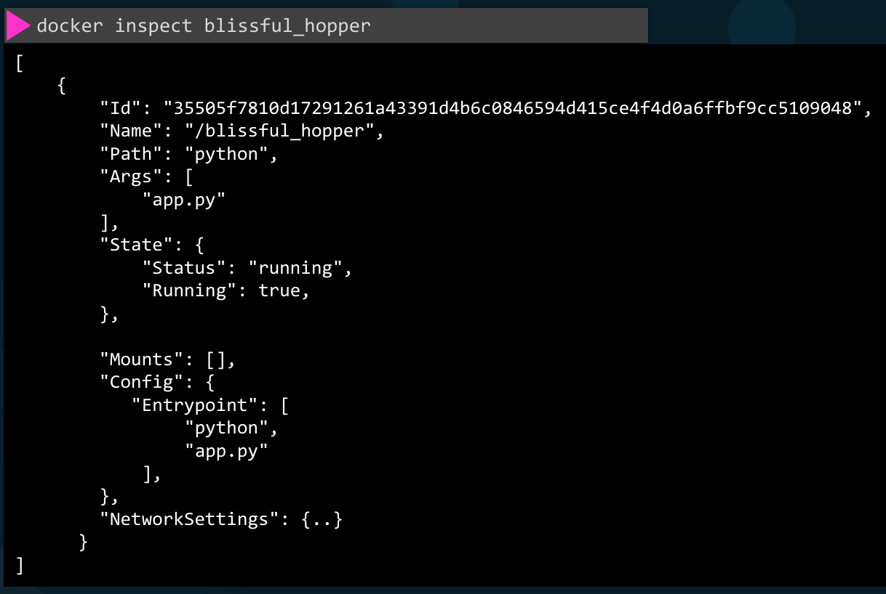

### 2.11) docker logs

**NOTE:** You can use `$CONTAINER_NAME` or `$CONTAINER_ID` on the commands below.

* Use `docker logs $CONTAINER_NAME` to view the logs of a container.
* Use `docker logs -f $CONTAINER_NAME` to view the logs of a container in real time.

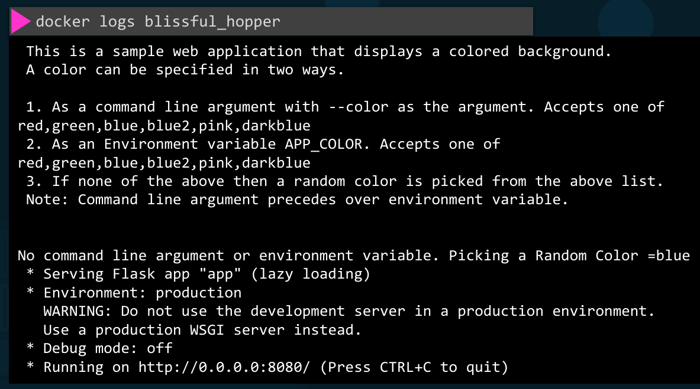

### 2.11) docker build

* The first step is to write down the steps you would do to manually deploy the application.

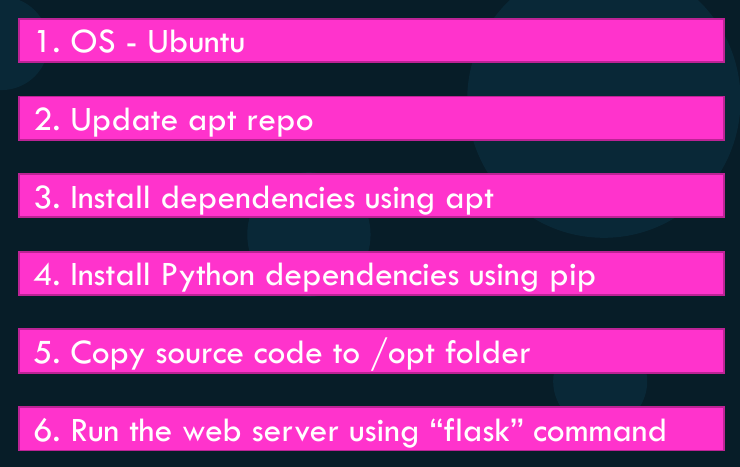

* The second step is to convert these to a Dockerfile.

```Dockerfile
FROM Ubuntu
RUN apt-get update
RUN apt-get install python
RUN pip install flask
RUN pip install flask-mysql
COPY . /opt/source-code
ENTRYPOINT FLASK_APP=/opt/source-code/app.py flask run
```

* Use `docker build $PWD -f Dockerfile -t $IMAGE:$TAG` to build an image with a tag. This will build it locally, you need to push this to an external image repository.

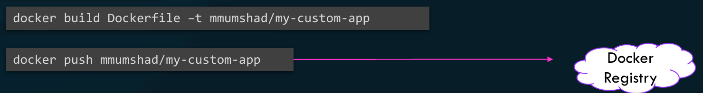

#### 2.11.1) Dockerfile

* This is a textfile containing the insutrctions to build the image. It uses the instruction and argument format. Insutrctions are in capital letters and are reserved words and the arguments are what o do.


#### 2.11.1.2) CMD vs ENTRYPOINT

* Dockerfiles may contain `CMD` and / or `ENTRYPOINT`.
* `CMD` by itself is a hard coded shell format or JSON array format for the command and its arguments. Any arguments supplied to `docker run` overwrite it. The first element is the command to be run.


* `ENTRYPOINT` by itself is a hard coded shell format or JSON array format for the command. Any arguments supplied to `docker run` are appended here as arguments.


* When used together `ENTRYPOINT` is the hard coded shell format or JSON array format for the command and `CMD` is the hard coded shell format or JSON array format for the default arguments. Any arguments supplied to `docker run` are appended to `ENTRYPOINT` as arguments and override `CMD`.

**NOTE:** `docker run --entrypoint $CMD $IMAGE_NAME` can be used to override the `ENTRYPOINT` of a Dockerfile.

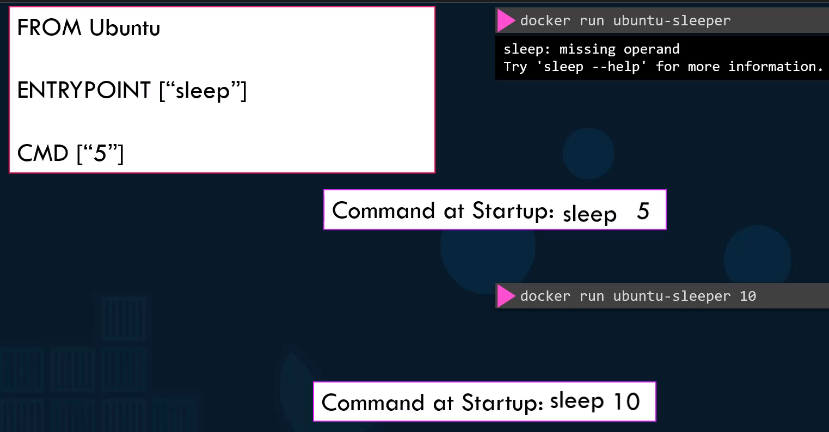

### 2.12) docker push

**NOTE:** You can use `$IMAGE_NAME` or `$IMAGE_ID` on the commands below.

* Use `docker push $IMAGE:TAG` to push this to the Docker Hub image repo.


### 2.13) docker history

**NOTE:** You can use `$IMAGE_NAME` or `$IMAGE_ID` on the commands below.

* Docker builds images in a layered architecture. Each line in a Dockerfile creates a new image with the changes from the previous image. Each layer only stores the changes from the previous layer.

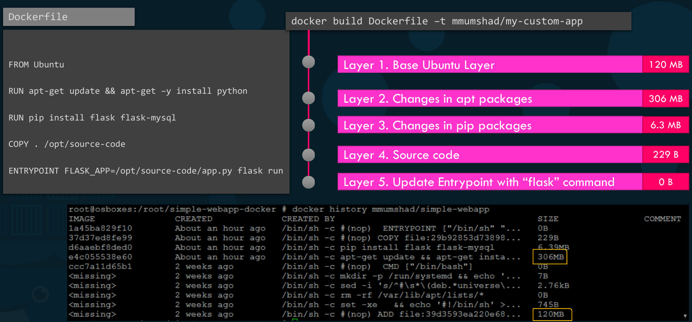

* Use `docker history $IMAGE_NAME` to view this layered architecture.
* All layers are cached by Docker and will be reused in subsequent builds.

## 3) Docker Compose

https://docs.docker.com/compose/

* Docker compose uses a YAML file called `docker-compose.yaml` to define and run applications that have multiple containers. This replaces having to run multiple `docker` commands to set everything up.
* `docker-compose up`

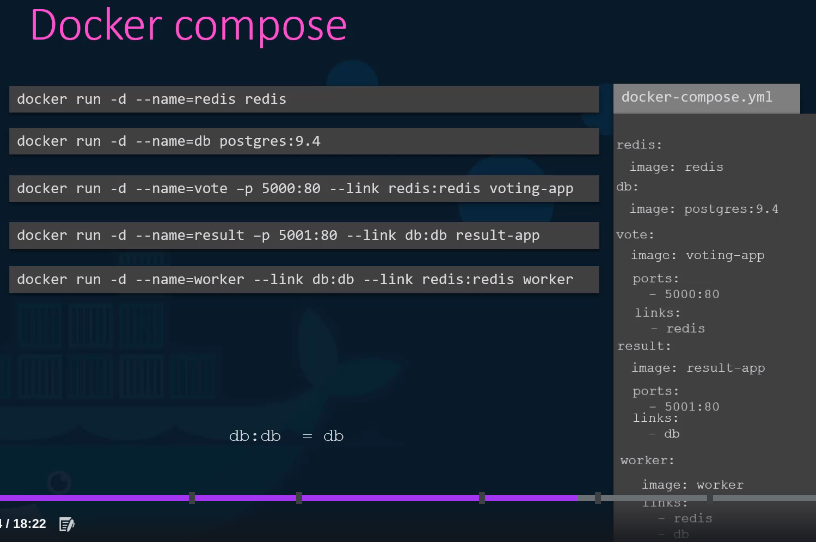

* You can build images via Docker compose as well. You need to use the `build: $PATH` entry to specify the path where to get the Dockerfile from to build the image.


* There are different versions of Docker compose so there are different valid syntaxes for `docker-compose-.yaml` files. Check out the documentation for what each version supports.

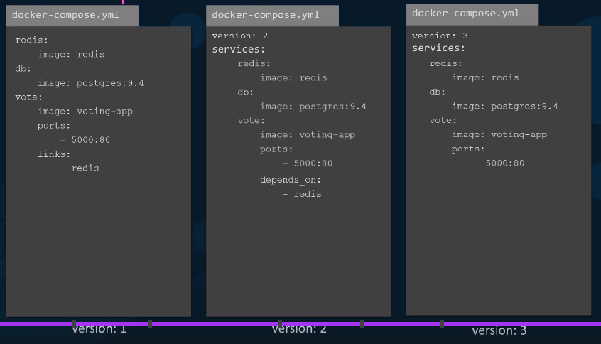

```yaml
services:
  redis:
    image: redis:alpine
  clickcounter:
    image: kodekloud/click-counter
    ports:
    - 8085:5000
version: '3.0'
```

## 4) Docker Registry

* This is a central repository of all Docker images, currently this is https://docker.io
* The `image: $IMAGE_NAME` actually expands into `image: $DOCKERHUB_URL/$DOCKERHUB_USER:$IMAGE_NAME`

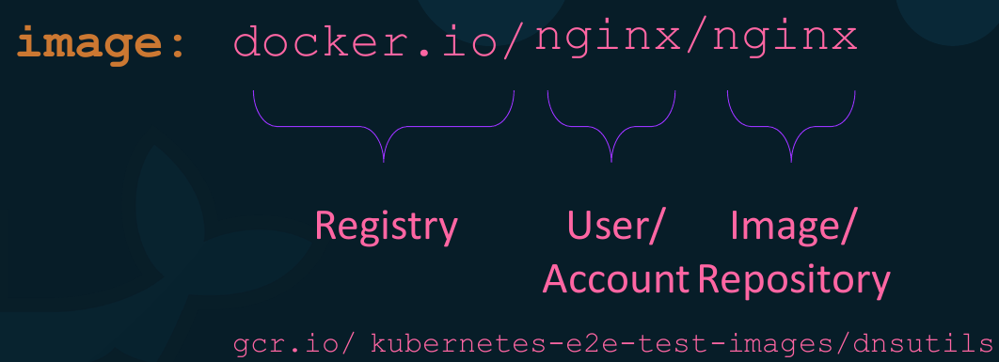 

* Use `docker login $PRIVATE_REGISTRY_URL` to access your personal registry and `docker run $PRIVATE_REGISTRY_URL $IMAGE_NAME` to run an image from your private registry. You must login first before doing this.

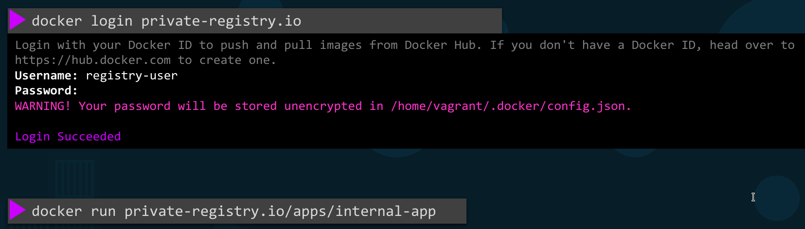

* You can deploy your own private Docker registry using the image `registry` on port 5000. You will need to use your `$PRIVATE_REGISTRY_URL` with all `docker` commands.


## 5) Docker Engine

## 6) Docker Storage

## 7) Docker Networking

## 8) Container Orchestration

