# k8s Administrator (CKA) Notes <!-- omit in toc -->

* Third course in a series [[beginner](../02.applications-developer/README.md#1-core-concepts), [developer](../02.applications-developer/README.md#2-configuration), administrator, security]
* Can do the exam if you want.

## Tables Of Contents <!-- omit in toc -->
- [1) Core Concepts](#1-core-concepts)
  - [1.1) ETCD](#11-etcd)
  - [1.2) Kube-API Server](#12-kube-api-server)
  - [1.3) Kube Controller Manager](#13-kube-controller-manager)
  - [1.4) Kube Scheduler](#14-kube-scheduler)
  - [1.4) Kubelet](#14-kubelet)
  - [1.5) Kube Proxy](#15-kube-proxy)
  - [1.6) Imperative vs Declarative](#16-imperative-vs-declarative)
  - [1.7) Kubectl Apply Command](#17-kubectl-apply-command)
- [2) Scheduling](#2-scheduling)
  - [2.1) Manual Scheduling](#21-manual-scheduling)
  - [2.2) Automatic Scheduling](#22-automatic-scheduling)
  - [2.3) Resource Requests & Limits](#23-resource-requests--limits)
  - [2.4) Daemon Sets](#24-daemon-sets)
  - [2.5) Static Pods](#25-static-pods)
  - [2.6) Multiple Schedulers](#26-multiple-schedulers)
- [3) Monitoring & Logging](#3-monitoring--logging)
  - [3.1) Monitoring](#31-monitoring)
  - [3.2) Logging](#32-logging)
- [4) Application Lifecycle Management](#4-application-lifecycle-management)
  - [4.1) Rolling Updates & Rollbacks](#41-rolling-updates--rollbacks)
  - [4.2) Commands & Arguments](#42-commands--arguments)
  - [4.3) Environment Variables](#43-environment-variables)
  - [4.4) Secrets](#44-secrets)
  - [4.5) Scaling Applications](#45-scaling-applications)
  - [4.6) Multi-container Pods](#46-multi-container-pods)
    - [4.6.2) Monolithic vs Microservices](#462-monolithic-vs-microservices)
    - [4.6.1) Design Patterns](#461-design-patterns)
  - [4.7) initContainers](#47-initcontainers)
  - [4.8) Self Healing Applications](#48-self-healing-applications)
- [5) Cluster Maintenance](#5-cluster-maintenance)
  - [5.1) O/S Upgrades](#51-os-upgrades)
  - [5.2) Software Versions](#52-software-versions)
  - [5.2) Cluster Upgrades](#52-cluster-upgrades)
    - [5.2.1) Master Upgrade](#521-master-upgrade)
    - [5.2.1) Worker Upgrade](#521-worker-upgrade)
  - [5.2) Backup & Restore Methods](#52-backup--restore-methods)
- [6) Security](#6-security)
  - [6.1) Primitives](#61-primitives)
  - [6.1) Authentication](#61-authentication)
  - [6.2) TLS Encryption](#62-tls-encryption)
    - [6.2.1 ) TLS Basics](#621--tls-basics)
    - [6.2.2) TLS In k8s](#622-tls-in-k8s)
    - [6.2.2.1) Creating Digital Certificates For k8s](#6221-creating-digital-certificates-for-k8s)
    - [6.2.2.2) Certificates API](#6222-certificates-api)
    - [6.2.2.3) Kube Config](#6223-kube-config)
  - [6.3) API Groups](#63-api-groups)
  - [6.4) Authorisation](#64-authorisation)
    - [6.4.1) RBAC](#641-rbac)
    - [6.4.2) Namespaced vs Cluster Scoped](#642-namespaced-vs-cluster-scoped)
  - [6.5) Security](#65-security)
    - [6.5.1) Image Security](#651-image-security)
  - [6.5) Network Policies](#65-network-policies)
- [7) Storage](#7-storage)
  - [7.1) Docker Storage](#71-docker-storage)
    - [7.1.1) Storage Drivers](#711-storage-drivers)
    - [7.1.2) Volume Drivers](#712-volume-drivers)
    - [7.1.3) k8s Cluster Interfaces](#713-k8s-cluster-interfaces)
  - [7.2) k8s Storage](#72-k8s-storage)
    - [7.2.1) Volumes](#721-volumes)
    - [7.2.2) Persistent Volumes](#722-persistent-volumes)
    - [7.2.3) Persistent Volume Claims](#723-persistent-volume-claims)
    - [7.2.4) Storage Classes](#724-storage-classes)
- [8) Networking](#8-networking)
  - [8.1) Linux Networking Basics](#81-linux-networking-basics)
    - [8.1.1) Switching, Routing, & Gateway](#811-switching-routing--gateway)
      - [8.1.1.1) Setting Up Linux As A Router](#8111-setting-up-linux-as-a-router)
    - [8.1.2) DNS](#812-dns)
      - [8.1.2.1) Domain Names](#8121-domain-names)
      - [8.1.2.2) Domain Name Resolution](#8122-domain-name-resolution)
      - [8.1.2.3) DNS Record Types](#8123-dns-record-types)
    - [8.1.3) CoreDNS](#813-coredns)
    - [8.1.4) Linux Network Namespaces](#814-linux-network-namespaces)
  - [8.2) Docker Networking](#82-docker-networking)
    - [8.2.1) Docker Bridge Network](#821-docker-bridge-network)
  - [8.3) Container Network Interface (CNI)](#83-container-network-interface-cni)
  - [8.4) k8s Cluster Networking](#84-k8s-cluster-networking)
    - [8.4.1) Network Setup & Ports](#841-network-setup--ports)
    - [8.4.2) Pod Networking](#842-pod-networking)
    - [8.4.3) CNI In k8s](#843-cni-in-k8s)
      - [8.4.3.1) CNI Weave](#8431-cni-weave)
      - [8.4.3.2) IP Address Management (IPMAN) in Weave](#8432-ip-address-management-ipman-in-weave)
    - [8.4.4) Service Networking](#844-service-networking)
    - [8.4.5) DNS In k8s](#845-dns-in-k8s)
    - [8.4.5.1) CoreDNS In k8s](#8451-coredns-in-k8s)
    - [8.4.6) Ingress](#846-ingress)
      - [8.4.6.1) Ingress Annotations & Rewrites](#8461-ingress-annotations--rewrites)
- [9) Desinging A Cluster](#9-desinging-a-cluster)
- [9.1) High Availability (HA)](#91-high-availability-ha)
  - [9.1.1) Kube API Server](#911-kube-api-server)
    - [9.1.2) Scheduler & Controller Manager](#912-scheduler--controller-manager)
    - [9.1.3) ETCD](#913-etcd)
- [10) Installing A Cluster With Kubeadm](#10-installing-a-cluster-with-kubeadm)
- [11) Troubleshooting The Cluster](#11-troubleshooting-the-cluster)
  - [11.1) Application Failure](#111-application-failure)
  - [11.2) Control Plane Failure](#112-control-plane-failure)
    - [11.2.1) Control Plane Components As Pods](#1121-control-plane-components-as-pods)
    - [11.2.1) Control Plane Components As O/S Services](#1121-control-plane-components-as-os-services)
  - [11.3) Worker Node Failure](#113-worker-node-failure)
  - [11.4) Network Troubleshooting](#114-network-troubleshooting)
- [12) Other Topics](#12-other-topics)
  - [12.1) YAML Basics](#121-yaml-basics)
  - [12.2) JSON Basics](#122-json-basics)
  - [12.3) JSON Path Basics](#123-json-path-basics)
  - [12.4) Advanced Kubectl Commands](#124-advanced-kubectl-commands)
- [13) Exam Tips](#13-exam-tips)

# 1) Core Concepts

* This is the entire [beginners course](../02.applications-developer/README.md#1-core-concepts) recapped, with some of the [developers course](../02.applications-developer/README.md#2-configuration) recapped, and a couple of new sections of new topics or additional details of existing topics.

**Note:** For simplicity I have merged everything from the beginners course into [developers course](../02.applications-developer/README.md#1-core-concepts)

* Master - manage, plan, schedule, and monitor nodes
  * Every component together is called the control plane.
* Workers - host applications as containers

* Container runtime engine (CRE) must be installed on all Nodes in the Cluster. By default this is Docker, it can be others though like containerd or rkt.
  * Some control plane components can be run as containers instead of system binaries. For example DNS and networking solutions. This is why the CRE must be installed onto the master nodes.

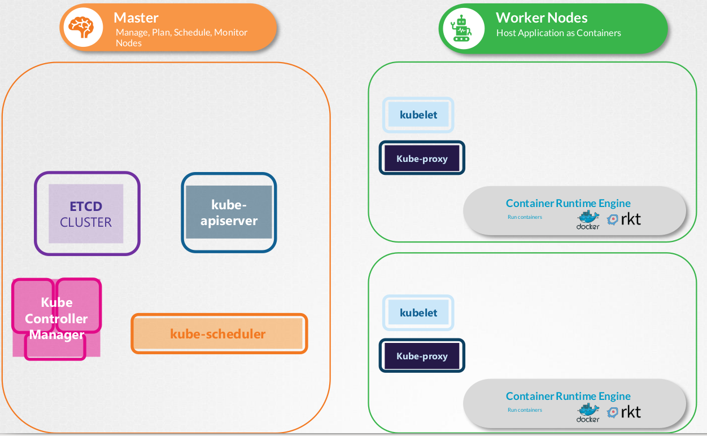

## 1.1) ETCD

* A distributed database that stores data in a key/value format, e.g. a map.
* It is used to quickly store and retrieve small chunks of data.
* The ETCD service listens on port 2379 by default.
* In k8s ETCD stores information about things like:
  * Nodes
  * Pods
  * Configs
  * Secrets
  * Accounts
  * Roles
  * Bindings
  * etc
* All information from `kubectl get $K8S_OBJECT` is from the ETCD server.
* All changes to the cluster are applied in the ETCD server, and only when the change is applied ETCD is the change considered complete.
* Practice test uses the KubeADM tool. We will also do it from scratch in this course.
  * kubeadm deploys ETCD as Pod in the kube-system namespace.
  * When installing from scratch, download the binary and install it onto the master node and start up the ETCD service.
* k8s stores data in ETCD using `/registry/K8s_OBJECTS/`
* In a high availablity environment, there will be multiple master nodes with multiple ETCD services running on them. They all need to know about each other so data replication works correctly.

* There are 2 versions of ETCD commands, version 2 and version 3. Version 2 is the default. Use `export ETCDCTL_API=3` to use version 3. The commands from different versions do not work with the other version.

```bash
# The ETCD control client CLI
etcdctl set key1 value
etcdctl get key1

# When starting ETCD on a master you need to provide the certificates.
kubectl exec etcd-master -n kube-system -- sh -c "ETCDCTL_API=3 etcdctl get / --prefix --keys-only --limit=10 --cacert /etc/kubernetes/pki/etcd/ca.crt --cert /etc/kubernetes/pki/etcd/server.crt  --key /etc/kubernetes/pki/etcd/server.key" 

```

## 1.2) Kube-API Server

* This is the primary management component of k8s. It is responsible for orchestrating all operations within the cluster. The API is used by users and cluster components to communicate with the server. There are 4 stages of this process:
1. Authenticate the user sending the request
2. Validate the request
3. Retrieve or update the data from ETCD
4. Send a response
* The Kube API server periodically requests status reports from the kubelet agents so it can monitor the status of Nodes and their resources.
* The Kube API server is the only component in the cluster that interacts with the ETCD data store.
* This is running either as an O/S service or a Pod in the kube-system namespace.

## 1.3) Kube Controller Manager

https://kubernetes.io/docs/concepts/architecture/controller/

* A **Controller** is a non-terminating loop that regulates the state of the system. i.e. they watch the state of the k8s cluster and make or request changes to move the current state of the cluster closer to the desired state.
* There are various Controllers in the cluster, such as:
  * Controller Manager
  * Node Controler takes care of nodes, new and existing.
  * Replication Controller ensures the desired number of Pods are running at all times.
  * There are many Controllers in the cluster, whatever intelligence that you see by k8s objects (e.g. deployments, jobs, etc) this is implemented by their respective Controller.
* All Controllers in the cluster are installed via the Kube-Controller-Manager bundle. This is running either as an O/S service or a Pod in the kube-system namespace.

## 1.4) Kube Scheduler

* Identifies the right Node to place the Pod on, based on the Pod's resource requirements and contraints, and the Node's available resources and contraints. The constraints are things like Taints, Tolerations, and NodeAffinity.
* This does not place Pods onto Nodes, it just identifies the Node for placement. The kubelet actually places the Pod onto the Node.
* This is running either as an O/S service or a Pod in the kube-system namespace.

## 1.4) Kubelet

* It listens for instructions from the Kube-API server and performs those instructions when received. This could be deploying new resources, destroying existing resources, or giving information updates about existing resources.
* Responsible for placing a Pod onto a Node after the Kube Scheduler identifies the correct Node to place it on.
* You must always manually install this on your Worker Nodes, even if you install your Cluster via Kubeadm. This will be running as an O/S level service.

## 1.5) Kube Proxy

* This is a process running on each Node that enables communication between every Pod on every Worker Node.
* It can use IP Tables rules on each Node in the cluster to create forwarding traffic rules. This is how ClusterIP Services work.
* This is running either as an O/S service or a Pod in the kube-system namespace. It is deployed as a Daemon Set so there always 1 Pod running on each Node in the cluster.

## 1.6) Imperative vs Declarative

* When trying to achieve a goal, **the imperative approach** specifies exactly what steps to do and how to do them to achieve the goal.
* When trying to achieve a goal, **the declarative approach** only specifies what the goal is. The details of how the goal is reached are abstracted away.


* The declarative approach is used in infrastructure as code (IAS). Tools like Ansible ingest YAML files that declare what the final state needs to be and Ansible works out how to do it. Ansible does this in an idempotent way, i.e. running the declarative process one or many times will always produce the same result.


* In k8s the majority of `kubectl` commands are the imperative approach. This is great for the exam since you can get things done quickly.
* In k8s the `kubectl apply` command uses YAML files to work out what needs to be done to get the desired state. This is the declarative approach in k8s.


## 1.7) Kubectl Apply Command

https://kubernetes.io/docs/tasks/manage-kubernetes-objects/declarative-config/

* The `kubectl apply` command looks at the current configuration and figures out what changes need to be made to reach the desired state. This may be creating, updating, or delete objects.
* The `kubectl apply` command uses 3 sets of data points to determine what it needs to do. These are:
1. The local YAML definition file
2. The live (i.e. in memory) k8s object definition
3. The last applied configuration within the live k8s object. This is the local YAML definition file converted to JSON and stored inside the live k8s object.

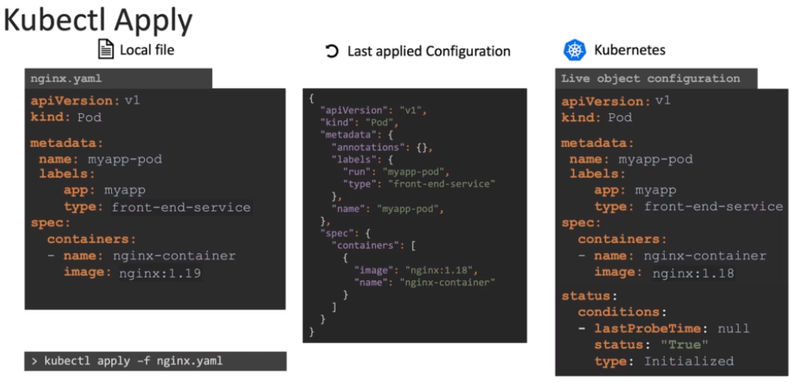

* The last applied configuration is stored inside of `/metadata/annotations/kubectl.kubernetes.io/last-applied-configuration/` as a JSON string.


# 2) Scheduling


```bash
# check for a scheduler running as a pod
kubectl get pods --namespace kube-system | fgrep scheduler
# check for a scheduler running as a service
ps aux | fgrep 'scheduler'

# Using multiple labels
kubectl get $K8s_OBJECT --selector='key1=value1,key2=value2,key3=value3'
```

## 2.1) Manual Scheduling

`/spec/nodeName/$NODE_NAME` can be used to manually schedule a Pod to a Node. This is the simplest form of Pod assignment is rarely used. If this field isn't empty, the scheduler will try to place the Pod onto the specified Node only. This has 3 limitations:

1. If the `nodeName` used doesn't exist then the Pod will never run.
2. If the `nodeName` used doesn't have the required resources that the Pod needs then the Pod will never run.
3. The `nodeName` in a cloud environment isn't stable and will change at some point in time.

## 2.2) Automatic Scheduling

The topics Labels & Selectors, Taints & Tolerants, and Node Selector and Node Affinity are covered in the developer's course under the section [Assigning Pods To Nodes](../02.applications-developer/README.md#26-assigning-pods-to-nodes)


## 2.3) Resource Requests & Limits

The details for this can be found in in the developer's course under the section [Resources](../02.applications-developer/README.md#25-resources)

## 2.4) Daemon Sets

https://kubernetes.io/docs/concepts/workloads/controllers/daemonset/

* A **Daemon Set** ensure that all Nodes in the cluster run a copy of a Pod. As new Nodes are added to the cluster, the Daemon Set runs the desired Pod on the new Node. It does using the default scheduler and node affinity rules. Obviously when Nodes are removed from the cluster the Daemon Set Pod will be removed too. Daemon sets are ignored by the Kube Scheduler.


* Some typical use cases are:
  * Running a cluster management Pods (e.g. kube-proxy Pod in the kube-system namespace) on every node.
  * Running log collection daemon on every node.
  * Running node monitoring daemon on every node.


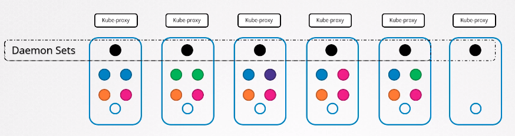

* The DaemonSet YAML definition file is almost identical to a Deployment YAML definition file.

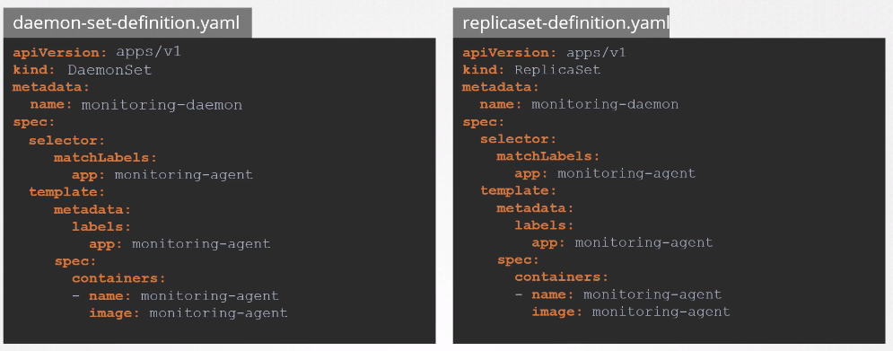

```bash
kubectl get daemonsets
kubectl get ds
kubectl describe ds $NAME
# Create a deployment and then edit the YAML and change it to a DaemonSet
# Need to remove replicas, strategy, and any extra fields.
kubectl create deployment $NAME --image=$NAME --dry-run -o yaml > $YAML_FILE
```

## 2.5) Static Pods

https://kubernetes.io/docs/tasks/configure-pod-container/static-pod/

* **Static Pods** are automatically created by the kubelet daemon using a filesystem based or web hosted based YAML definition file, rather than one supplied via the kube-apiserver. The Static Pod is only created for the Node that the YAML defintion file is associated with. The Statics Pods are created outside of control plane management tools, and are available as read only objects within the cluster. To delete the Static Pod, just delete the YAML defintion file. Static Pods are completely ignored by the Kube Scheduler.


* The location of the filesystem or web hosted based YAML defintion file is passed in to the kubelet daemon through its O/S service file. The `--pod-manifest-path=$PATH` or `--pod-manifest-path=$CONFIG_FILE` option is used for filesystem YAML defintion files and `--manifest-url=$URL` is used for web hosted YAML definition files.
  * In older versions it can be found at `--config=$PATH` or `--config=$CONFIG_FILE`


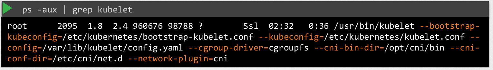


* Static Pods will typically have a Node name in their name as a suffix, something like `$POD_NAME-$NODE_NAME`. So you can use the `kubectl get po -A | grep '$NODE_NAME'` to look for Static Pods.
* A typical use case for using Static Pods is to deploy the control plane componenets on each Node. This is how kubeadm sets up control plane components in the cluster.


* If you want to view the running containers of a Static Pod before the other cluster components are avaiable, you need to use `docker ps` to see them.

```bash
# Find the path or config file that has the path to where static pod YAML definition files are stored
ps aux | grep kubelet | grep config
```

```
# Output
root      4871  0.0  0.1 4151324 107740 ?      Ssl  07:56   1:07 /usr/bin/kubelet --bootstrap-kubeconfig=/etc/kubernetes/bootstrap-kubelet.conf --kubeconfig=/etc/kubernetes/kubelet.conf --config=/var/lib/kubelet/config.yaml --network-plugin=cni --pod-infra-container-image=k8s.gcr.io/pause:3.2
```

```bash
# --config=/var/lib/kubelet/config.yaml
grep static /var/lib/kubelet/config.yaml
```

```
# Output
staticPodPath: /etc/kubernetes/manifests
```

## 2.6) Multiple Schedulers

* You can create your custom scheduling algorithm and deploy it into the cluster. k8s allows for multiple schedulers running at the same time.
* When installing the `kube-scheduler` for the first time, if you don't give it a name it will automatically be called `default-scheduler`. You can supply whatever name you like.

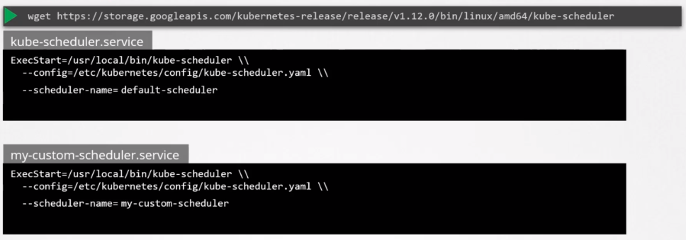

Note: This example is using the same scheduler in the example.

* kubeadm deploys the scheduler as a Pod. You can find its Static Pod defintion at `/etc/kubernetes/manifests/` or the path you configured yourself.
  * The `/spec/containers/[i]/command` array has all the command options. The `--leader-elect=true` option is used when there are multiple copies of the scheduler running on multiple Master Nodes in a HA setup. Only one scheduler can be active at a time, this option chooses the active scheduler.
  * The `/spec/containers/[i]/command` array has all the command options. The `--leader-elect=false` option is used when there are multiple copies of the scheduler running on one Master Node. Only one scheduler can be active at a time, this option chooses the active scheduler.


* A Pod can manually choose its scheduler by using the `/spec/schedulerName/` option. If the custom scheduler isn't working properly, the Pod will be in a PENDING state.

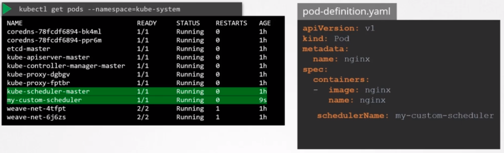

* Use `kubectl get events` to find scheduler events which will tell you which scheduler was used for a Pod.

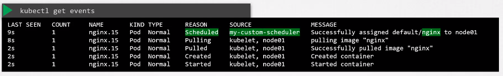

```bash
# View k8s related events, useful for troubleshooting
kubectl get events

# View the scheduler logs
kubectl -n kube-system logs $SCHEDULER_POD_NAME
```

# 3) Monitoring & Logging

## 3.1) Monitoring

Details previously covered in the developer's course under the section [Monitoring](../02.applications-developer/README.md#35-monitoring)

## 3.2) Logging

Details previously covered in the developer's course under the section [Logging](../02.applications-developer/README.md#34-logging)

# 4) Application Lifecycle Management

## 4.1) Rolling Updates & Rollbacks

Details previously covered in the developer's course under the section [Deployment Updates and Rollbacks](../02.applications-developer/README.md#161-deployment-updates-and-rollbackss) and [Deployment Updates & Rollbacks](../02.applications-developer/README.md#42-deployment-updates--rollbacks)

## 4.2) Commands & Arguments

**Note:** This is not on CKA exam but good to understand.

Details previously covered in the developer's course under the section [Commands & Arguments](../02.applications-developer/README.md#21-commands--arguments)

## 4.3) Environment Variables

Details previously covered in the developer's course under the section [Enviroinment Variables](../02.applications-developer/README.md#22-enviroinment-variables)

**Note:** These should match POSIX environment variable naming conventions so they are created properly within the container and are viewable with `printenv`.

## 4.4) Secrets

Details previously covered in the developer's course under the section [Secrets](../02.applications-developer/README.md#secrets)

## 4.5) Scaling Applications

Details previously covered in the developer's course under the section [k8s Deployments Recap](../02.applications-developer/README.md#16-k8s-deployments-recap)

## 4.6) Multi-container Pods

### 4.6.2) Monolithic vs Microservices

Details previously covered in the developer's course under the section [Multi-Container Pods](../02.applications-developer/README.md#3-multi-container-pods)

### 4.6.1) Design Patterns

Details previously covered in the developer's course under the section [k8s Implementation](../02.applications-developer/README.md#32-k8s-implementation)

**Note:** CKA only uses sidecar containers. The other 2 patterns are for CKAD.

## 4.7) initContainers

https://kubernetes.io/docs/concepts/workloads/pods/init-containers/

**initContainer**s are containers that are run before the app containers are started. They always run to completion, if they dont complete successfully the Pod will be restarted. The restart policy of never can change this. Also, you can have multiple initContainers too, each initContainer is run one at a time in sequential order. Each initContainer must complete successfully before the next one starts. When all initContainers have completed successfully, the main application container will start. They are typically used for set up tasks.

```yaml
apiVersion: v1
kind: Pod
metadata:
  name: myapp-pod
  labels:
    app: myapp
spec:
  containers:
  - name: myapp-container
    image: busybox
    command: ['sh', '-c', 'echo The app is running! && sleep 3600']
  initContainers:
  - name: myapp-initcontainer
    image: busybox
    command: ['sh']
    args: ['-c', 'git clone $REPO; done']
```

```yaml
apiVersion: v1
kind: Pod
metadata:
  name: myapp-pod
  labels:
    app: myapp
spec:
  containers:
  - name: myapp-container
    image: busybox:1.28
    command: ['sh', '-c', 'echo The app is running! && sleep 3600']
  initContainers:
  - name: init-myservice
    image: busybox:1.28
    command: ['sh', '-c', "until nslookup myservice.$(cat /var/run/secrets/kubernetes.io/serviceaccount/namespace).svc.cluster.local; do echo waiting for myservice; sleep 2; done"]
  - name: init-mydb
    image: busybox:1.28
    command: ['sh', '-c', "until nslookup mydb.$(cat /var/run/secrets/kubernetes.io/serviceaccount/namespace).svc.cluster.local; do echo waiting for mydb; sleep 2; done"]
```

## 4.8) Self Healing Applications

Note: Not covered in CKA, covered in CKAD. This using ReplicaSets and Liveness, Readiness, and Startup probes.

# 5) Cluster Maintenance

## 5.1) O/S Upgrades

* When a Node goes offline, by default the Master Node waits 5 minutes for an offline Worker Node to come back online before pronouncing it dead. This time limit is known as the pod evicition timeout and it set on the `kube-controller-manager` process when its starting.
  * If it is pronounced dead after the pod eviction timelimt, eligible Pods (i.e. inside of a Deployment) will be placed onto other Worker Nodes. Ineligible Pods won't be recreated anywhere.
  * If it comes back online before the pod eviction timelimit, the Pods will be recreated on that Node.
* When you manually bring down a Worker Node, you can force the Pods on that Node to be recreated on other Nodes by using `kubectl drain $NODE`. A drained Node cannot be used by the Scheduler as it is cordoned off from other Nodes. When you bring the Node back online, you will need to manually uncordon it with `kubectl uncordon $NODE`. This doesn't mean Pods will be recreated back there, it just means the Node is available for scheduling again.
* You can manually cordon off a node with `kubectl cordon $NODE` which will make the Node unavailable to the Scheduler but it doesn't evict all Pods from the Node.

```bash
# ignore daemonset pods when draining
kubectl drain $NODE --ignore-daemonsets 

# remove pods that won't automatically be rescheduled
kubectl drain $NODE --force

# stop pods being scheduled onto a node but don't evict any pods
kubectl cordon $NODE

# allow pods to be scheduled onto the node again, needed after a drain or cordon
kubectl uncordon $NODE
```

## 5.2) Software Versions

* Kubernetes follows [Semantic Versioning](https://semver.org/) which has `MAJOR.MINOR.PATCH` version numbers.
  1. MAJOR version when you make incompatible API changes,
  2. MINOR version when you add functionality in a backwards compatible manner, and
  3. PATCH version when you make backwards compatible bug fixes.

**Note:** Additional labels for pre-release and build metadata are available as extensions to the MAJOR.MINOR.PATCH format.


* `kubectl get nodes -o wide` or `kubectl version --short` shows the k8s semantic version of `kubelet`.
* The [k8s github repo release page](https://github.com/kubernetes/kubernetes/releases) has all the released versions of k8s. You can download the file which contains all the control plane components within it. All of the k8s supplied control plane components will have the same semantic version, but the third party supplied control plane components will have different semantic version numbers.


## 5.2) Cluster Upgrades

* Searching for 'upgrading kubeadm' in the k8s documentation page brings up [upgrading kubeadm clusters](https://kubernetes.io/docs/tasks/administer-cluster/kubeadm/kubeadm-upgrade/) which has all the steps you need to upgrade via kubeadm.
* The Kube API Server is the primary component in the control plane, no other core k8s control plane components can have a higher version than it. But they can be at lower versions, the rules are:
  * The Controllers and Scheduler can be the same version or 1 behind.
  * Kubelet and Kube Proxy can be the same version or up to 2 versions behind.
  * `kubectl` can be the same version, 1 version behind, or 1 version ahead.

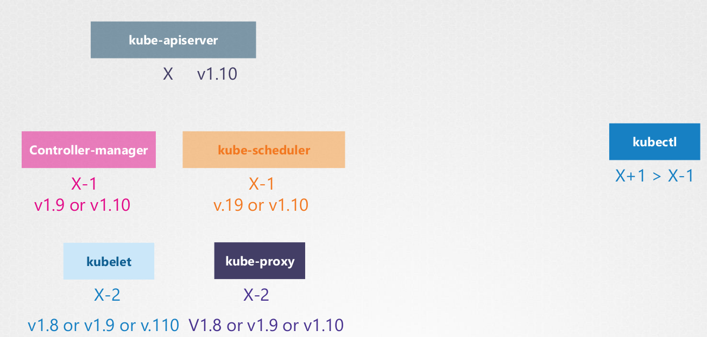

* This version differencing allows upgrading, component by component if desired. k8s only supports the 3 latest minor versions. You must upgrade 1 minor release version at a time, you cannot jump minor versions unless you completely reinstall.


* There are 3 high level steps to the `kubeadm` cluster upgrade process:
  1. Upgrade a primary control plane node.
  2. Upgrade additional control plane nodes.
  3. Upgrade worker nodes.
* The Master Node must be taken offline when upgrading it. This means the cluster has no management features avaiable, but Worker Node Pods will continue to run. But if one does there is no ReplicationController to bring the Pod back up.

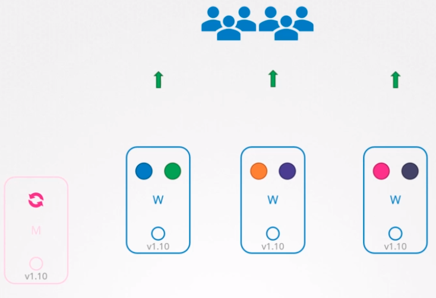

* There are 3 strategies to use when upgrading Worker Nodes.
  1. You can upgrade all Worker Nodes at once. But that has an outage for users.
  2. You can upgrade the Worker Nodes one at a time. This has no outage for users.
  3. You can add new Worker Nodes to the cluster that already have the desired k8s version and then remove old Worker Nodes from the cluster. This has no outage for users and is easily done in cloud environments.

### 5.2.1) Master Upgrade

https://kubernetes.io/docs/tasks/administer-cluster/kubeadm/kubeadm-upgrade/#upgrading-control-plane-nodes

```bash
# Plan the upgrade
kubeadm upgrade plan

# Upgrade kubeadm - https://kubernetes.io/docs/tasks/administer-cluster/kubeadm/kubeadm-upgrade/#determine-which-version-to-upgrade-to
# Find the version
yum list --showduplicates kubeadm --disableexcludes=kubernetes

# Upgrade, replace n with the version from above
yum install -y kubeadm-1.21.n --disableexcludes=kubernetes

# Verify the upgrade
kubeadm version

# Upgrade the rest of the control plane
sudo kubeadm upgrade apply v1.21.n

# Drain before upgrading kubelet & kubectl
kubectl drain $MASTER_NODE --ignore-daemonsets

# Upgrade kubelet & kubectl as kubeadm doesn't upgrade this
yum install -y kubelet-1.21.n kubectl-1.21.n--disableexcludes=kubernetes

# Restart kubelet service
sudo systemctl daemon-reload
sudo systemctl restart kubelet

# Allow scheduling again
kubectl uncordon $MASTER_NODE
```

### 5.2.1) Worker Upgrade

**Note:** When upgrading the cluster, all `kubectl` commands must be run on the Master Node. e.g. `kubectl drain $WORKER_NODE` must be run on the Master Node.

https://kubernetes.io/docs/tasks/administer-cluster/kubeadm/kubeadm-upgrade/#upgrade-worker-nodes

```bash
# Upgrade, replace n with the version from above
yum install -y kubeadm-1.21.n --disableexcludes=kubernetes

# Upgrade worker node
sudo kubeadm upgrade node

# Drain before upgrading kubelet & kubectl - RUN THIS FROM THE MASTER
kubectl drain $WORKER_NODE

# Upgrade kubelet & kubectl as kubeadm doesn't upgrade this
yum install -y kubelet-1.21.n kubectl-1.21.n--disableexcludes=kubernetes

# Restart kubelet service
sudo systemctl daemon-reload
sudo systemctl restart kubelet

# Allow scheduling again - RUN THIS FROM THE MASTER
kubectl uncordon $WORKER_NODE
```

## 5.2) Backup & Restore Methods

* There are 2 things to consider when backing up:
  1. k8s objects
     * These can be backed up via their YAML defintion files. The YAML defintion files should be stored in a code repo. They can be recreated at any time.
     * You can also back up all of the resource manually by dumping their YAML defintions file. Tools like Velero can do this.
     * You can also back up this via backing up ETCD.  The `--data-dir` is what you need to back up, or just use the inbuilt ETCD back up tools.
  1. Persistent storage, the Pods` data needs to be backed up. There are third party tools for this, like Velero.

```bash
# k8s ETCD shiz
# Only one API version can be used at a time, and some commands only exist in 1 API version
export ETCDCTL_API=2
export ETCDCTL_API=3

# If ETCD database is TLS-Enabled, the following options are mandatory
# --cacert # vertify TLS certificates using CA bundle
# --cert # identify secure client using TLS cert
# --endpoints=[127.0.0.1:2379] # default ETCD bind address and port
# --key # the TLS key

# Save a backup (only works with API 3): etcdctl snapshot save -h
etcdctl snapshot save /opt/snapshot-pre-boot.db \
--cert=/etc/kubernetes/pki/etcd/server.crt \
--cacert=/etc/kubernetes/pki/etcd/ca.crt \
--key=/etc/kubernetes/pki/etcd/server.key

# Check the backup
etcdctl snapshot status /opt/snapshot-pre-boot.db

# If running as a service, stop the kube-apiserver service as you need to restart the ETCD service
systemctl stop kube-apiserver

# Restore from backup (only works with API 3), don't need keys as it is on the local filesystem: etcdctl snapshot restore -h
etcdctl snapshot restore /opt/snapshot-pre-boot.db \
--data-dir /var/lib/etcd-from-backup 

# Update the ETCD static Pod data path
cp /etc/kubernetes/manifests/etcd.yaml ~/etcd.yaml.old

# Update the /volume/[i]/hostPath/ for ETCD so the new host path containing the backup is used inside the container
sed -i -r 's|path: /var/lib/etcd|path: /var/lib/etcd-from-backup|g' /etc/kubernetes/manifests/etcd.yaml

# If running as a service, restart the service daemon, ETCD service, and kube-apiserver service.
systemctl daemon-reload
systemctl restart etcd
systemctl restart kube-apiserver

# Check ETCD is back up
docker ps -a | grep etcd
docker logs $CONTAINER_ID -f

kubectl -n kube-system get pods
kubectl -n kube-system logs $ETCD_POD -f
```

`--listen-client-urls` connect from current node (port 2379)
`--listen-peer-urls` connect from other nodes (port 2380)
`/etc/kubernetes/pki/etcd/` contains TLS files.

# 6) Security

## 6.1) Primitives

* The hosts running k8s must be hardened. Things like:
  * `ssh` hardening such as disabling root access, disabling passwords, using keys for authentication, etc.
* From a k8s perspective, the `kube-apiserver` is the most important thing to defind. This is because all interactions within the cluster go through it.

## 6.1) Authentication

* **Authentication** confirms that users are who they say they are. There are 2 types of users, humans and computers. Details previously covered in the developer's course under the section [Service Accounts](../02.applications-developer/README.md#service-accounts)
* All requests to the cluster go through the `kube-apiserver` and the user making the request is authenicated before the request is fulfilled.
* There are 4 authentication mechanisms to access the cluster via the `kube-apiserver`:
  1. Basic authentication with passwords which are stored in a text file with 4 columns. Password,username,user id, and group. The username and password would be supplied with `curl -u $USER:$PASSWORD`
     * **Note:** deprecated in v1.19
  2. Basic authenticaiton with tokens which are stored in a text file with 4 columns. Token,username,user id, and group. The token would be supplied with `curl --header Authorization: Bearer $TOKEN`
     * **Note:** deprecated in v1.19
  3. Certificates.
  4. Third party identity services, e.g. LDAP or Kerberos.

**Note:** Service Accounts are not in the CKA exam, they are in CKAD. They are mentioned here for information only.

## 6.2) TLS Encryption

* All communication between the components in the cluster is secured using TLS encryption. TLS certificates can also be used for user authentication.

### 6.2.1 ) TLS Basics

* A **digital certificate (X.509)** provides a trusted link between a public key and an entity (e.g. a business, domain name, etc). This is a trusted link because it has been verified (i.e. signed) by a trusted third party (i.e. a Certificate Authority).

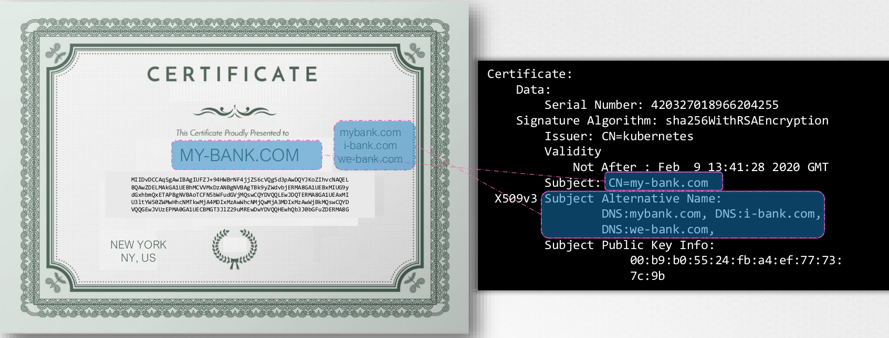

* A digital certificate needs to be signed by a Certificate Authority for it to be considered trusted and valid. Self signed certificates cannot be trusted as anyone can create them. This signing and validation request is known as a **Certificate Signing Request (CSR).**
* A **Certificate Authority (CA)** is a public, well known, and trusted organisation that will validate the information within CSR's and sign certificates. They sign certificates with their private key. Their public key is built into the browser and O/S and is used to validate a CA signed certificate. There are 2 types of CA certificates:
  1. A **root certificate** is used by CAs to issue other certificates called intermediates.
  2. An **intermediate certificate** is by CAs to issue end user certificates for servers and clients.
* You can host your own private CA so you can validate internal websites. You must bundle your private CA's public key into the browser and O/S so your private CA signed certificates can be validated.


* There are 4 steps to an CSR:
  1. The server generates an OpenSSL public/private key pair.
  2. The server creates a Certificate Signing Request (CSR) based on its public key.
  3. The Certificate Authority (CA) validates the information within the CSR and signs the certificate with its private key. The signed certificate is sent back to the server.
  4. The server uses the signed certificate to establish HTTPS connections with others. It does this by sending sending the signed certificate to others for use in symetric key exchange.
* A certificate contains important information about who owns the domain and the server's public key. Both are used to verify the server's identity. A CA will verify this information before signing it.
  * e.g. the certificate's Subject and Subject Alternative Name defines what domains and IP addresses that the certificate is valid for.
* SSL/TLS uses assyemtric encryption for secure symetric encryption key exchange. Symeteric encryption and the exchange key is used to create sessioned based encryption. There are 5 steps to establishing HTTPS:
  1. **Client Hello** - The client sends a list of supported cipher suites.
  2. **Server Hello** - The server chooses the best cipher it can support from the client's cipher suites. It replies with the cipher choice and its signed certificate.
  3. **Client Key Exchange** - The client validates the server's certificate with a CA certificate bundled in its O/S or browser, and extracts the server's public key from the certificate. The client generates a pre-master key, encrypts that with the server's public key, and sends it back to the server.
  4. **Change Cipher Suite** - The server decrypts the pre-master key with its private key, and uses the pre-master key to create a symmetric key. The symmetric key is used to encrypt a message sent back to the client.
  5. **Establish Secure Connection** - The client uses the pre-master key to create the same symmetric key as the server did. It decrypts the message from the server and an encrypted session has been established between the client and server with the same symmetric key that both the client and server created from the pre-master key.


* Certificate naming conventions are typically:
  * A public key file has is named `*.crt` or `*.pem`, i.e. the public key doesn't have the word key in its name or extension.
  * A private key file has is named `*.key` or `*-key.pem`, i.e. the private key has the word key in its name or extension.

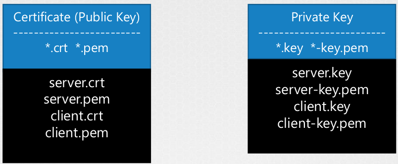

### 6.2.2) TLS In k8s

* From a k8s perspective, there are 3 types of certificates:
  1. **Root certificates** which are installed on the CA server and also on the server and client. k8s supports mulitiple CAs, so you can have one CA for client certificates and one CA for server certificates. 
  2. **Server certificates** which are installed on the k8s cluster and used by cluster components. These are verified by the cluster.
  3. **Client certificates** which are installed onto the clients and use when connecting to the cluster. These are verified by the cluster.
* The following control plane components require their own server certificates:
  * The Kube API Server
  * The ETCD Server
  * The Kubelet agents
* The following clients require their own client certificates:
  * Human Administrators
  * The Kube Scheduler
  * The Kube Controller Manager
  * The Kube Proxy
  * Kube API Server to Kubelet agent (optional, can reuse server certificate)
  * Kube API Server to ETCD Server (optional, can reuse server certificate)

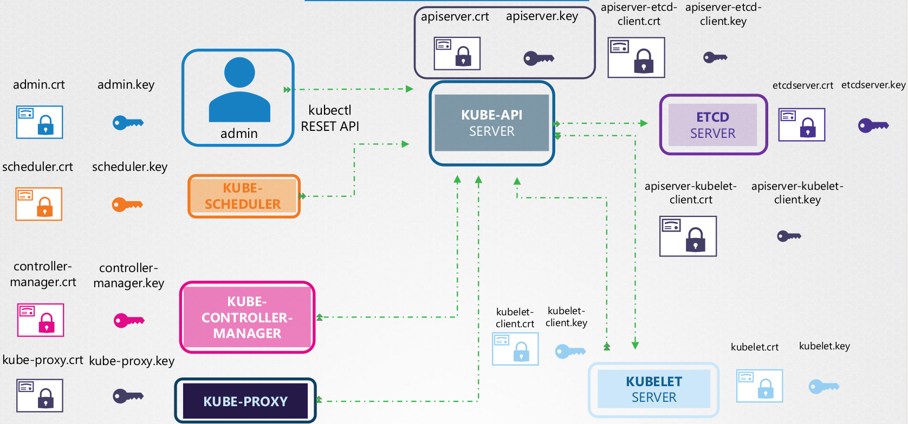


**Note:** In the diagrams above there have been new public/private key pairs created (e.g. Kube API server talking to ETCD server), but you can share the same one as well.

### 6.2.2.1) Creating Digital Certificates For k8s

**Note:** Using `kubeadm` will configure all the certificates for you. The certificates will be deployed inside of Static Pods, so you can view the YAML definition files in `/etc/manifests/kubernetes`. If the control plane components are configured as services, you can view the SystemD service files in `/etc/systemd/system`. You can also log into each Node and look in `/etc/kubernetes/pki`.

```bash
# Create an RSA public and private key pair for ssh
ssh-keygen
id_rsa
id_rsa.pub

# Create an RSA public and private key pair for SSL/TLS
openssl genrsa -out my-private.key 2048
openssl rsa -in my-private.key -pubout > my-public-key.pem
```

```bash
# Create a CA private key
openssl genrsa -out $CA_PRIVATE_KEY 2048

# Create a CA public key, optional as we can extract this from the certificate later
openssl rsa -in $CA_PRIVATE_KEY -pubout > $CA_PUBLIC_KEY

# Create a certificate signing request
openssl req -new -key $CA_PRIVATE_KEY -out $CA_CSR -subj "CN=KUBERNETES-CA"

# Self sign the CA certificate
openssl x509 -req -in $CA_CSR -signkey $CA_PRIVATE_KEY -out $CA_CERTIFICATE

# Display the contents of the CA certificate
openssl x509 -in $CA_CERTIFICATE -text -noout
```

**Note:** This CA certificate needs to be used when generating all client and server certificates.

```bash
# Create an administrator privay key
openssl genrsa -out $ADMIN_PRIVATE_KEY 2048

# Create a certificate signing request, the CN can be anything but the O must have the admin group in it.
openssl req -new -key $ADMIN_PRIVATE_KEY -out $ADMIN_CSR -subj "CN=kube-admin/O=system:masters"

# Self sign the CA certificate
openssl x509 -req -in $ADMIN_PRIVATE_KEY -CA $CA_CERTIFICATE -CAkey $CA_PRIVATE_KEY -out $ADMIN_CERTIFICATE

# Display the contents of the CA certificate
openssl x509 -in $ADMIN_CERTIFICATE -text -noout
```


**Note:** The user certificates can be moved into `KUBECONFIG` which is used to connect and authenticate with the server.

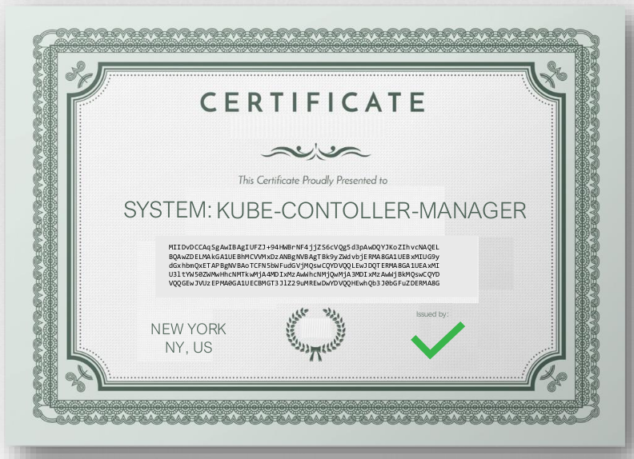

**Note:** All system components must have 'system' as the prefix in their certificate CN field, e.g. system:kube-controller-manager.

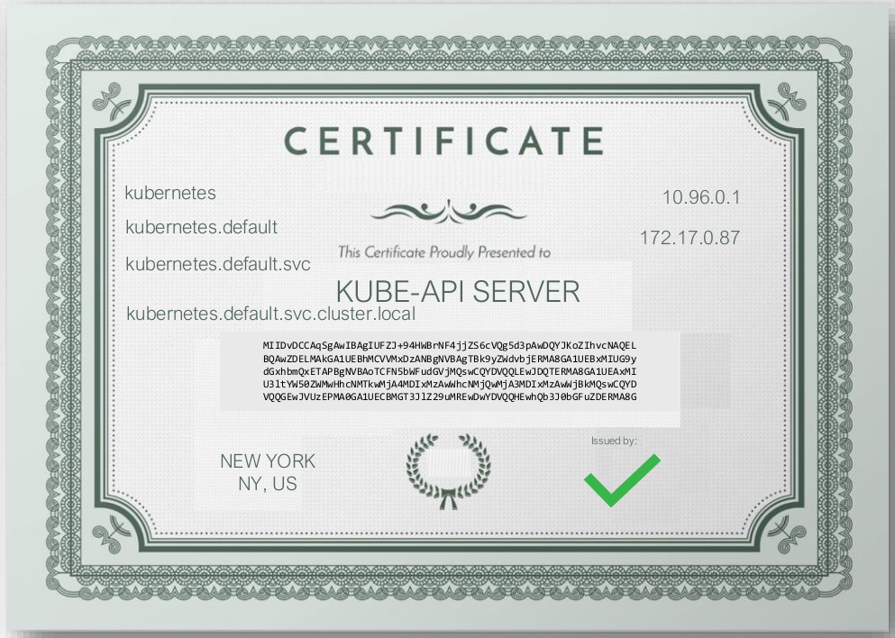


**Note:** The Kube API Server must have Alternative Names present the certificate.


**Note:** There needs to be a certificate for Kubelet on each Node in the cluster. The certificates are named after the Node.

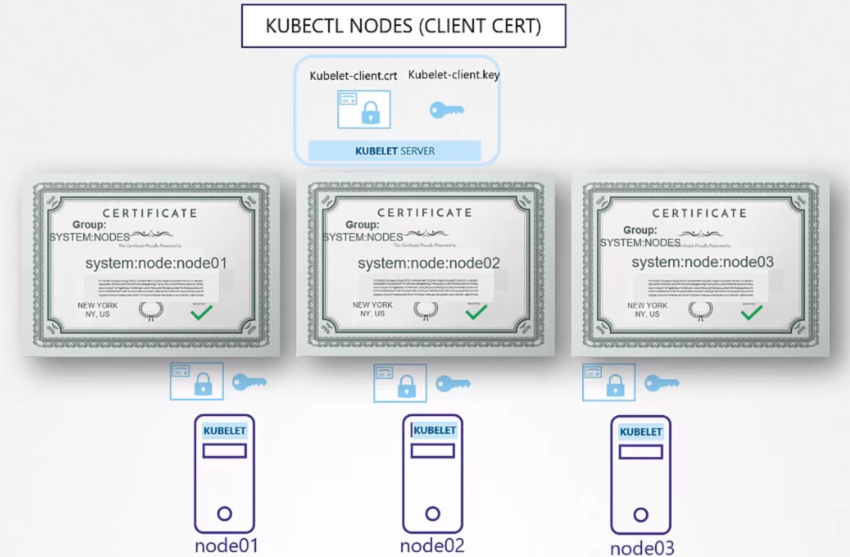

**Note:** Each Node also needs to have client certificates for Kubelet so they can talk to the Kube API Server. Since they are system components they need to have the name `system:node:$NODE_NAME`. These certificates go into the KUBECONFIG file and allow Kubectl to work.

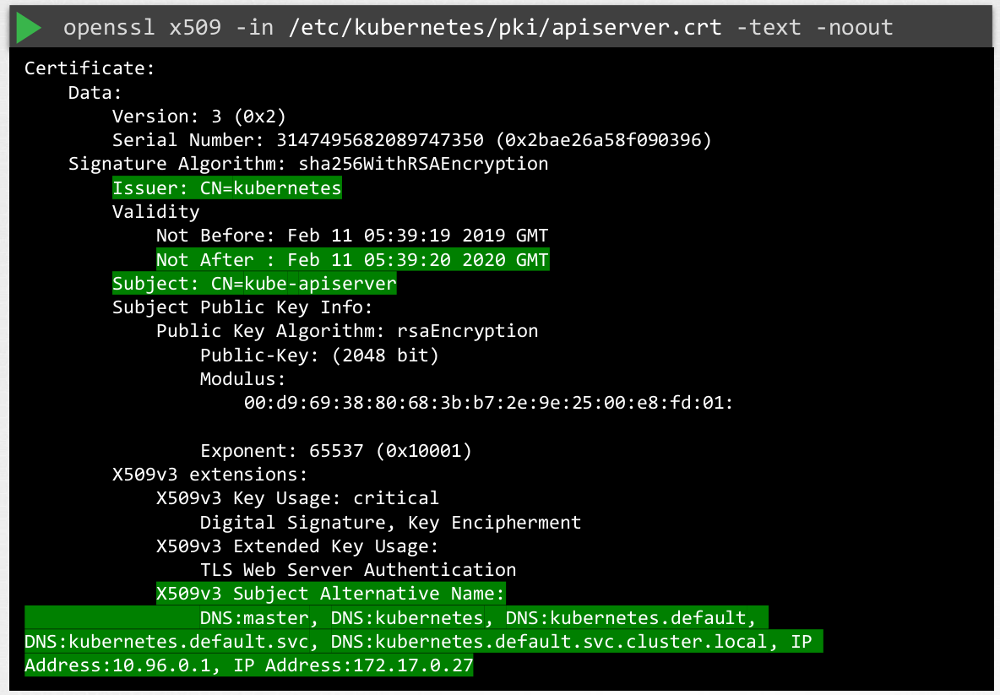

**Note:** When viewing the certificate's contents with `openssl x509 -in $CA_CERTIFICATE -text -noout` you need to pay attention to `Issuer`, `Validity`, `Subject`, and the `Subject Alternative Names`.

**Note:** When troubleshooting certificates, you need to look at the logs. This will either be `journalctl -u $CONTROL_PLANE_SERVICE -l` or `kubectl -n kube-system logs $CONTROL_PLANE_POD`. If that isn't work, trying Docker with `docker logs $CONTAINER_ID -f`.

### 6.2.2.2) Certificates API

* The CA server can be any server, since it is just hosting the public/private key pair. `kubeadm` makes the Master Nodes the CA servers.
* Instead of manually signing certificates through the command line, you can use the Certificates API and the CSR object.

https://kubernetes.io/docs/reference/access-authn-authz/certificate-signing-requests/

```bash
# Generate OpenSSL private key
openssl genrsa -out $PRIVATE_KEY 2048

# Create CSR for new Admin, or use a CSR object
openssl req -new -key $PRIVATE_KEY -subj "/CN=$USER/O=system:masters" -out $CSR
```

**Note:** The user's public key must be base64 encoded. Do this with `cat $PUBLIC_KEY |base64 | tr -d '\n' && echo`. We are using `tr` to delete all newlines as the CSR YAML definition file doesn't accept them. Use the script at https://kubernetes.io/docs/reference/access-authn-authz/certificate-signing-requests/#create-certificatesigningrequest and add `/metadata/name/$USERNAME`, `/spec/request/$BASE64_PUBLIC_KEY`, and the correct `/spec/groups/[i]/$USER_PERMISSION`.


```bash
# View certificate signing requests
kubectl get csr

# Deny CSR requests
kubectl certificate deny $USER

# Approve the CSR and k8s will create new certificate for the user using the CA certificate.
kubectl certificate approve $USER

# Get the certificate to share to the user
kubectl get csr $USER -o yaml
```


**Note:** The Controller Manager is responsible for all certificate related operations.

### 6.2.2.3) Kube Config

* The **Kube Config file** is used instead of supplying the certificates with every `curl` or `kubectl` command.

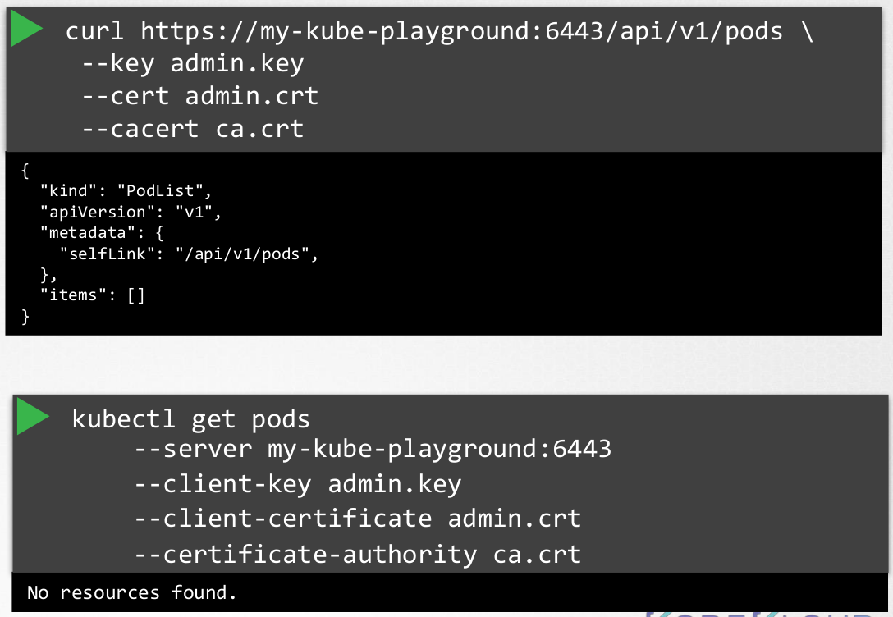

* The default Kube Config file is located at `~/.kube/config` but can be named whatever you like. You can set this in the environment variable `KUBECONFIG` or `kubectl --config $FILE`.
* The Kube Config file has 3 sections:
  1. `/clusters/[i]` contains all the k8s clusters you can access. The server CA certificate and connectiong details goes here.
  2. `/contexts/[i]` define which user account will be used to access which cluster. This uses the existing users and clusters within the
  3. `/users/[i]` are the accounts that you use to access the clusters. The username, certificate, and key goes here.

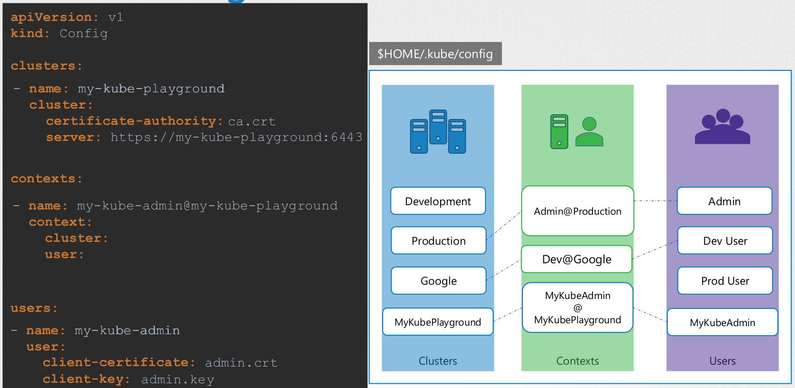
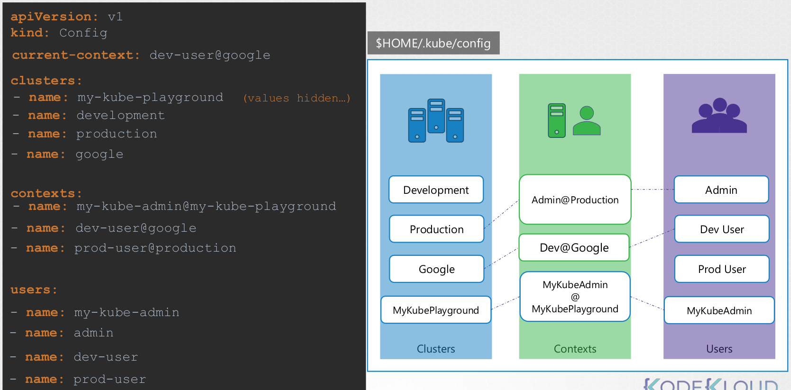

* The `/current-context` specifies which is the default context to use from the Kube Config file.
* The `/contexts/[i]/context/namespace` specifies which is the default namespace to use for the context from the Kube Config file.

```bash
# There are a variety of Kube Config related commands with kubectl
kubectl config $ARGS

# View the default ~/.kube/config file
kubectl config view

# View a custom default ~/.kube/my-config file
kubectl config view --kubeconfig=~/.kube/my-config\

# Change the current context being used within the Kube Config
kubectl config use-context $CONTEXT_NAME
```

**Note:** All `kubectl config` commands change the Kube Config file.

* There are 2 ways to specify the certificates to use within a Kube Config file:
  1. Using a relative or absolute path to the certificate file.
  2. Using the base64 encoded string of the certificate file contents.

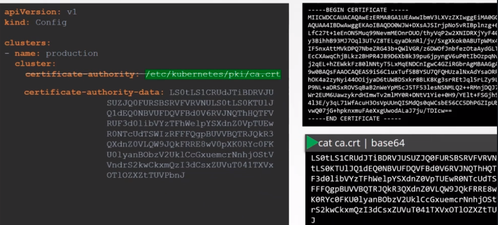

## 6.3) API Groups

* All k8s objects are grouped into different API Groups. Here are some groups from the k8s API:
  1. `/api` is the core group, and provides core cluster functionality through API versions.
  2. `/apis` is the named group, and provides core cluster functionality but through names instead of API versions.
  3. `/logs` used to integrate with third party logging solutions (e.g. prometheus).
  4. `/healthz` used to monitor the health of the cluster.
  5. `/metrics` used to get metric data about the cluster.
  6. `/version` views the version of the cluster.


* `/apis` has **API Groups** which provide a variety of functionality that relates to that particular group.
* `/apis` API Groups has **API Resources** which provides the specific implementation for the k8s object within it.
* `/apis` API Groups has API Resources which has **Verbs** (i.e actions) which provides the k8s object actions. Users need access to these Verbs to be able to perform actions in the cluster.

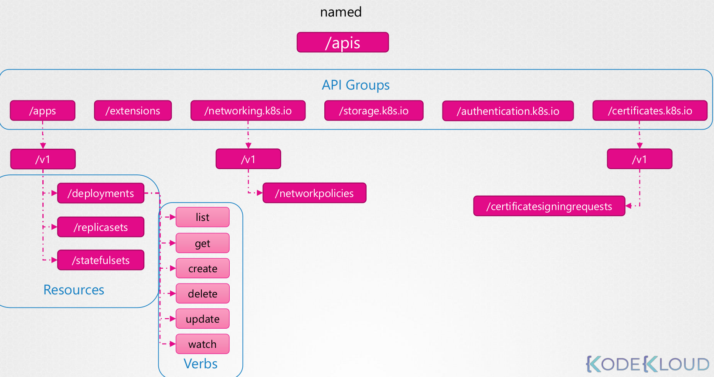

* The [k8s API Reference page](https://kubernetes.io/docs/reference/) shows all the API Groups and the objects within them.
* You can view your cluster's API Groups using `curl -k http://$ADDRESS:6443` and you can view your cluster's API Resources using `curl -k http://$ADDRESS:6443/api | grep name`

**Note:** You still need to authenticate with the API, you can do this by passing your certificates via `curl --key $KEY --$CERT --cacert $CA_CERT` or using your KUBECONFIG via `kubectl proxy`.

* `kubectl proxy` launches a local client on `127.0.0.1:8001` can uses your Kube Config File to access the cluster. You just need to replace port 6443 with 8001 when using curl.

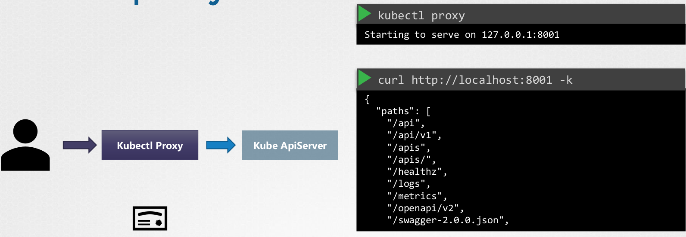

## 6.4) Authorisation

* **Authorization** gives authenticated users permission to access a resource.
* There are 6 types of authorisation in k8s:
  1. **Node authorisation** is a special mode that authorises API requests made my kubelet agents.
  
  2. **Attribute Based Access Control (ABAC)** grants access rights to users.
  
  3. **Role Based Access Control (RBAC**) grants access rights to roles, and roles are assigned to users. This is a common approach for authorisation.
  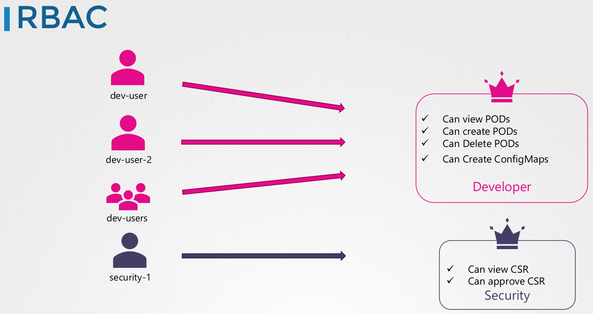
  4. **Webhook** is a HTTP callback, i.e. an event notification using HTTP POST. k8s will query an external REST service when determining user privileges.
  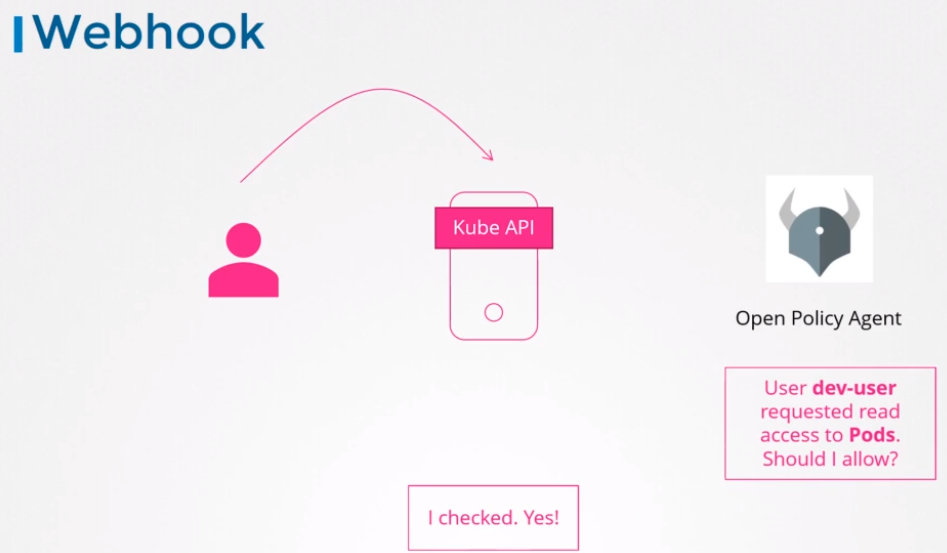
  5. **AlwaysAllow** allows all requests in the cluster. This is the default is nothing is set.
  6. **AlwaysDeny** denys all requests in the cluster.
* The authorisation modes are set with the `kube-apiserver --authorization-mode=$ACCESS_MODE1,$ACCESS_MODE2`. When multiple authorisation modes are configured, the access request is checked by going to each mode sequentially until access is granted or all nodes have been visited and no access is granted.


### 6.4.1) RBAC

* RBAC is commonly used for authentication in many applications. Because it is easy to maintain a single role for many users, than maintaining ABAC for many users.
* When using RBAC, you need to either create a Role and RoleBinding. The **Role** provides the authorised access details and the **RoleBinding** links a user to a Role. This can be created with YAML definition files or imperative commands.


```bash
# Create a Role
kubectl create role developer --verb=$API_GROUP_VERB1,$API_GROUP_VERB2 --resource=$K8S_OBJECT -n $NAMESPACE

# Create a RoleBinding
kubectl create rolebinding $NAME --role=$ROLE_NAME --user=$USERNAME

# View access permissions for a Role
kubectl describe role $NAME

# View what users can use a Role
kubectl describe rolebinding $NAME

# Check what a user can do
kubectl auth can-i $API_GROUP_VERB $K8S_OBJECT --as $USER
```

* RBAC can cover namespaces and specific objects within a namespace. Use the `/roles/[i]/resourceNames` array to specific which objects.


### 6.4.2) Namespaced vs Cluster Scoped

* There are 2 scopes within k8s
  1. Namespaced, i.e. the scope is a namespace.
  2. Cluster scoped, i.e. the scope is the entire cluster.
* Roles and RoleBindings are created within namespaces. If you don't specificy a namespace they will be created in `default`.
* ClusterRoles and ClusterRoleBindings are created within the cluster, i.e. they cover all namespaces within the cluster.
* A ClusterRole can be used to grant access to all resources in all namespaces.

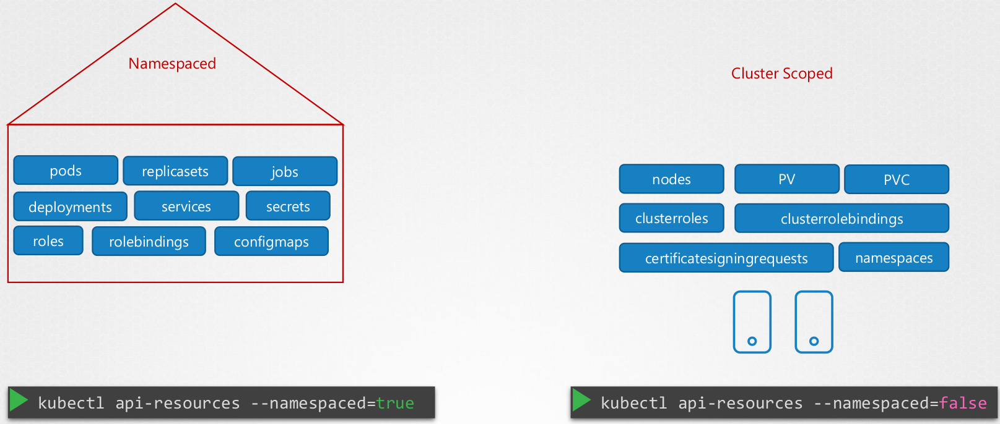

```bash
# View all namespaced scoped objects
kubectl api-resources --namespaced=true

# View all cluster scoped objects
kubectl api-resources --namespaced=false

# Create a ClusterRole
kubectl create clusterrole developer --verb=$API_GROUP_VERB1,$API_GROUP_VERB2 --resource=$K8S_OBJECT

# Create a ClusterRoleBinding
kubectl create clusterrolebinding $NAME --clusterrole=$CLUSTER_ROLE_NAME --user=$USERNAME

# View access permissions for a ClusterRole
kubectl describe clusterrole $NAME

# View what users can use a ClusterRole
kubectl describe clusterrolebinding $NAME

# Check what a user can do
kubectl auth can-i $API_GROUP_VERB $K8S_OBJECT --as $USER
```

## 6.5) Security

The details for this can be found in in the developer's course under the section [Security](../02.applications-developer/README.md#24-security)

### 6.5.1) Image Security

* The `/spec/containers/[i]/image: image-name` value has some rules from Docker:
  * The name of the image is assumed to be the name of the Docker account supplying the image and this account gets implicitly added. e.g. `image: nginx` expands into `image: nginx/nginx` which is `image: docker-hub-username:image-name`
  * The registry used to pull images is assumed to be https://docker.io and this is added implicitly. e.g. `image: nginx` becomes `image: docker.io/nginx/nginx`
  * You can add whatever image registry you like, you just need to specify it like `image: $REPO_URL/$REPO_USERNAME/$IMAGE_NAME`.

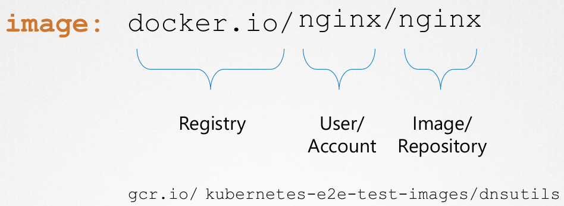

* To access a private image repository in Docker you need to:
  1. Log in with `docker login $REPO_URL` with a username and password.
  2. Run the app with `docker run $REPO_URL/$USERNAME/$IMAGE_NAME`


* To access a private image repository in k8s you need to:
  1. Create a Docker Registry Secret for the docker credentials. `kubectl create secret docker-registry $NAME --docker-server=$URL --docker-username=$USER --docker-password=$PASSWORD --docker-email=$EMAIL`
  2. Supply the `/spec/imagePullSecrets/[i]/name` with the Docker Registry Secret.
  3. Supply the `/spec/containers/[i]/image: $REPO_URL/$USERNAME/$IMAGE_NAME` in the YAML definition file.


## 6.5) Network Policies

The details for this can be found in in the developer's course under the section [Network Policy](../02.applications-developer/README.md#53-network-policy)

**Note:** Sometimes you need to add a Network Policy to allow DNS resolution.

# 7) Storage

## 7.1) Docker Storage

### 7.1.1) Storage Drivers

* Docker stores its local data inside of `/var/lib/docker`.


* When Docker builds images, it builds them in a layered architecture. Every line in a Docker File is created in `/var/lib/image` as its own layer. Each layer only stores what has changed since the previous layer.
* The final image will have mutliple layers in it. When rebuilding an image the layer will only change if the Docker File has changed.
* The layered image approach means Docker can save time when building and space storing image layers. It does this by reusing layers.

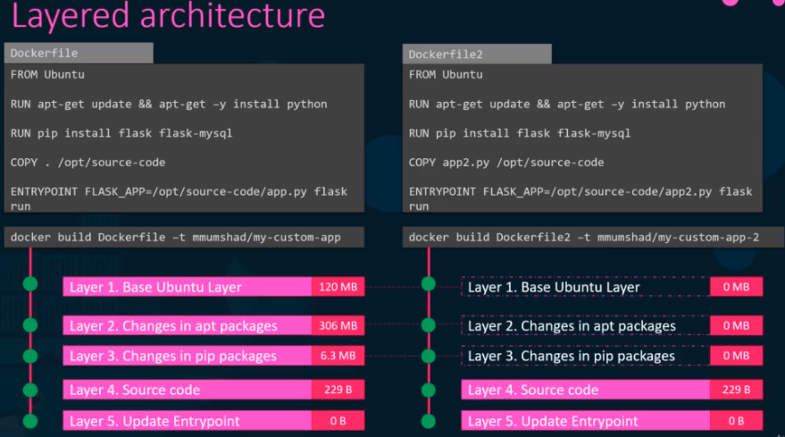

* All of the layers that were used to build a Docker Image become read only when inside a container. They are known as the **Image Layer**. The same Image Layer is shared by all containers using this image.
* A running container has a writeable layer called ther **Container Layer**. All new files created in the container are in the Container Layer. If you try to make any changes to files inside of a container that are from the Image Layer, they will be copied to the Container Layer and all changes will be made there. This is called **Copy On Write.**

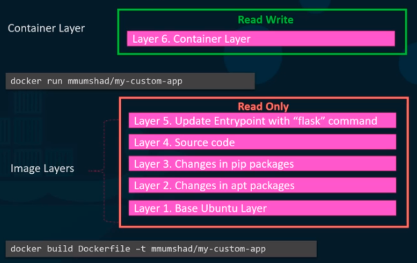

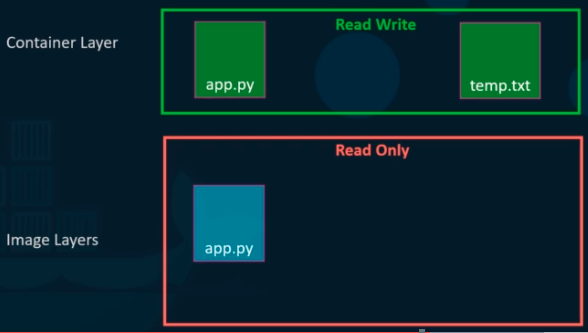

* The Container Layer and its data is destroyed when the container exits. If you want to data to persist after that container is destory, you need to use a Docker Volume.
* There are 2 types of mounting in Docker:
  1. **Volume mounting** is using a Docker Volume inside of `/var/lib/docker/volumes/`
  2. **Bind mounting** is using a path from the filesystem on the Docker host. 


**Note:** Using `--mount` is prefered over the original `-v` when mounting Volumes.

* The **Storage Driver** controls how images and containers are stored and managed on your Docker host. The selection of the Storage Driver is determined by what the underlying O/S supports. There are many Storage Drivers.


https://docs.docker.com/storage/storagedriver/select-storage-driver/

### 7.1.2) Volume Drivers

https://docs.docker.com/engine/extend/plugins_volume/#docker-volume-plugins

* **Volume Drivers** control how Docker Volumes are managed on your Docker host. Plugins are used to provide this functinoality and there are many types of Volume Driver Plugins.
* The Local Volume Driver Plugin is what creates and manages `/var/lib/docker/volumes`

### 7.1.3) k8s Cluster Interfaces

* The **Container Runtime Interface (CRI)** is a standard that provides the details on how to create third party container runtime engine plugins to interact with the k8s cluster without having their code in the k8s code base. Traditionally only Docker was supported and the Docker support was written directly in the k8s code base. This approach changed when more CRE providers like CRI-O and containerd became mature.
* The **Container Network Interface (CNI)** is a standard that provides the details on how to create third party networking solution plugins to interact with the k8s cluster without having their code in the k8s code base.
* The **Container Storage Interface (CSI)** is a standard that provides the details on how to create third party storage solution plugins to interact with the k8s cluster without having their code in the k8s code base.


**Note:** The CSI is a universal standard that exists outside of k8s and allows a number of container orchestration tools to interface with third party storage plugins.


## 7.2) k8s Storage

### 7.2.1) Volumes

The details for this can be found in in the developer's course under the section [Volumes](../02.applications-developer/README.md#61-volumes)

### 7.2.2) Persistent Volumes

The details for this can be found in in the developer's course under the section [Persistent Volumes](../02.applications-developer/README.md#62-persistent-volumes)

### 7.2.3) Persistent Volume Claims

The details for this can be found in in the developer's course under the section [Persistent Volume Claims](../02.applications-developer/README.md#persistent-volume-claims)

### 7.2.4) Storage Classes

The details for this can be found in in the developer's course under the section [Storage Classes](../02.applications-developer/README.md#71-storage-classes)

# 8) Networking

## 8.1) Linux Networking Basics

### 8.1.1) Switching, Routing, & Gateway

* A **Computer Network** is a group of connected computing devices that can communicate with each other.


* A computing device on a network must have a **Network Interface** which allows traffic to flow into and out of the computing device. These can be physical cards (i.e. NICs) installed into the computing device or a virtual interface made from software only.
* A network interface requires an IP address so it can communicate with other devices on the network.

```bash
# View the interfaces on the host
ip -c -h link
ip -c -h l


# More verbose output
ip -c -h address
ip -c -h addr
ip -c -h a
```

```bash
# Manually add an IP address to an interface. Need to do this on all hosts.
ip addr add $CIDR dev $NETWORK_INTERFACE

# Test connectivity between 2 hosts
ping -c $PING_COUNT $TARGET_IP_ADDRESS
```

* **Note:** By default Linux does not forward packets between network interfaces on the same host.

```bash
# Check if network interface packet forwarding is on. 1 is on and 0 is off.
cat /proc/sys/net/ipv4/ip_forward
sysctl net.ipv4.ip_forward

# Update lost on reboot
echo 1 > /proc/sys/net/ipv4/ip_forward

# Update held on reboot
cat >> /etc/sysctl
net.ipv4.ip_forward = 1

sysctl -w net.ipv4.ip_forward=1
```

* **Switches** connect devices within a network and forward data packets to and from those devices. Unlike a router, a switch only sends data to the single device it is intended for, not to networks of multiple devices. Thus they are only used for devices on the same network.


* **Routers** select paths for data packets to cross networks and reach their destinations. Routers do this by connecting with different networks and forwarding data from network to network. They are required for internet connectivity and home users will have a small switch, router, and modem combination device.

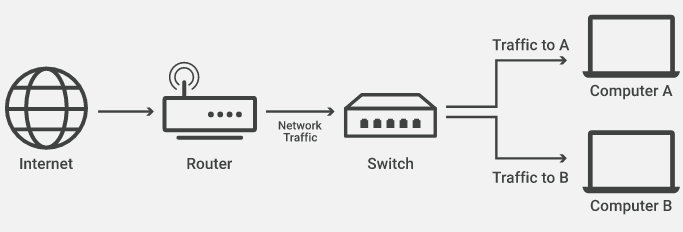


* A **Gateway** is a network node that serves as an access point to another network, often involving not only a change of network addressing, but also a different networking technology. This is also known as the Route.

```bash
# Display the systems gateway / route
route -n
ip -c -h route
ip -c -h r

# Manually add a gateway / route between to local networks. Need to do this on all hosts.
ip route add $CIDR via $GATEWAY_IP_ADDRESS
```


* A **Default Gateway** is the node in a computer network using that serves as the forwarding host (i.e. router) to other networks when no other route specification matches the destination IP address of a packet. This is typically used for internet connectivity as its easier to say forward all traffic to any address that the gateway doesn't know about, rather than listing every address on the internet!

```bash
# Manually add a default gateway / route
ip route add default via $DEFAULT_GATEWAY_IP_ADDRESS

# 0.0.0.0 means any IP address, this is the same as above.
ip route add 0.0.0.0 via $DEFAULT_GATEWAY_IP_ADDRESS
```


* **Note:** When troubleshooting internet connectivity issues, a good place to start is checking the default gateway.

#### 8.1.1.1) Setting Up Linux As A Router

* This exmample has 3 hosts, Host A, Host B, and Host C.
* Host A and Host C are on different subnets, 192.168.1 and 192.168.2 respectively. They already 1 network inferface each and already have IP addresses assigned to them, 192.168.1.5 and 192.168.2.5.
* Host B will be the router for Host A and Host C. Host B has 2 network interfaces and the IP addresses 192.168.1.6 and 192.168.2.6.
* There are 3 steps to configure this setup:
  1. Add a route from Host A to Host C via Host B `ip route add 192.168.2.0/24 via 192.168.1.6`
  2. Add a route from Host C to Host A via Host B `ip route add 192.168.1.0/24 via 192.168.2.6`
  3. Allow packet forwarding between network interfaces on Host B `echo 1 > /proc/sys/net/ipv4/ip_forward`
  
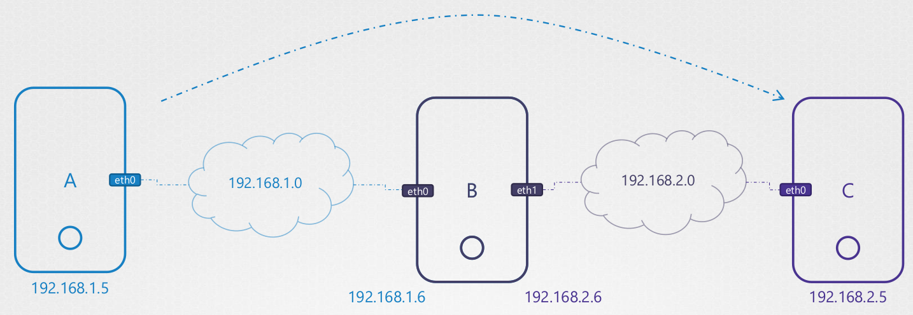

### 8.1.2) DNS

https://www.cloudflare.com/en-gb/learning/dns/what-is-dns/

* The **Domain Name System (DNS)** is the phonebook of the network, including the Internet. Humans access information online through domain name. Computers interact through Internet Protocol (IP) addresses. DNS translates domain names to IP addresses.
* Local DNS hostname resolution is done via `/etc/hosts`.

```bash
# Assign an IP address to a hostname
cat >> `/etc/hosts
$IP_ADDRESS $HOSTNAME
```

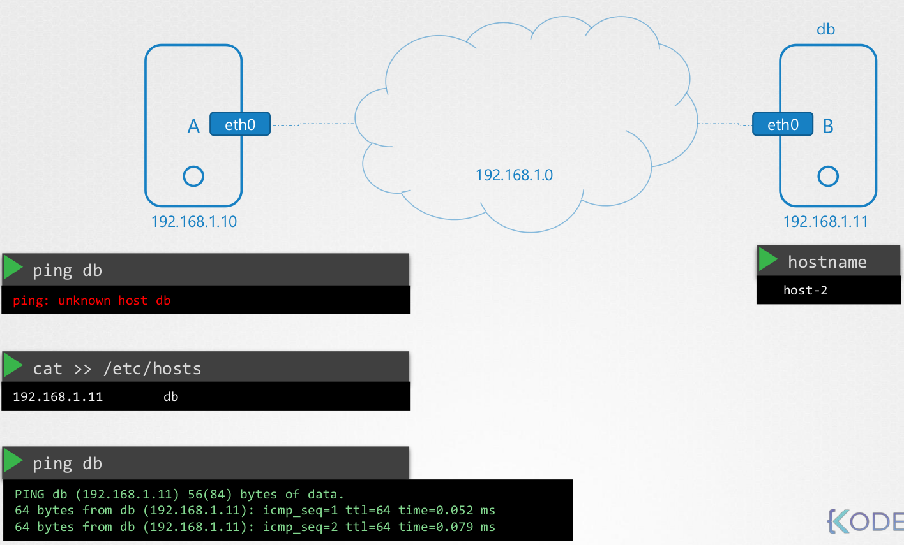

* Local DNS hostname resolution does not scale though, as every host needs to be updated.

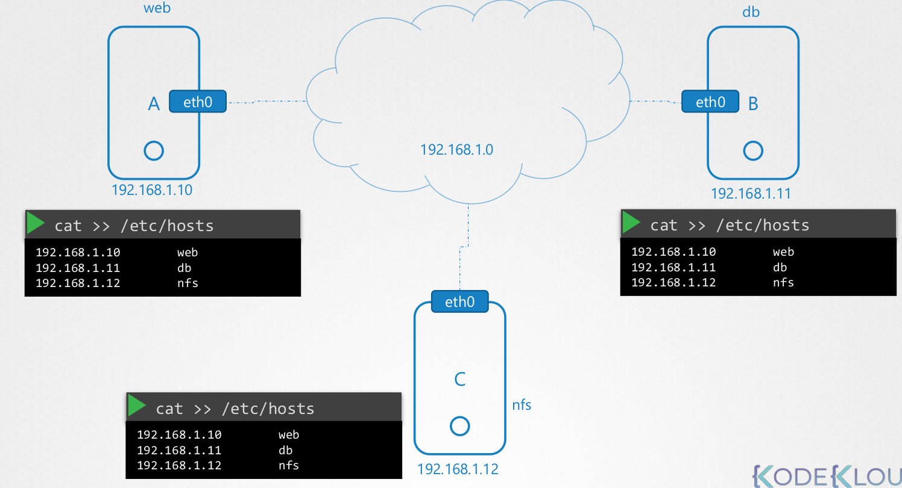

* A DNS nameserver is used for centralised DNS hostname resolution. This is known as a nameserver. The IP address of the DNS nameserver can be found at `/etc/resolv.conf`. The DNS nameserver listens on port 53 by default and there are many software solutions available for this.

**Note:** On a host running SystemD, `/etc/resolv.conf` is a symlink to `/run/systemd/resolve/resolv.conf` and the address in there will be `127.0.0.53`. This is the address that `systemd-resolved` is listening for DNS queries. The real IP addresses of the nameservers are in `/run/systemd/resolve/resolv.conf`.


* The default order of searching for nameservers is `/etc/hosts` and then `/etc/resolv.conf` but this can be changed. To change this, update `/etc/nsswitch.conf` and the `hosts:` line.
* When trying to reach Internet hostnames, you will need to use a public internet DNS nameserver like Google's `8.8.8.8` or Cloudflare's `1.1.1.1` and they will be able to resolve any DNS queries that your local nameservers cannot resolve. If you have a DNS nameserver then you should add this there, otherwise in the local file is okay.


```bash
# Query a nameserver for DNS resolution
nslookup $IP_ADDRESS
nslookup $DOMAIN

dig $IP_ADDRESS
dig $DOMAIN
```

**Note:** `nslookup` only queries the nameserver, it ignores your `/etc/hosts` files.

#### 8.1.2.1) Domain Names

* A **Domain Name** is an alphanumeric name with one or more periods, e.g. https://www.google.com and each entry is called a label. Domain names act as a pointer to an IP address on a computer network such as the Internet. They are used as they are easy for humans to remember.


* There a 4 levels in the entire domain name:
  1. **Root level domain** is the highlest level in the DNS hierarchy. It does not have a formal name and its label in the DNS hierarchy is typically an empty string. It sometimes can be represented as a single dot. e.g. `www.google.com.` the final dot is the root level domain.
  2. **Top level domains (TLD)** are used to group like objects together. e.g. .com is for comerical businesses.
  3. **Domain** name is owned by a person or company and is used to host their services.
  4. **Subdomains** are used to group things together under the domain. e.g. with Google `www` is for their search engine, `maps` is for Google Maps, `mail` is for GMail and so forth. You can have as many subdomains as you like.

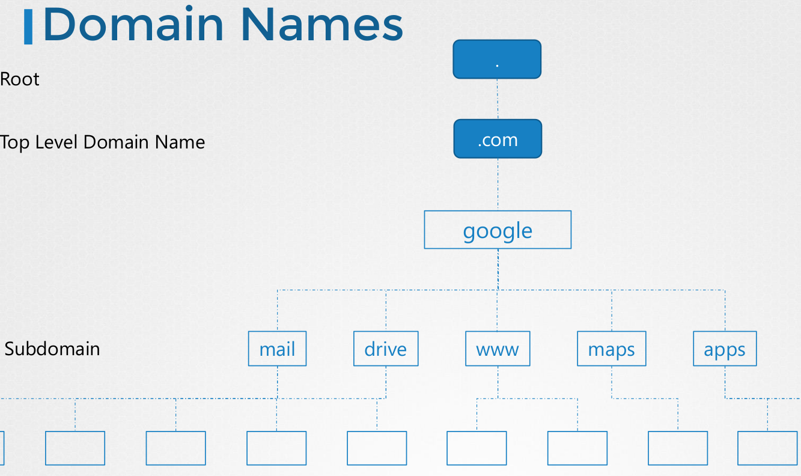

**Note:** The domain name forms a tree structure.

#### 8.1.2.2) Domain Name Resolution

https://www.cloudflare.com/en-gb/learning/dns/dns-server-types/

* There are potentially 6 steps when your computer tries to resolve a domain name:
  1. The application making the DNS query checks its DNS cache to see if it knows the answer. If yes hostname is resolved, if no it asks the O/S.
  2. On behalf of the application, the O/S checks its DNS cache to see if it knows the answer. If yes hostname is resolved, if no it asks the DNS Resolver. This could be a local nameserver or a network nameserver.
  3. On behalf of the application and O/S, the DNS Resolver checks its DNS cache to see if it knows the answer. If yes hostname is resolved, if no it asks the Root DNS Server.
  4. On behalf of the DNS Resolver, the Root DNS Server checks its DNS cache to see if it knows the answer. If yes hostname is resolved, if no it points to the TLD Server.
  5. On behalf of the DNS Resolver, the TLD Server checks its DNS cache to see if it knows the answer. If yes hostname is resolved, if no it points to the authoriatve namesever, i.e. the nameserver at the domain itself.
  6. On behalf of the DNS Resolver, the authoriatve namesever replies what the IP address is for the DNS query.

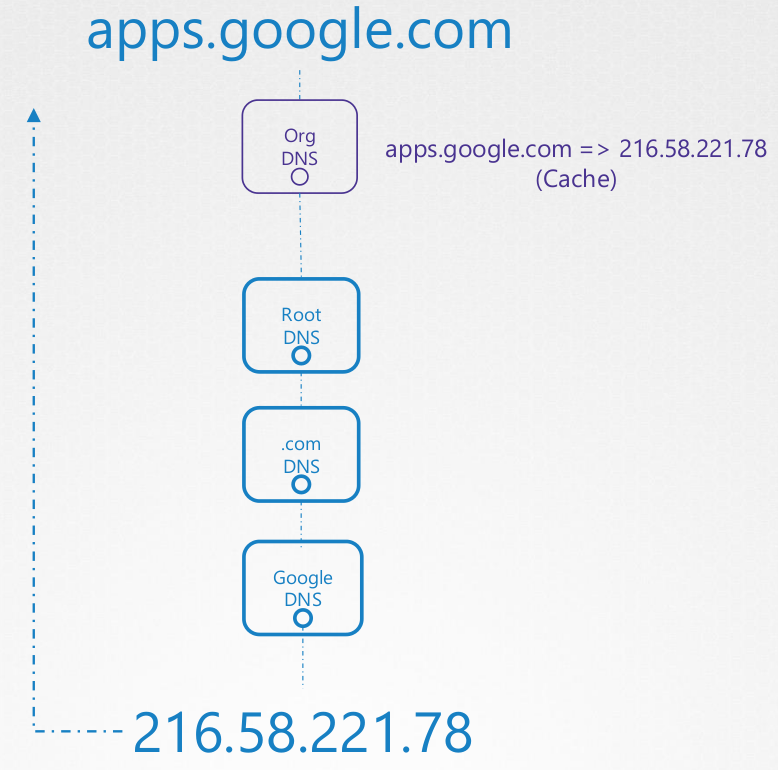

**Note:** Steps 1 and 2 are ommitted from the picture above.

* The `/etc/resolve.conf` file can have an entry called `search $DOMAIN` which means everytime you enter a subdomain it will automatically search the nameserver for `$SUBDOMAIN.$DOMAIN`.


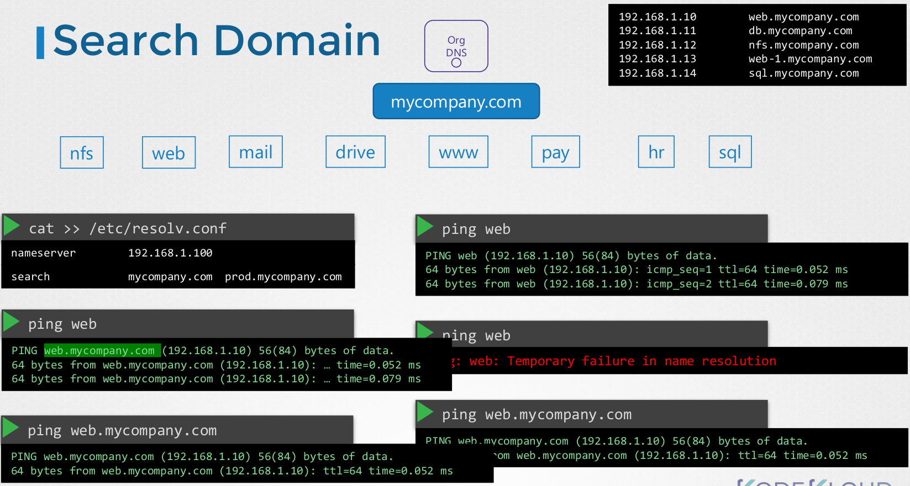

#### 8.1.2.3) DNS Record Types

https://www.cloudflare.com/en-gb/learning/dns/dns-records/


* **DNS records** are text files on authoritative DNS servers and provide information about a domain, including what IP address is associated with that domain and how to handle requests for that domain.
* Here are 3 common DNS record types:
  1. **A** maps a domain to an IPv4 address. https://www.cloudflare.com/en-gb/learning/dns/dns-records/dns-a-record/
  2. **AAAA** maps a domain to an IPv6 address.
  3. **CNAME (Canonical Name)** forwards the traffic for one domain or subdomain to another domain. It does not provide an IP address. https://www.cloudflare.com/en-gb/learning/dns/dns-records/dns-cname-record/


### 8.1.3) CoreDNS

* https://kubernetes.io/docs/tasks/administer-cluster/coredns/
* https://kubernetes.io/docs/tasks/administer-cluster/dns-custom-nameservers/

* **CoreDNS** is DNS nameserver software that’s often used to support the service discovery function in containerized environments, particularly those managed by Kubernetes. This is recommend DNS solution for k8s.
* It can be deployed as an O/S service from a binary or as a `kube-system` Pod on the Master Nodes.
* In a basic set up, the `/etc/hosts` file of the nameserver has all of the DNS entries added to it and then that is passed into CoreDNS via a `Corefile`. You can also use k8s plugins to do this.

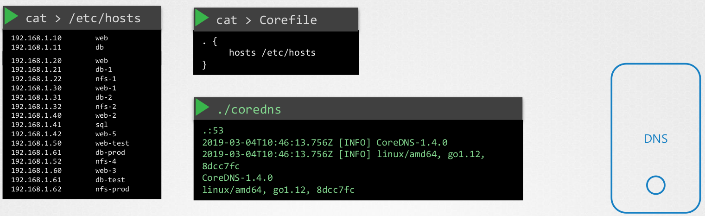

### 8.1.4) Linux Network Namespaces

* The **ARP (Address Resolution Protocol)** is a network protocol used to find out the hardware (MAC) address of a device from an IP address.

```bash
# View the ip Address / MAC address combination
arp -n
```

* **Network Namespaces** are used by CRE to implement network isolation. The network namespace needs it own virtual network interface as it cannot see or use the CRE host network interfaces.

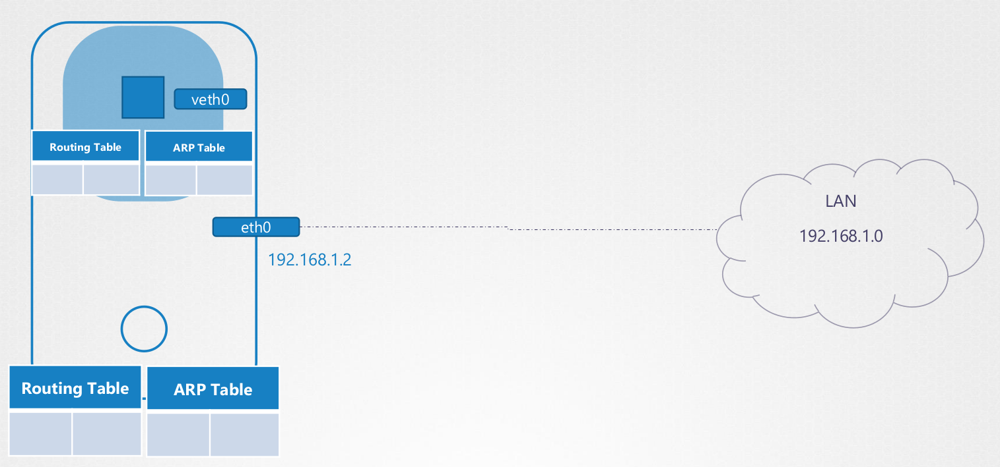

```bash
# Create a network namespace
ip ns add $NAMESPACE

# List network namespaces
ip listns

# Run commands within the network namespace
ip netns exec $NAMESPACE ip link
ip -n $NAMESPACE link
```

* You can connect 2 network namespaces via their virtual network interfaces using a virtual ethernet cable, called a pipe.
* **VETH (Virtual Ethernet)** are a local ethernet tunnel. They are created in pairs and packets transmitted between the 2 are immediately received. VETHs are used to connect network namespaces together, which also includes the host's main network namespace. https://developers.redhat.com/blog/2018/10/22/introduction-to-linux-interfaces-for-virtual-networking/#veth

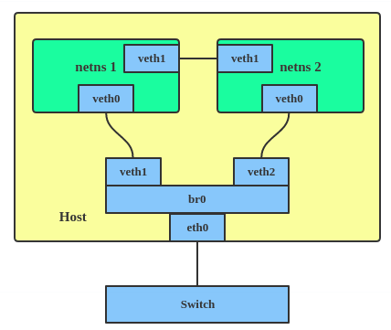

```bash
# Create a virtual ethernet cable (i.e. pipe) between 2 virtual network interfaces on separate network namespaces
ip link add $VIRTUAL_INTERFACE_A type veth peer name $VIRTUAL_INTERFACE_B
```

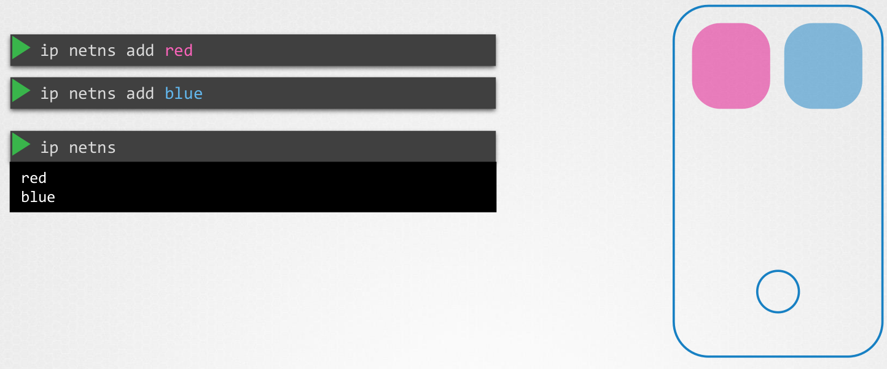

```bash
# Attach each virtual interface to their respective network namespace
ip link set $VIRTUAL_INTERFACE_A netns $NAMESPACE_A
ip link set $VIRTUAL_INTERFACE_B netns $NAMESPACE_B

# Assign IP addresses to the virtual network interfaces
ip -n $NAMESPACE_A addr add $IP_ADDRESS dev $VIRTUAL_INTERFACE_A
ip -n $NAMESPACE_B addr add $IP_ADDRESS dev $VIRTUAL_INTERFACE_B

# Bring the network interfaces UP, as they will be DOWN
ip -n $NAMESPACE_A link set $VIRTUAL_INTERFACE_A up
ip -n $NAMESPACE_B link set $VIRTUAL_INTERFACE_B up

# Test connectivity
ip netns exec $NAMESPACE_A ping $IP_ADDRESS

# Delete a virtual ethernet cable, this will delete both interfaces and the cable.
ip -n $NAMESPACE_A del $VIRTUAL_INTERFACE_A
```


```bash
# Create a virtual switch using Linux Bridge. This appears as an interface on the CRE host.
ip link add $VIRTUAL_SWITCH type bridge

# Bring the virtual switch UP, as it will be DOWN
ip link set $VIRTUAL_SWITCH up
```


```bash
# Create new virtual ethernet cables and interfaces that connect to the virtual switch
ip link add $VIRTUAL_INTERFACE_A type veth peer name $VIRTUAL_CABLE_NAME

# Add the virtual interfaces to their respective endpoints
ip link set $VIRTUAL_INTERFACE_A netns $NAMESPACE_A
ip link set $VIRTUAL_CABLE_NAME master $VIRTUAL_SWITCH

# Add IP addresses and make the links UP
ip -n $NAMESPACE_A addr add $IP_ADDRESS dev $VIRTUAL_INTERFACE_A
ip -n $NAMESPACE_A link set $VIRTUAL_INTERFACE_A up
```


**Note:** If you really wanted to access the virtual switch from the CRE host, you just need to add an IP address to the virtual switch on the CRE host. `ip addr add $CIDR dev $VIRTUAL_INTERFACE_A`

```bash
# Add a route entry into the CRE host network interface so the network namespace can read another host on the network
ip netns exec $NAMESPACE ip route add $TARGET_CIDR via $CRE_HOST_VIRTUAL_INTERFACE_IP_ADDRESS

# View the new route
ip netns exec $NAMESPACE route
```


```bash
# Enable NAT on CRE host to translate from virtual network interface IP address to the physical NIC IP address
iptables -t nat -A POSTROUTING -s $CRE_HOST_VIRTUAL_INTERFACE_CIDR -j MASQUERADE
```


```bash
# Add a default gateway to allow egress traffic to the internet
ip netns exec $NAMESPACE ip route add default via $CRE_HOST_VIRTUAL_INTERFACE_IP_ADDRESS

# Allow ingress traffic from the internet with port forwarding
iptables -t nat -A PREROUTING --dport 80 --to-destination $CRE_HOST_PHYSICAL_NIC_IP_ADDRESS:$PORT -j DNAT
```


**Note:** When trying to troubleshoot connectivity between network namespaces, check that you are using CIDR addresses and check firewall rules.

* The general steps for all of the above is:
  * Create the network namespaces.
  * Create the bridge network interface.
  * Create VETH pairs.
  * Attach VETH A to namespaces.
  * Attach VETH B to bridge.
  * Assign IP address to everything.
  * Bring all the interfaces UP.
  * Enable NAT for external communication.

## 8.2) Docker Networking

* When you run a Docker container, you have different networking options to choose from. Some are:
  * **None network**, the Docker container is not attached to any network and cannot be accessed external and it cannot access anything itself.
  
  * **Host network**, the Docker container is attached the CRE host network. So there is no isolation between the CRE host network and the Docker container network. Thus a Docker container listening on port 80 can be accessed via the CRE host's `$CRE_HOST_IP_ADDRESS:80`
  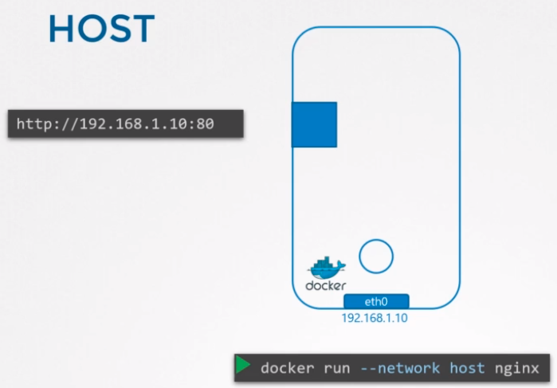
  * **Bridge network**, a virtual internal private network is created using Linux namespaces and the Docker containers attach to it.
  

### 8.2.1) Docker Bridge Network

```bash
# View the Docker network interfaces on the CRE host, it will be named bridge
docker network ls

# View the Docker network interfaces on the CRE host, it will be named docker0
ip -c -h a
```

* The default address for the bridge network is `172.17.0.0` and every Docker container attached this virtual internal private network gets and IP address from this range.
* Docker uses similar steps discussed in [Linux network namespaces](#814-linux-network-namespaces). The general steps are:
  * Create the network namespaces.
  * Create the bridge network interface.
  * Create VETH pairs.
  * Attach VETH A to namespaces.
  * Attach VETH B to bridge.
  * Assign IP address to everything.
  * Bring all the interfaces UP.
  * Enable NAT for external communication.


* VETH pairs can be identified by using numbers, and odd and even combination is used.

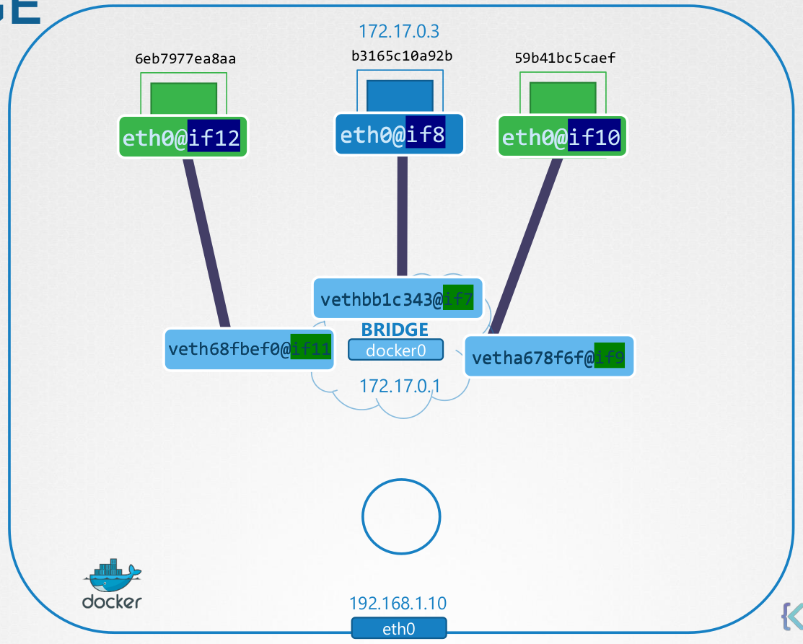

* The Docker container needs to have its port mapped to a CRE host port. This is so traffic sent to the host can be forwarded to the container. This is done through NAT.


## 8.3) Container Network Interface (CNI)

* All of the CNI solutions solve the networking of containers the same way. The general steps are:
  * Create the network namespaces.
  * Create the bridge network interface.
  * Create VETH pairs.
  * Attach VETH A to namespaces.
  * Attach VETH B to bridge.
  * Assign IP address to everything.
  * Bring all the interfaces UP.
  * Enable NAT for external communication.

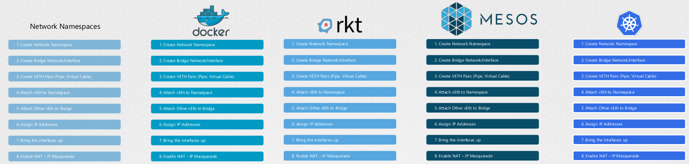

* So the **Container Network Interface (CNI)** standard was created as a centralised approach that every CRE solution can follow. The CNI does all the required tasks to get a container attached to a bridge network.

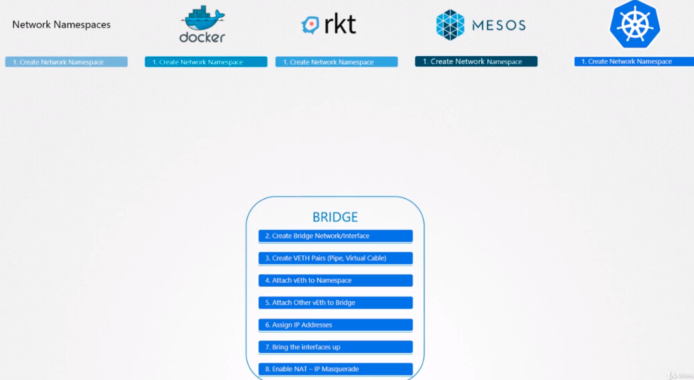
  
* The exception is Docker, they developed their own which is called the **Container Network Model (CNM)**. The CNM does all the required tasks to get a container attached to a bridge network. Docker can implement CNI, but you must use the None Network and then do it yourself manually.

**Note:** k8s using the None Network with Docker and implements a CNI as its container networking solution.


* The programs implementing the CNI are called plugins. Some CNI network plugins are:
  * Flannel
  * Calico
  * Weave

**Note:** In the CKA exam you are unable to go to third party websites and since the k8s documentation is vendor netural you need to go to third party websites for install instructions. But there is [one page left](https://kubernetes.io/docs/setup/production-environment/tools/kubeadm/high-availability/#steps-for-the-first-control-plane-node) talking about how to install the Weave CNI network plugin, it is step 2.

## 8.4) k8s Cluster Networking

### 8.4.1) Network Setup & Ports

* Each Node in the Cluster must:
  * Have at least one network interface connected to a network.
  * Have an IP address allocated to the network interface.
  * Have a unique hostname and MAC address.
  * And the [following ports](https://kubernetes.io/docs/setup/production-environment/tools/kubeadm/install-kubeadm/#check-required-ports) need to be opened.

**Note:** When troubleshooting why the cluster isn't working, check that the required ports are open with `ss -lntp`.


* Master Node ports:
  * 6443: the `kube-apiserver` listens for API requests on this port.
  * 10250: all `kubelet` agents listens on this port.
  * 10251: the `kube-scheduler` listens on this port.
  * 10252: the `kube-controller-manager` listens on this port.
  * 2379: ETCD listens locally on this port.
  * 2380: ETCD listens to other ETCD clients on this port. This is only needed in a Cluster with multiple Master Nodes.
* Worker Node ports:
  * 10250: all `kubelet` agents listens on this port.
  * 30000-32767: Services use this port range to listen on.

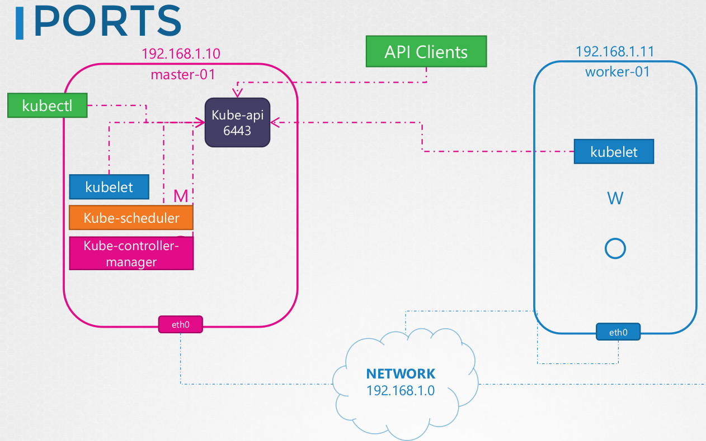

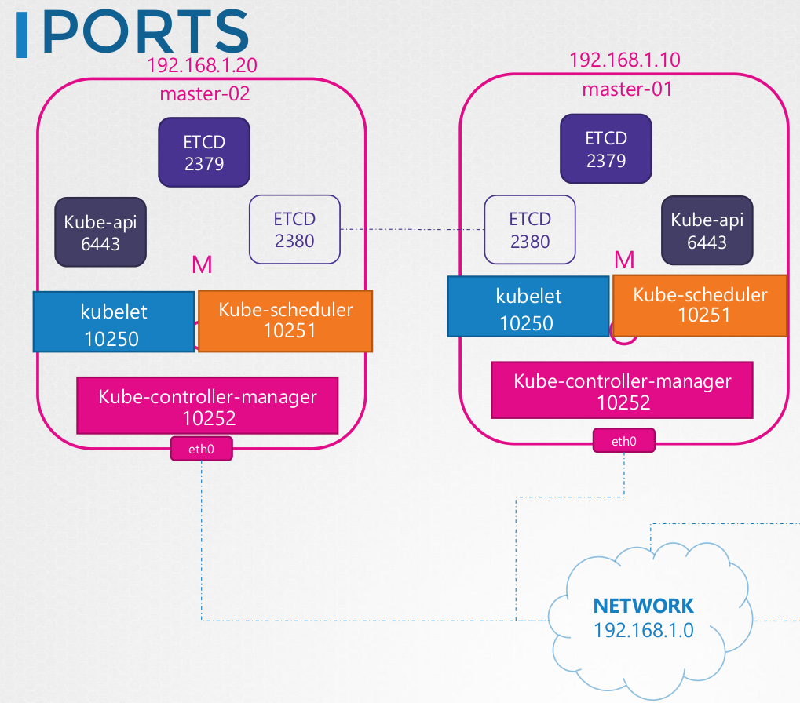

### 8.4.2) Pod Networking

* k8s doesn't supply a networking solution natively. There are 3 requirements for any Pod networking solution:
  1. Every Pod should have an IP address.
  2. Every Pod should be able to communicate with every other Pod in the same Node.
  3. Every Pod should be able to communicate with every other Pod on other Nodes without NAT.
* All of the CNI solutions solve the networking of containers the same way. The general steps are:
  * Create the network namespaces.
  * Create the bridge network interface.
  * Create VETH pairs.
  * Attach VETH A to namespaces.
  * Attach VETH B to bridge.
  * Assign IP address to everything.
  * Bring all the interfaces UP.
  * Add routes between the bridge interfaces and Nodes
  * Enable NAT for external communication.


### 8.4.3) CNI In k8s

* The CNI plugin is reponsible for:
  * CRE creates network namespaces.
  * Identifying network to attach the container to.
  * CRE invokes CNI when a container is ADDed.
  * CRE invokes CNI when a container is DELeted.
  * CNI can spit out the networking configuration in JSON.
* The `kubelet` agent is responsible for invoking the CNI plugin. The `kubelet` agent is also where the CNI plugin is configured.

```bash
# Checkout CNI configuration details with kubelet
ps aux | grep kubelet | grep 'network-plugin'
ps aux | grep kubelet | grep 'cni'

# Check out the --cni-bin-dir and --cni-conf-dir
l /opt/cni/bin
l /etc/cni/net.d
```

#### 8.4.3.1) CNI Weave

* A CNI agent is placed on each Node. 
* The CNI agents communicate with each about networking information for Nodes and the k8s objects within them. Each agent stores a topology of the entire cluster's set up so they know exactly what to do.
* The CNI agents are responsible for all network traffic between Nodes and the k8s objects within them.
* The CNI agent creates it own bridge network on each Node and assigns IP addresses to them. These bridge networks are used to communicate between Nodes. There are a few steps in this process:
  * A packet going from Node A to Node B is intercepted by Node A's CNI agent.
  * Node A's agent encapsulates the packet and sends it to Node B.
  * Node B's agent strips away the encapsulation and the original packet is sent on to its original desitination.
* A single Pod may be attached to multiple bridge networks, e.g. the Docker bridge and CNI bridge. The CNI makes sure the Pod gets the correct routes so it can use the CNI bridge network.


* You will need to use third party documentation to deploy a third party's CNI. The CNI can be deployed daemons or services at the O/S level, or deployed as control plane Pods. The Pods will be deployed as a DaemonSet to ensure each Node in the cluster has one CNI Pod on it.

**Note:** In the CKA exam you are unable to go to third party websites and since the k8s documentation is vendor netural you need to go to third party websites for install instructions. But there is [one page left](https://kubernetes.io/docs/setup/production-environment/tools/kubeadm/high-availability/#steps-for-the-first-control-plane-node) talking about how to install the Weave CNI network plugin, it is step 2.

#### 8.4.3.2) IP Address Management (IPMAN) in Weave

* IPMAN is needed in k8s for the virtual bridge network IP addresses and the IP addresses of all other k8s objects.
* The CNI plugin is responsible for IPMAN and ensuring there are no duplicate IP addresses assigned. CNI provides a few ways to do this:
  * DHCP plugin.
  * host-local plugin.

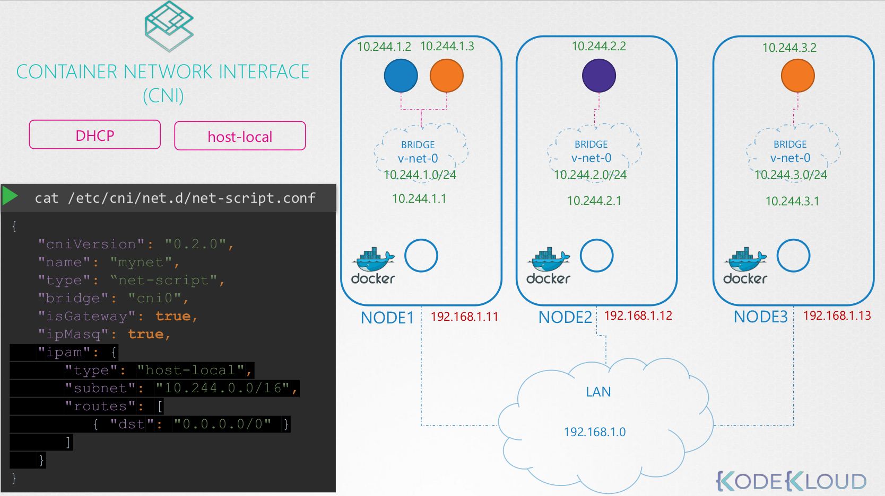

* Weave by default uses `10.32.0.0/12` for the entire network. This about 1 million IP addresses for the Node. This IP address is able to be changed when you deploy Weave.

```bash
# Use ipcalc to show the networking information for 10.32.0.0/12
ipcalc 10.32.0.0/12

# Output
Network: 10.32.0.0/12
Netmask: 255.240.0.0 = 12
Broadcast: 10.47.255.255

Address space:	Private Use
HostMin: 10.32.0.1
HostMax: 10.47.255.254
Hosts/Net: 1048574
```


### 8.4.4) Service Networking

* It is rare for Pods to directly communicate with each other, they typically go through ClusterIP Services.
* There are a few steps involved to configure networking for k8s Services. Here are the steps for creating a ClusterIP Service:
  * The `kubelet` agent responds to the `kube-apiserver`'s request to create a new Pod.
  * The `kubelet` agent creates the new Pod.
  * The `kubelet` agent invokes the CNI plugin to set up the Pod network configuration.
  * When the ClusterIP Service is created, it is given an IP address. The `kube-proxy` agent takes this IP address and sets up forwarding from the ClusterIP Service IP address and port to the IP address and port of the Pod.

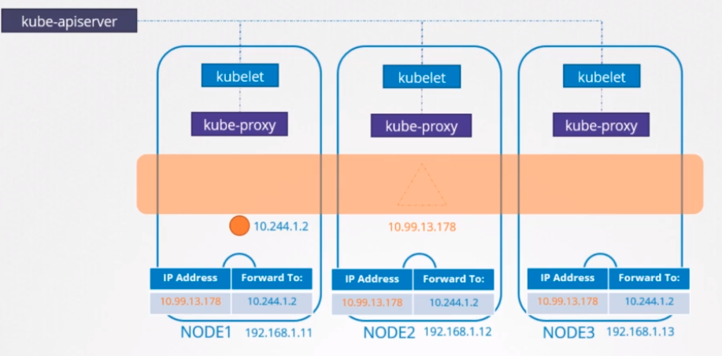

**Note:** There isn't actually a ClusterIP Service object, it is just a series of IP Tables rules to provide the ClusterIP Service functionality. These rules are created across the cluster on all Nodes.

* There are 3 ways that `kube-proxy` can create the IP forwarding rules for a ClusterIP Service:
  1. Userspace
  2. Ipvs
  3. IP Tables, the default option.
* The IP forwarding mode can be set using the `--proxy-mode` when configuring `kube-proxy`.
* The IP addresses assigned when creating Services can be set using the `--service-cluster-ip-range` when configuring `kube-apiserver`.

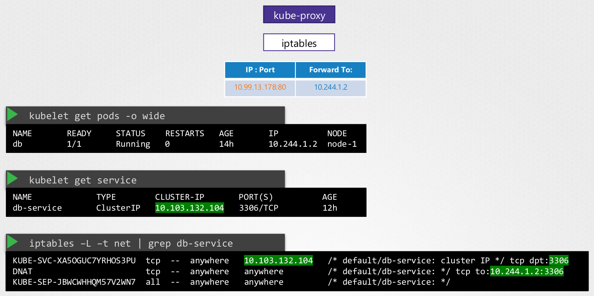


```bash
# Fine node ip address range
ip -c -h a

# Find pod ip address range when using weave
kubectl -n kube-system logs weave-net-ptjqh weave | grep ipalloc

# Find service ip address range
ps aux | grep 'kube-api' | grep 'range'
cat /etc/kubernetes/manifests/kube-apiserver.yaml | grep range
kubectl -n kube-system describe $KUBE_API_POD | grep range

# Check what kube-proxy is using for traffic rules (e.g. iptables)
ps aux | grep 'kube-proxy' | grep 'proxy'
kubectl -n kube-system logs $KUBE_PROXY_POD | grep proxy

# View IP tables rules for services
iptables -L -n -t net | grep $SERVICE_NAME

# Can be found in a log too, but this location may be different depending on O/S
cat /var/log/kube-proxy.log
```

**Note:** The Pod network range and Service network range must not overlap. You can check that by using `ipcalc $POD_CIDR` and `ipcalc $SERVICE_CIDR`

### 8.4.5) DNS In k8s

* The Node name and its IP address will be recorded in a DNS nameserver somewhere.

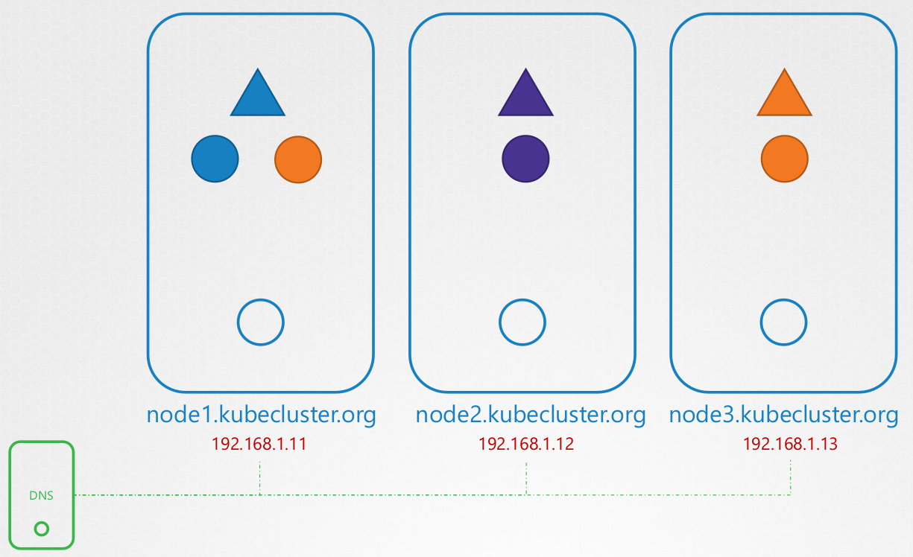

* A DNS solution to handle internal Cluster DNS resolution is installed by default, unless you are setting up the Cluster manually. Prior to version 1.12 this was `kube-dns` but now CoreDNS is recommended.


* Whenever a Services is created, k8s creates a DNS record for it. It maps the name and IP address, so any Pod in the same namespace can access the Pod via the Service using the Service name.
  
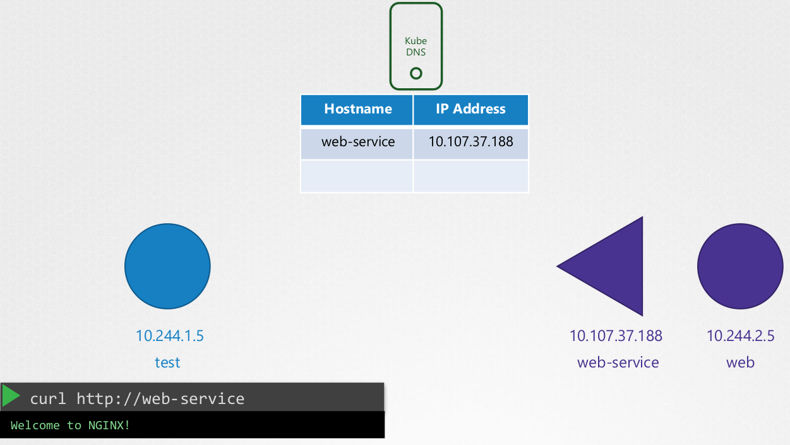

* If the Pod is in another namespace, it must use `$SERVICE_NAME.$NAMESPACE.svc.cluster.local` to access the Pod through the Service.


* All Services are grouped into a sub-domain called `svc`.
* All Services and Pods are grouped into a root domain for the cluster called `cluster.local`.


* Pods do not get a DNS record by default, but this can be turned on. The Pod's DNS record name is its IP address with the dots replaced by dashes. They then can be reached on `$POD.$NAMESPACE.pod.cluster.local`


**Note:** `$SERVICE.$NAMESPACE.svc.cluster.local` is the fully qualified domain name.

### 8.4.5.1) CoreDNS In k8s

* Rather then adding an entry into every Pod's `/etc/hosts` file, every Pod's `/etc/resolv.conf` points to a DNS nameserver with all the DNS records. You could do this manually.


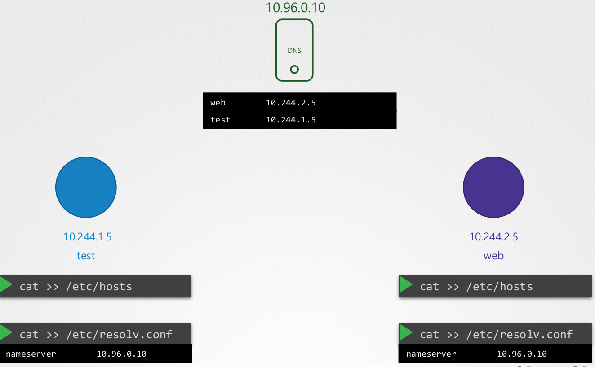

* By default it is handled automatically by the DNS solution installed by k8s. Prior to version 1.12 this was `kube-dns` but now it is CoreDNS.
* CoreDNS is deployed as Pods in `kube-system` namespace via a Deployment. A ClusterIP Service called `kube-dns` is created for the CoreDNS Pods. This is how all other k8s objects communicate with the CoreDNS Pods.
* The IP address of the `kube-dns` ClusterIP Service is the IP address used as the DNS nameserver.
* The `kubelet` agent is reponsible for configuring Pod DNS nameservers to point to the CoreDNS ClusterIP Service `kube-dns` IP address.

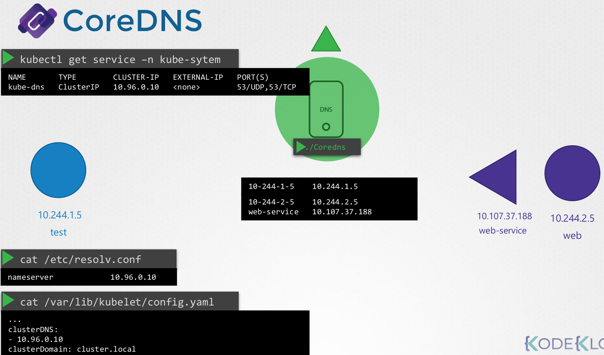

* The `/etc/coredns/Corefile` within the CoreDNS Pod contains the configuration details for CoreDNS. It is a ConfigMap mounted as a Volume so you can easily make changes to it. This file contains:
  * A number of plugins handling different functionality. They are highlighted orange in the picture below.
  * `kubernetes` is the plugin handling CoreDNS running in k8s.
    * The cluster domain is defined here as `cluster.local` by default.
    * `pods insecure` will create DNS record entries for Pods with the DNS name having the IP address dots replaced with dashes.
  * `proxy`is the plugin that handles any DNS resolution that `kubernetes` cannot handle. For example trying to reach an IP address on the internet.


* The CoreDNS Pods watch the Cluster for new Services and everytime one is created it will create a new DNS record for it. It does this Pods as well if the `pods insecure` option is on within its `/etc/coredns/Corefile` `kubernetes` plugin.
* If you use `nslookup` to lookup the DNS record for a k8s Service using any combination of the domain through to the fully qualified domain, you will always receive the fully qualified domain name `$SERVICE.$NAMESPACE.svc.cluster.local`. This is the `/etc/resolv.conf` file has a `search` entry for it.


* If you allow Pods to have a DNS record created, you must always use the fully qualified domain name to resolve the Pod. `$POD.$NAMESPACE.pod.cluster.local`.

### 8.4.6) Ingress

The details for this can be found in in the developer's course under the section [Ingress](../02.applications-developer/README.md#52-ingress)

#### 8.4.6.1) Ingress Annotations & Rewrites

* You can use Ingress Resources to configure the Ingress Controller to rewrite URL paths before they are sent to the application. e.g. `http://<ingress-service>:<ingress-port>/watch` becomes `http://<watch-service>:<port>/` with the rewrite option. Without it `http://<ingress-service>:<ingress-port>/watch` becomes `http://<watch-service>:<port>/watch` and this will be a problem if the applicaiton is expecting `/` but it gets `/watch`. It will return 404 not found. You can fix this with URL rewrites.
  * [This GitHub page](https://github.com/kubernetes/ingress-nginx/blob/master/docs/examples/rewrite/README.md) talks about how URL path rewriting process.
  * [This k8s documentation section](https://kubernetes.io/docs/concepts/services-networking/ingress/?spm=a2c4g.11186623.2.23.3fdd30dfnyevPx#the-ingress-resource) has a basic example as well.
  * [This k8s GitHub documentation section](https://kubernetes.github.io/ingress-nginx/examples/rewrite/) has more examples as well.

# 9) Desinging A Cluster

* There are several questions that you need to ask and get answers to when designing a cluster. They are:
  * What is the cluster's purpose?
    * Education - use MiniKube or kubeadm
    * Dev / test - use kubeadm or cloud.
      
    * Production - use kubeadm or cloud.
    
  * Where will it be hosted?
    * In the cloud.
    * On premesis.
    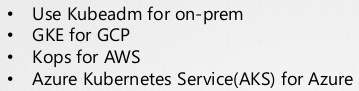
  * What type of workloads will the cluster run?
    * How many applications will be hosted?
      * Few vs many.
    * What kind of applications?
      * Web, data science, etc.
    * What compute resources will the applications need?
      * CPU, memory, and disk.
    
    * What type of network traffic will the applications generate?
      * Burst traffic vs heavy sustained traffice.
  * Do you need high availability?
  
  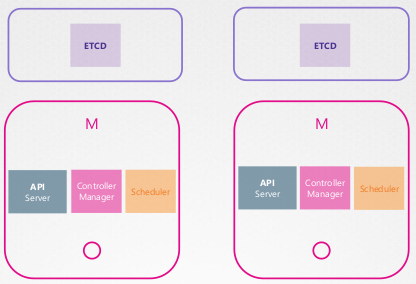

* k8s only supports running on Linux.
* There are 2 types of k8s deployment solutions
  1. **Turnkey solutions**, are when you provision the hosts to install k8s on and do all of the configuration and maintenance yourself.
  2. **Hosted solutions** are when a third party provides the hosts to install k8s on and the third party does all the configuration and maintenance.


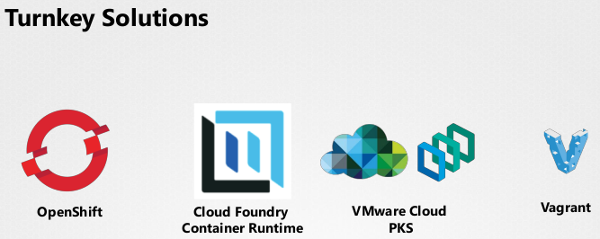

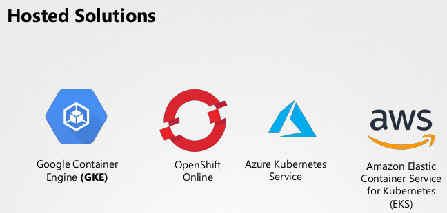

# 9.1) High Availability (HA)

* If you only have 1 Master Node in your Cluster and it crashes, what happens?
  * You cannot access the Cluster via `kubectl` as there is no `kube-apiserver`
  * As long as your Worker Nodes are still running then users can access the applications. But if a Pod crashes then there are no Control Plane components to be able to recreate Pods.
* **High availability** means you redundancy across every componenet in your system, which avoids having a single point of failure.
* In k8s HA is achieved by having multiple Master Nodes, multiple Worker Nodes, and possibly separate hosts for ETCD.

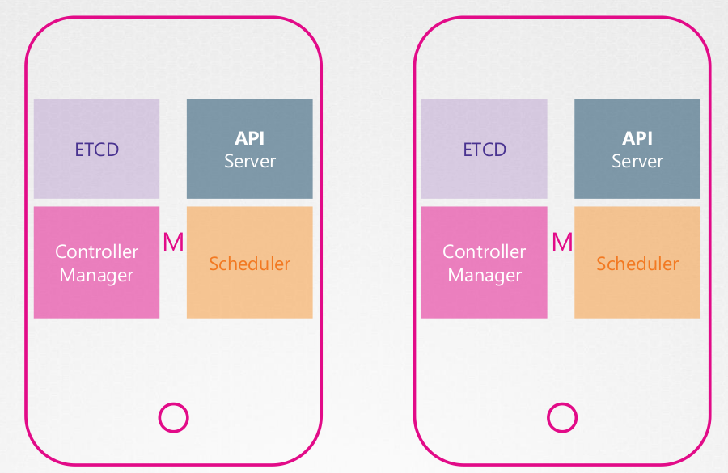

## 9.1.1) Kube API Server

* In a HA setup, the `kube-apiserver` on all Master Nodes can be run in 'active active' mode. An API request must only be sent to one of them. `kubectl` can only be configured with one Master Node to send API requests to. To use multiple `kube-apiservers` with `kubectl`, a load balancer (e.g. nginx) sits infront of the Master Nodes and splits traffic between them. The `kubectl` points to the load balancer.
* **Active / Active** mode means all of the multiple components are active and doing their job.


### 9.1.2) Scheduler & Controller Manager

* This Control Plane components contiunually monitor the Cluster and make changes when triggered. If multiple instances are running in 'active active' then duplicate actions will occur. e.g. the ReplicationControllers will create 2 sets of Pods instead of just 1. To counter this, they must be run in 'active standby' mode.
* **Active / Standby** mode means that only one of many components is active and doing its job, and the rest are doing nothing while in standby.
* When configuring the Controller Manager, the `--leader-elect true` option is used. The Controller Managers will try to gain a lock (i.e. lease) on the `kube-controller-manager` Endpoint, and whoever gets this lock becomes the active and the rest are passive. The default settings for this are:
  * `--leader-elect-lease-duration` is 15 seconds and this determines how long the leader lock lasts for.
  * `--leader-elect-renew-deadline` is 10 seconds and this determines how often to renew the current lock. 
  * `--leader-elect-retry-period` is 2 seconds and this determines how often all of the components vying for the lock will request the lock.


**Note:** Both the Controller Manager and Scheduler use this locking mechanism and configuration options.

### 9.1.3) ETCD

* In k8s there are 2 deployment topologies for ETCD:
  1. Installing ETCD on the Master Node with the rest of the Control Plane components.
  
  2. Installing ETCD on its own host separate to the Master Nodes.
   

**Note:** Regardless of the toplogy used to deploy ETCD, the configuration option `--etcd-servers` in the `kube-apiserver` set up configuration options is used to tell the `kube-apiserver` where to look for ETCD. Having 1 or 2 ETCD instances doesn't offer any redundancy value.


* When running multiple ETCD servers:
  * The data is replicated across all of the ETCD servers.
  
  * You can read data from any ETCD server.
  
  * You can only write to one ETCD server, known as the leader. If any write requests go to non-leaders they will forward the write request to the leader. The write is only considered complete when the majority of ETCD nodes have performed the write.
  
  
* Leader election in ETCD is done by the RAFT protocol.
  * When the ETCD cluster is set up, a random timer is given to all ETCD nodes and leader will be the Node where the random timer expires first.
  * The leader tells the other ETCD nodes that it is the leader and the other ETCD nodes acknowledge this.
  * The leader periodically tells the other ETCD nodes it is still the leader. If other ETCD nodes don't received this period message, the leader election is done again.
* The majority (i.e. quorum) algorithm for ETCD clusters is `Number of ETCD nodes / 2 + 1`

* The number of ETCD hosts should be only odd numbers greater than or equal to 3. As this provides the best fault tolerances against network segmentation. The minumum required amount of ETCD nodes in HA is 3, and 5 ETCD nodes is the point of diminishing return.


* When configuring ETCD for the first time, `--initial-cluster` option is important as it configures the address of all ETCD peers in the ETCD cluster.

# 10) Installing A Cluster With Kubeadm

* Setting up a k8s Cluster manually is a tedious task. The `kubeadm` tool makes it easier to set up production grade k8s clusters. https://kubernetes.io/docs/setup/production-environment/tools/kubeadm/ has the links on how to do this.
* In general the install steps start on the page https://kubernetes.io/docs/setup/production-environment/tools/kubeadm/ and then:
  * On all Nodes, install kubeadm, kubelet, and kubectl - https://kubernetes.io/docs/setup/production-environment/tools/kubeadm/install-kubeadm/
  * On all Nodes, install CRE - https://kubernetes.io/docs/setup/production-environment/container-runtimes/
  * On Master Node, create the cluster - https://kubernetes.io/docs/setup/production-environment/tools/kubeadm/create-cluster-kubeadm/
    * Remember to use kubeadm init with `--apiserver-advertise-address=$MASTER_NODE_IP` and `--pod-network-cidr $POD_CIDR_RANGE`
    * On Worker Node, join the cluster with the output from `kubeadm init` on Master.
    * On Master Node, install Weave CNI in the exam with https://kubernetes.io/docs/setup/production-environment/tools/kubeadm/high-availability/

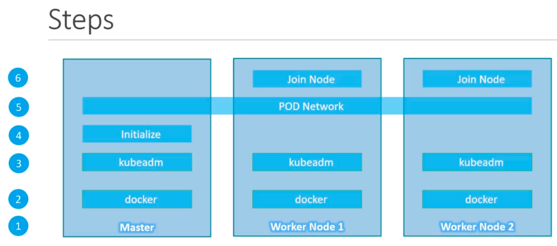

**Note:** When `kubectl get nodes` reports Cluster Nodes as NotReady this means the CNI network plugin hasn't been installed.

```bash
# Running without any flags can work
kubeadm init

# What I did to get the cluster to work
kubeadm init --apiserver-advertise-address=$MASTER_NODE_IP --pod-network-cidr $POD_CIDR_RANGE

# Undo a kubeadm init
kubeadm reset

# Regenerate a new join token for Worker Node
kubeadm token create --print-join-command
```

# 11) Troubleshooting The Cluster

## 11.1) Application Failure

https://kubernetes.io/docs/tasks/debug-application-cluster/debug-application/

* Here is a list of generic application failure troubleshooting steps.
  * Create a diagram of the environment you are troublesshooting.
  * Depending on what you know about the failure will determine which end of the diagram you start at.
  * Check every object and link in the diagram.

```bash
# Check if the application is accessible using the IP of the Node
curl -v $NODE_IP:$NODESERVICE_PORT

# Check the NodePort Service to see if it has the correct ports and selectors
kubectl describe svc $NAME

# Check the end points of Services to see if they are working properly
kubectl get endpoints
kubectl get ep

# Check the technical detils of a Pod and compare it to the Service. Checking for matching ports and labels.
kubectl describe deploy $NAME
kubectl describe po $NAME

# Check the Pod's status and restart count
kubectl get po

# Check the current Pod's logs
kubectl logs $POD_NAME

# Check the previous failed Pod's logs
kubectl logs $POD_NAME --previous
```

## 11.2) Control Plane Failure

* https://kubernetes.io/docs/tasks/debug-application-cluster/debug-cluster/
* Focus on the elements in https://kubernetes.io/docs/tasks/debug-application-cluster/debug-cluster/#master

* Here is a list of generic Control Plane troubleshooting steps.
  * Check the Master Nodes\` health. `kubectl get nodes`
  * Check the Control Plane components\` health.
  * Check the Control Plane components\` logs.
* When troubleshooting, remember:
  * The Scheduler is responsible for selecting which Node to play a Pod onto.
  * The Kubelet agent is reponsible for placing the Pod onto a Node.
  * The Controller Manager is reponsible for Deployments and ReplicaSets.
  * Static Pods will have `$POD_NAME-$NODENAME` so remember to check the last part of the name to see what Node the Static Pod is running on.

### 11.2.1) Control Plane Components As Pods

```bash
# Check Node health
kubectl get nodes

# Check the Pods` status
kubectl -n kube-system get pods

# Check the Pods` logs
kubectl -n kube-system logs $POD_NAME
```

### 11.2.1) Control Plane Components As O/S Services

```bash
# Check Node health
kubectl get nodes

# Check the Control Plane service status
systemctl status kube-apiserver
systemctl status kube-controller-manager
systemctl status kube-scheduler
systemctl status kubelet
systemctl status kube-proxy

service $SERVICE_NAME status

# Check the Control Plane service logs
journalctl -u $SERVICE_NAME
less /var/log/$SERVICE_NAME

# Check the Control Plane service files
ls /etc/systemd/system/
ls /etc/systemd/system/$SERVICE_NAME
less /etc/systemd/system/$SERVICE_NAME/$SERVICE_FILE

# Restart service after fixing
systemctl daemon-reload
systemctl restart $SERVICE_NAME
```

**Note:** The `kubelet` configuration file determines where the Static Pod YAML definition files are, so use `grep -i 'staticpod' $KUBELET_SERVICE_CONF_FILE`. By default for `kubeadm` this is `/etc/kubernetes/manifests/`

## 11.3) Worker Node Failure

* Focus on the elements in https://kubernetes.io/docs/tasks/debug-application-cluster/debug-cluster/#worker-nodes

* Here is a list of generic Control Plane troubleshooting steps.
  * Check the Worker Nodes\` health.
  * Check the Worker Nodes\` O/S and resource health
    * If a Status is set to True then it is okay.
    * If a Status is set to False then it is broken.
    * If a Status is set to Unknown then network connectivity is lost.
* When troubleshooting, remember:
  * The Kubelet agent is reponsible for placing the Pod onto a Node.
  * The Kube Proxy is reponsible for setting up IP Tables rules for network communication.
  * Static Pods will have `$POD_NAME-$NODENAME` so remember to check the last part of the name to see what Node the Static Pod is running on.

```bash
# Check Node health
kubectl get nodes

# Check O/S and resource health
kubectl describe node $NAME

# Check process on the broken node
ssh $BROKEN_NODE
top
htop
ps aux | grep $SERVICE_NAME

# Check memory
free -h
top
htop

# Check disk space
df -h

# Check the Worker Node service status
systemctl status kubelet
systemctl status kube-proxy

service $SERVICE_NAME status

# Check the Control Plane service logs
journalctl -u $SERVICE_NAME
less /var/log/$SERVICE_NAME

# Check the Control Plane service files
ls /etc/systemd/system/
ls /etc/systemd/system/$SERVICE_NAME
less /etc/systemd/system/$SERVICE_NAME/$SERVICE_FILE

# Check the certificate ISSUER (ca) and Validity Not After (expiry)
openssl x509 -in $CERT_PATH -text

# Restart service after fixing
systemctl daemon-reload
systemctl restart $SERVICE_NAME
```

## 11.4) Network Troubleshooting

* https://kubernetes.io/docs/tasks/debug-application-cluster/debug-service/
* https://kubernetes.io/docs/tasks/administer-cluster/dns-debugging-resolution/
* Remember that:
  * k8s uses CNI plugins for networking.
  * `kubelet` is reponsible for executing plugins.
    * Check `cni-bin-dir` and `network-plugin` in the process parameters.
  * `kube-proxy` is reponsible for IP Tables rules.
  * `kube-dns` aka CoreDNS is responsible for DNS.


```bash
# Check that a CNI network plugin is installed, look for weave, flannel, calico
kubectl -n kube-system get pods

# Check CoreDNS deployment and look at the config map and volumes
kubectl -n kube-system describe deployment coredns

# Check CoreDNS endpoints
kubectl -n kube-system get ep

# Check Kube Proxy daemon set, check command and configmap
kubectl -n kube-system describe ds kube-proxy
```

**Note:** If there are multiple CNI configuration files in the directory, the kubelet uses the configuration file that comes first by name in lexicographic order.

# 12) Other Topics

## 12.1) YAML Basics

* [YAML](https://yaml.org/) is a human friendly data presentation standard for all programming languages.
* YAML can store the same data as XML and JSON but in an easier way to read.

* Some YAML syntax rules:
  * Like Python, YAML uses indentation for scope. The amount of spaces used in indentation must match.
  * Like Python, Lists are ordered and Dictionaries are unordered.
  * A line beginning with a `#` is a comment.
* All programming languages should support YAML.

```yaml
# Basic Map AKA dictionary, key value pairs
fruit: apple
vegetable: carrot
drink: water

# Arrays AKA lists
fruits:
- apple
- banana
- orange
vegetables:
- carrot
- lettuce
- pea

# Nested data structure, a dictionary within a dictionary
apple:
  color: red
  size: medium
  cost: 1 dollar
  nutrition:
    calories: 50
    carbs: 10
    fat: 1

banana:
  color: yellow
  size: large
  cost: 50 cents
  nutrition:
    calories: 57
    carbs: 6
    fat: 2

# Nested data structure, a dictionary within a list
fruits:
- apple:
    color: red
    size: medium
    cost: 1 dollar
    nutrition:
      calories: 50
      carbs: 10
      fat: 1
- banana:
    color: yellow
    size: large
    cost: 50 cents
    nutrition:
      calories: 57
      carbs: 6
      fat: 2
```

## 12.2) JSON Basics

* JSON can store the same data as XML and YAML.

* YAML uses space identation to denotescope and JSON uses spaces and curly braces to denote scope.

* YAML uses `- list-item` for lists and JSON uses `[list-item]`.
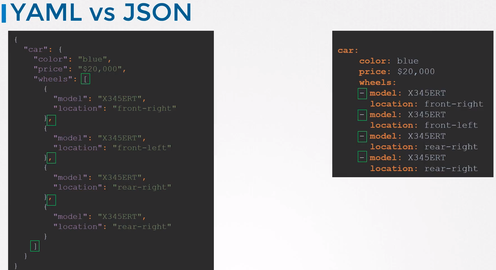
* YAML uses `key: value` for dictionaries and JSON uses `{ key: value }`.
* You can easily convert between YAML and JSON with https://www.json2yaml.com/
* All programming languages should support JSON.

```json
# Basic Map AKA dictionary, key value pairs
{
  "fruit": "apple",
  "vegetable": "carrot",
  "drink": "water"
}

# Arrays AKA lists
{
  "fruits": [
    "apple",
    "banana",
    "orange"
  ],
  "vegetables": [
    "carrot",
    "lettuce",
    "pea"
  ]
}

# Nested data structure, a dictionary within a dictionary
{
  "apple": {
    "color": "red",
    "size": "medium",
    "cost": "1 dollar",
    "nutrition": {
      "calories": 50,
      "carbs": 10,
      "fat": 1
    }
  },
  "banana": {
    "color": "yellow",
    "size": "large",
    "cost": "50 cents",
    "nutrition": {
      "calories": 57,
      "carbs": 6,
      "fat": 2
    }
  }
}

# Nested data structure, a dictionary within a list
{
  "fruits": [
    {
      "apple": {
        "color": "red",
        "size": "medium",
        "cost": "1 dollar",
        "nutrition": {
          "calories": 50,
          "carbs": 10,
          "fat": 1
        }
      }
    },
    {
      "banana": {
        "color": "yellow",
        "size": "large",
        "cost": "50 cents",
        "nutrition": {
          "calories": 57,
          "carbs": 6,
          "fat": 2
        }
      }
    }
  ]
}
```

## 12.3) JSON Path Basics

* In databases you can use SQL to query and return data. In JSON you can use JSON path to query and return data.
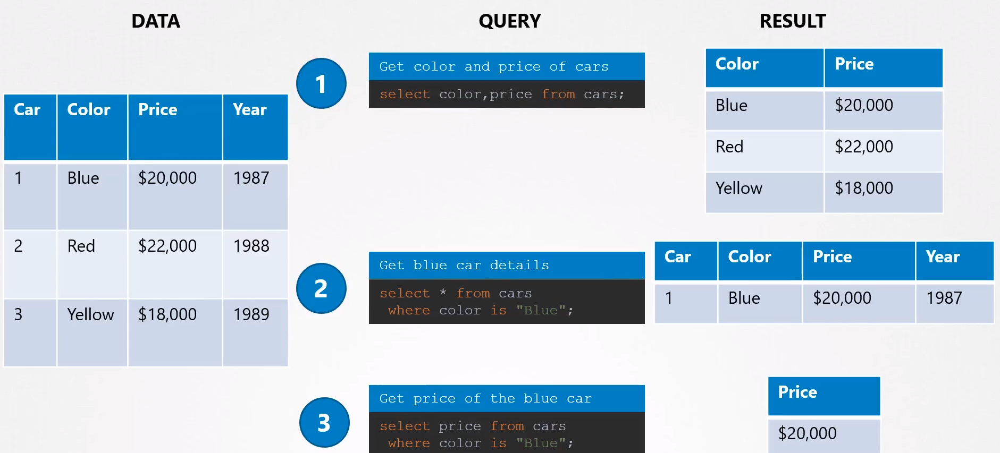
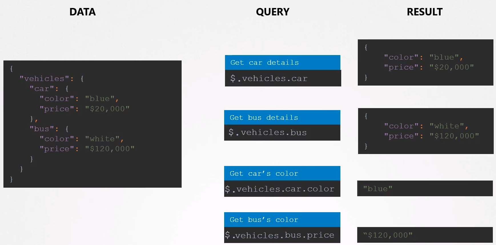
* All results from a JSON Path query are returned as an array.
* The root element in JSON for a dictionary is `$`
* Use dot notation `key.value` to access dictionary elements.
* Use bracket notation and indices `[i]` to access list elements.

* The root element in JSON for a list is `$[]`
* Like Python, list elements start at 0 and the standard list operations exist.
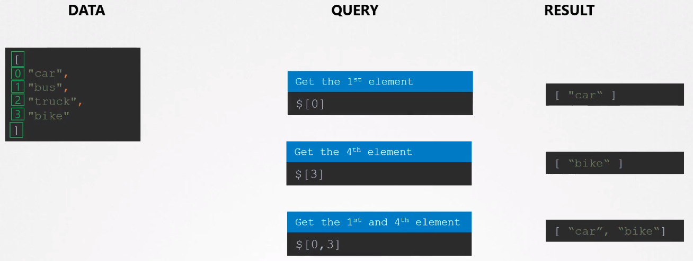
* You can write selection statements with list items with `[?( @.item operator expression )]`.
  * The `$()` means you are writing a selection statement.
  * The `@.item` refers to key in the list.
  * The `operator` will be something like `==` or `!=`.
  * The `expression` will be something like a string or number.

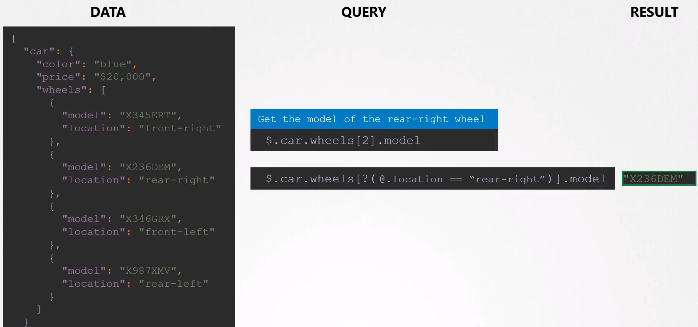
* You can use `*` as a wild card in JSON path. It can mean any property in a dictionary and any item within a list.

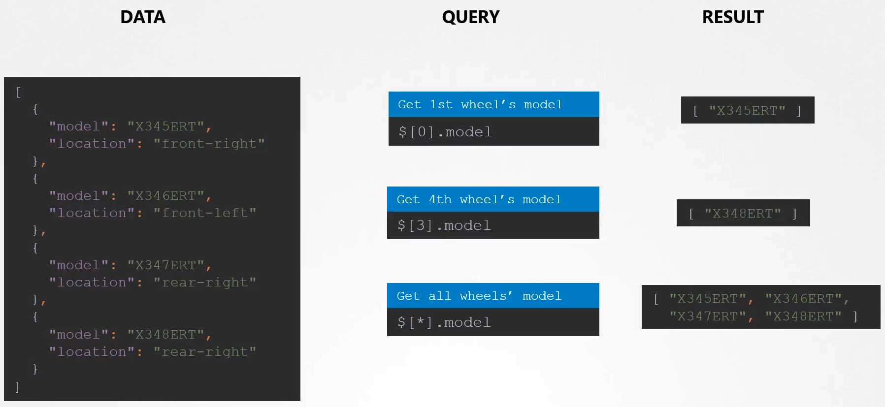
* These are some of the list operations supported in JSON Path:
  * First element = `[0]`
  * Third element = `[2]`
  * First and third element = `[0,2]`
  * All elements beween first and fifth element = `[0:5]`. Notice how we are using 5 instead of 4, because the last number is excluded from the range.
  * Every second element beween first and fifth element = `[0:5:2]` which effectively the elements `[0,2,4]`. The additional third number denotes how many positions to increment by.
  * All elements in the list = `[0:-1]` or just `[0:]`
  * Last element = `[-1:0]` or just `[-1:]`
  * The last three elements = `[-3:0]` or just `[-3:]`

**Note:** A good idea when writing complex queries is to use a step by step approach rather than writing it all in one go.

## 12.4) Advanced Kubectl Commands

TODO

# 13) Exam Tips

* Editing in memory Pods is restricted compared to editing in memory Pod templates from a Deployment. But there will be times you cannot edit the object, in those instances a file will be saved to `/tmp` with your changes. Just delete the existing object and create the object from the file in `/tmp`.
* In the exam you can quickly check object syntax by doing `kubectl explain $K8S_OBJECT --recursive | less` and then search for the syntax you are looking for.
