# k8s Application Developer Notes

* Second course in a series [beginner, developer, administrator]
* Can do the exam if you want

# 1) Core Concepts

* This is the entire Beginner's Course recapped.

## 1.1) Containers

* **Containers** are an isolated environment with its own resources (e.g. processes, network interfaces, storage etc) within an operating system but all containers within the same O/S share the same kernel.


* Containers are used to isolate applications from each other. Each container has its own O/S that supports the application and its dependencies.


* A container can only run on the same O/S kernel that it has. So if Docker is running on a Linux kernel, any Linux distribution can run on it. Running a Linux Docker container on Windows actually spins up a Linux VM.

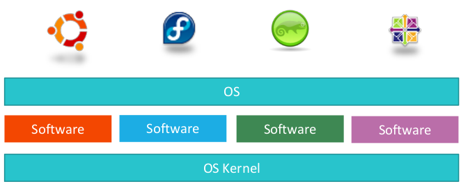

* Containers are not new but Docker is a high level tool that has made them very popular.
* Docker uses LXC containers.
* Containers are more resource friendly than VMs. They are typically 10s or 100s of MB in size whereas VMs are typically GBs in size.  It is common to run containers within VMs.


* A **Docker Image** is a template used to create a **Docker Container**. Thus like in OOP, the Docker Image is the blueprint and the Docker Container is the running instance.

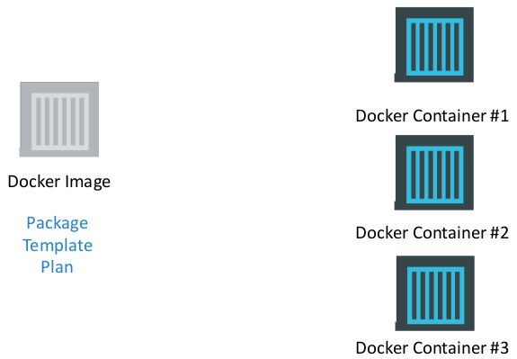

* A **Dockerfile** is a file has the necessary steps to build a Docker Image and subsequent Containers.


* Traditionally a developer would hand over the operations team the compiled application and a list of instructions on how to deploy it. This would change with each environment and become complicated quickly. Now a developer just hads the operations team the Dockerfile and they are able to build the Docker Container the same way in each environment.

## 1.2) Container Orchestration


* The process of automatically deploying and managing containers is called **Container Orchestration**. This can provide:
  * Fault tolerance by using multiple compute nodes.
  * Simple application scaling as demand changes.
  * Simple cluster scaling as demand changes.
* **Kubernetes** (aka k8s) is a container orchestration technology from Google, but others exist like Docker Swarm and Mesos for Apache.
  * **Docker Swarm** is easy to set up but lacks features
  * **Apache Mesos** is hard to set up
* k8s supports cloud platforms like Google Cloud Platform (GCP), Amazon Web Services (AWS), and Microsoft Azure.

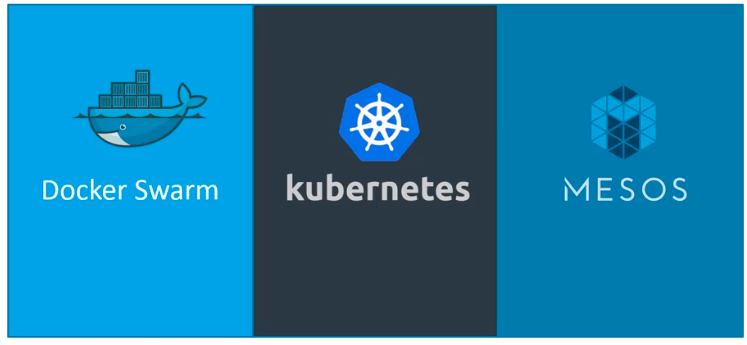

## 1.3) k8s Architecture Recap

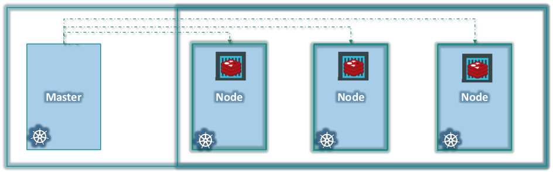

* A **Node** is physical or virtual machine where k8s is installed. A Node is used as a k8s worker. Also known as a Minion in the past. This is where applications and their containers run. It has:
  * kubelet
  * container runtime
* A **Cluster** is a set of Nodes grouped together. Which provides the ability to deploy applications across multiple Nodes and provide high availability and load balancing.
* The **Master** is another Node in the Cluster. The Master monitors and controls the worker Nodes. It has:
  * kube-apiserver
  * kubelet
  * etcd
  * controller
  * scheduler
  * kubectl


* k8s cluster components
  * **api server** - allows interaction with the k8s cluster. kube-apiserver
  * **etcd** - a distributed key value store which has data to manage the cluster
  * **container runtime** - the software (e.g docker) used to run containers
  * **controller** - make the decisions whether to bring up new containers
  * **scheduler** - distributes work or containers across the nodes
  * **kubelet** - an agent that runs on each Node in the cluster. The worker Nodes commmunication to the Master's kube-apiserver through the kubelet agent.
  * **kubectl** - the command line tool used to deploy and manage clusters
* **Minikube** is a way to quickly install a single node k8s cluster.
* **kubeadm** is a way to quickly install a multi-node k8s cluster.
  1. Need multiple machines or VMs available.
  1. Install a container runtime environment (CRE) like Docker
  1. Install kubeadm onto all of the nodes.
  1. Initialise a master node and worker node(s).
  1. Install networking layer between master and worker(s).
  1. Add worker(s) to the master.


```bash
# Deploy an application
kubectl run myapp

# Get k8s Cluster information
kubectl cluster-info

# List all Nodes in the Cluster
kubcetl get nodes
```

* The ultimate aim is to deploy an application in the form of containers on a set of machines configured as a k8s Cluster.

## 1.4) k8s Pod Recap

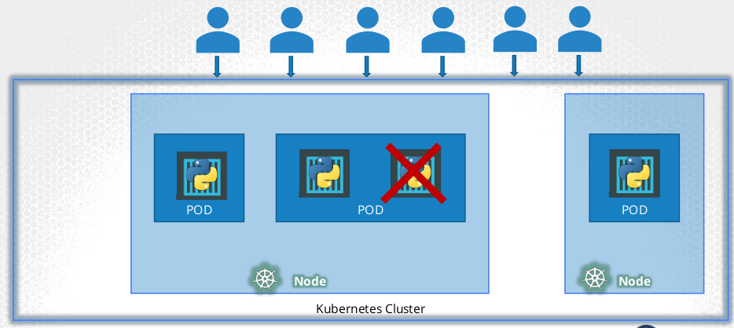

* A **Pod**
  * Is a single instance of an application. But multiple instances can be run by creating additional Pods.
  * Is the smallest object that can be created in k8s. This object is where containers are run.
  * Can have one or multiple containers. If running multiple containers, the containers are unique applications that are all related (e.g. main container and helper containers). These are created and destroyed together.
  * Multiple containers within a Pod can refer to each other via `localhost` as they share the same network space, they also share the same storage.
  * Are created by YAML files.
* To create Pods, we need access to container images (e.g. a Docker Registry like Docker Hub) and a working k8s Cluster.
* Pods can run in a single Node or Cluster (i.e. multiple Nodes) k8s environment.
* k8s doesn't deploy containers directly onto Nodes, they are deployed into Pods.
* k8s objects are created by YAML files. Each YAML file must contain 4 parts
  * apiVersion = controls what objects you can create. Versions support different types of objects.
  * kind = the type of k8s object you are creating
  * metadata = data about the object, in the form of a dictionary.
  * spec = the objects we are going to run, as a list of dictionaries

```yaml
apiVersion: # What k8s objects can be created
kind: # The tyoe of k8s object being created
metadata: # Data about the k8s object
  ...
spec: # The stuff the k8s object will be doing
  ...
```

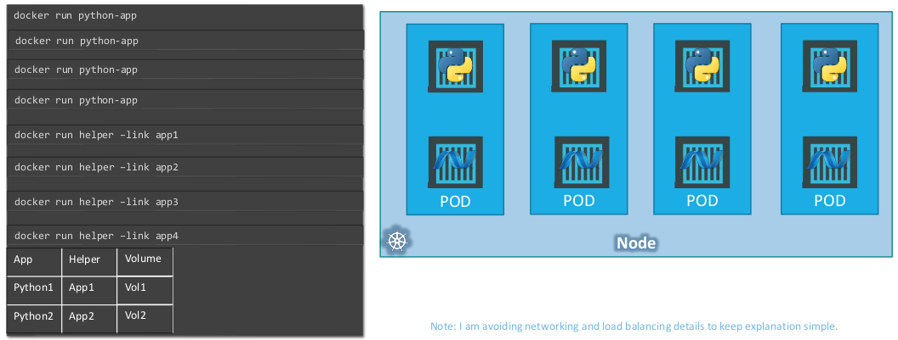

```yaml
# https://kubernetes.io/docs/concepts/workloads/pods/pod-overview/#pod-templates
# There is always 4 root elements
# The version depends on what you are doing
apiVersion: v1

# The type of object, dictates the type of version
kind: Pod

# Must have name and labels inside of it, the name is the pod name
metadata:
  name: my-nginx-pod
  # Can have any key/value pair here
  labels:
    app: my-nginx-app
    type: front-end
    
# Which container(s) will be running
spec:
  # Can have multiple containers, but usually 1 container per pod.
  containers:
    - name: nginx-container
      image: nginx

    - name: postgres
      image: postgres
      env:
        - name: POSTGRES_PASSWORD
          value: abc123
```

```bash
# Run a Pod from CLI
kubectl run --generator=run-pod/v1 $POD_NAME --image=$IMAGE_NAME -l $LABEL_KEY=$LABEL_VALUE

# Create a Pod
kubectl create -f pod-definition.yml

# Delete Pod
kubectl delete pod $POD_NAME

# Get Pods information
kubectl get pods
kubectl get pods -o wide
kubectl get all
kubectl describe pods

# Get Pod specific information
kubectl get pod $POD_NAME

# Update Existing Pod With File - remember to delete the existing Pods for the changes to apply
kubectl replace -f mypod-definition.yml

# Update Existing Pod Without File - remember to delete the existing Pods for the changes to apply
kubectl edit pod $POD_NAME

# Extract Pod Definition From Running Pod
kubectl get pod $POD_NAME -o yaml > pod-definition.yaml
kubectl run $POD_NAME--image $IMAGE_NAME --generator=run-pod/v1 --dry-run -o yaml
```

## 1.5) k8s Controller Recap

* These are the brains behind k8s.
* **Controllers** are processes that monitor k8s objects and respond to accordingly to events.

### 1.5.1) Replication Controller

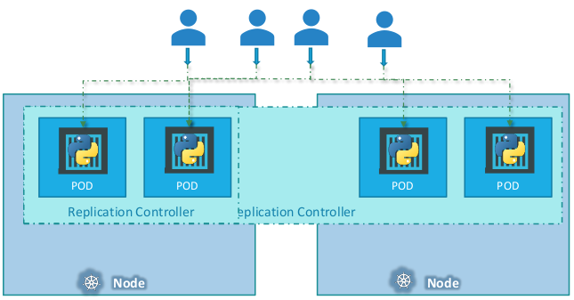

* A **ReplicationContoller** helps us run multiple instances of a single pod in a Cluster.
* It provides high availability by ensuring that the specified number of Pods is running at all times.
* It provides load balancing and scaling, by creating Pods across Nodes in the Cluster and spans across mutiple Nodes in a Cluster.
* But it is an older technology being replaced by Replica Set

```yaml
apiVersion: v1
kind: ReplicationController
metadata:
  name: my-apps-rc
  labels:
    app: my-app
    type: front-end
spec:
  replicas: 3 # How many Pods to run
  template:
  # Everything from pod-definition file goes here, but exclude apiVersion: and kind:
    metadata:
      name: my-apps-pod
      labels:
        app: my-app
        type: front-end
    spec:
      containers:
        - name: some-container
          image: some-container-image
        - name: some-container-2
          image: some-container-image-2
```

### 1.5.2) ReplicaSet


* Very similar to ReplicationController but it is not the same. The **ReplicaSet** is the modern and recommended replacement. 
* The concepts of ReplicationController's apply to ReplicaSets, with the Selector being the major differnece between them.
* The ReplicaSet is in a different apiVersion to the ReplicationController. 
* The ReplicaSet is a process that knows which Pods to monitor by the Labels provided during Pod creation.
* The Selector tells the RepliceSet what labels to watch. If any of the Pods matching the watched labels fail, the ReplicaSet will create new ones.
* The Selector tells the ReplicaSet what Pods it can control, even if they weren't created by the ReplicaSet. Thus the ReplicaSet can create its own Pods to monitor or monitor existing Pods.
* You may scale a ReplicaSet by updating the YAML file or update via command line with kubectl, second approach doesn't update the file.
* Labels and Selectors are used in many other places in k8s.

```yaml
# basically same as ReplicationController but the object is now ReplicaSet and has selector property.
# https://kubernetes.io/docs/concepts/workloads/controllers/replicaset/#example### 1.3.1) 
apiVersion: apps/v1

# ReplicaSet is the new technology, compared to ReplicationController
kind: ReplicaSet

# All Kubernetes yml files need metadata, and they must have name and label.
metadata:
  name: my-app-replica-set
  # Provide your own key/value pairs here.
  # This should match the nested metadata. Helps the Selector manage P ods.
  labels:
    app: my-app
    type: front-end

spec:
  # How many pods must be running at once
  replicas: 3
  # Required by ReplicaSet, not ReplicationController. Explains what pods fall under it, as you can add other pods that weren't created here.
  selector:
    matchLabels:
      type: front-end
  # This is used to tell Kubernetes how to create new Pods. It is basically like pod-definition.yml without apiVersion and kind.
  template:
    metadata:
      name: my-app-pod
      # This should match the parent metadata. Helps the Selector manage Pods.
      labels:
        app: my-app
        type: front-end
    spec:
      # Which container(s) to run
      containers:
        - name: nginx
          image: nginx
```

```bash
# Create a ReplicaSet -> Pods
kubectl create -f replicaset-definition.yml

# Delete ReplicaSet and its Pods
kubectl delete rs|replicaset $REPLICA_SET_NAME

# Get Specific ReplicaSet information
kubectl get rs|replicaset [$REPLICA_SET_NAME]
kubectl get pod [$POD_NAME]

# Get ReplicaSet information
kubectl get all
kubectl describe rs|replicaset
kubectl get rs|replicaset -o wide

# Update Existing ReplicaSet With File - remember to delete the existing ReplicaSet or Pods for the changes to apply
kubectl replace -f replicaset-definition.yml

# Update Existing ReplicaSet Without File - remember to delete the existing ReplicaSet or Pods for the changes to apply
kubectl edit rs|replicaset $REPLICA_SET_NAME

# Extract ReplicaSet Definition From Running Pod
kubectl get rs|replicaset $REPLICA_SET_NAME -o yaml > replicaset-definition.yaml

# Scale Up/Down Replica Without File Updates
kubectl scale --replicas=6 -f replicaset-definition.yml
kubectl scale --replicas=6 replicaset $REPLICA_SET_NAME
```

## 1.6) k8s Deployments Recap


* Applications and their dependencies need to be deployed (i.e installed) into environments. Each environment might have differnet installation requirements. Environment upgrades can be difficult as well. k8s can handle this with the Deployment object
* A **Deployment** object will create a ReplicaSet, and the ReplicaSet will create the Pods.
  * The ReplicaSet and Pods created by a Deployment will have the Deployment's name in their name.
* The Deployment object provides a way to do updates and rollbacks to Pod application versions.

```yaml
# This is a typical production way. Deployment -> ReplicaSet -> Pods. All from this file.
apiVersion: apps/v1

# Provides a way for rolling updates (1 by 1) and rolling back updates. Or pause, update, and reusume.
kind: Deployment
# All Kubernetes yml files need metadata, and they must have name and label.

metadata:
  name: my-app-deployment
  # Provide your own key/value pairs here.
  # This should match the nested metadata. Helps the Selector manage P ods.
  labels:
    app: my-app
    type: front-end

spec:
  # How many pods must be running at once
  replicas: 3
  # Required by ReplicaSet, not ReplicationController. Explains what pods fall under it, as you can add other pods that weren't created here.
  selector:
    matchLabels:
      type: front-end
  # This is used to tell Kubernetes how to create new Pods. It is basically like pod-definition.yml without apiVersion and kind.
  template:
    metadata:
      name: my-app-pod
      # This should match the parent metadata. Helps the Selector manage Pods.
      labels:
        app: my-app
        type: front-end
    spec:
      # Which container(s) to run
      containers:
        - name: nginx
          image: nginx # Updating the image is how you can trigger a new Deployment.
```

```bash
# NOTE: For a deployment to work, we still need a service.

# Create a Deployment -> ReplicaSet -> Pods With File
kubectl create -f deployment-definition.yml
# Use a file and save the history changes
kubectl create -f deployment-definition.yml --record
# Using an image
kubectl create deployment $DEPLOYMENT_NAME --image=$IMAGE_NAME

# Delete Deployment, ReplicaSet, and its Pods
kubectl delete deployments/$DEPLOYMENT_NAME

# Get Deployment information
kubectl get deployment [$DEPLOYMENT_NAME]
kubectl get rs|replicaset [$REPLICA_SET_NAME]
kubectl get pod [$POD_NAME]
kubectl get all
kubectl describe deployments

# Update Deployments Using File - remember to delete the existing Deployment or ReplicaSet or Pods for the changes to apply
kubectl apply -f deployment-definition.yml

# Update Deployments Without a File -  remember to delete the existing Deployment or ReplicaSet or Pods for the changes to apply
kubectl set image deployement/$DEPLOYMENT_NAME nginx=ngninx:1.9.1

# Scale deployment without file
kubectl scale $DEPLOYMENT_NAME --replicas=$REPLICA_AMOUNT

# Get Deployment Status
kubectl rollout status deployment/$DEPLOYMENT_NAME
kubectl rollout history deployment/$DEPLOYMENT_NAME

# Rollback An Update
kubectl rollout undo deployment/$DEPLOYMENT_NAME

# Create a YAML file
kubectl create deployment --image=image-name $DEPLOYMENT_NAME --replicas=n --dry-run -o yaml > deployment.yaml
```

* `kubectl [command] [TYPE][NAME] -o $OUTPUT_FORMAT` has 4 types
  1. `-o json` - which prints out JSON
  1. `-o name` - which prints out the resource name only.
  1. `-o wide` - which prints out additional information.
  1. `-o yaml` - which prints out YAML.
* https://kubernetes.io/docs/reference/kubectl/overview/
* https://kubernetes.io/docs/reference/kubectl/cheatsheet/

### 1.6.1) Deployment Updates and Rollbacks


* Each time a Deployment is run, a **Rollout** is triggered. A version (i.e. **Revision**) of the Rollout is kept, which can be used later to rollback to.
* There are 2 types of Deployment strategies
  * **Recreate strategy** will delete all at once and create all at once, this means there will be an outage
  * **Rolling Update** will delete old Pods and replace with new Pods 1 by 1, this means no outage. This is the default.
* Updates to version numbers are applied in the Deployment YAML file, by specifying the image tag version.
  * If you do it from the command line, the running Deployment is updated but this doesn't update the YAML file.
* A new ReplicaSet is created when upgrades are performed. Pods from the original ReplicaSet are destroyed and Pods in the new RepliceSet are created
* A **Rollback** is when you undo a Deployment and go back to a previous Rollout version.


## 1.7) k8s Namespaces

* **Namespaces** are named containers that are used to group objects together and provide each object within the group a unique name to all other objects outside the group. Namespace objects will be unique even if they have the same name as objects from another Namespace. For example, in Java there is `java.util.Date` and `java.sql.Date`. Thus Namespaces are a method of providing isolation (i.e. variable scope) to objects.
  * An analogy with people works. Each person in a family will typically have a unique name combination. But people from other familes may have the same name combination. To differeniate the people with the exact same name, we will use other identifying qualties like address, date of birth, etcetera. The combination of properties that uniquely identifies related people is the namespace. This will typically be their fullname and address.


* All objects within k8s are created within a namespace.
* 3 namespaces are automatically created by k8s
  1. **Default** - all user created objects will go here by default unless another namespace is created and used.
  1. **kube-system** - a namespace used by k8s for system level objects (e.g. networking).
  1. **kube-public** - a namespace that can be used for objects that will be available to all users.
* Namespaces can have policies which will define who can do what. Such as compute resource allocation.


* All resources within a Namespace can refer to each simply by their names. This is because a DNS entry is added into each host.
  * To access resource within another namespace, you must use `resource-name.namespace-name.svc.cluster.local`

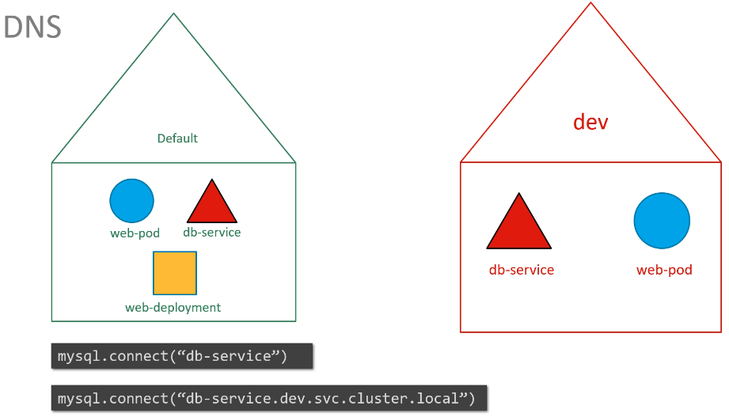
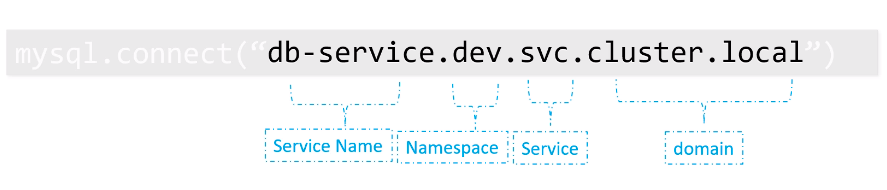

* By default all commands use the default Namespace, you can use the `--namespace` option to look at other namespaces.
  * You can change this permanently by using `kubectl config set-context $(kubectl config current-context) --namespace=$NAMESPACE`

```yaml
# https://kubernetes.io/docs/concepts/overview/working-with-objects/namespaces/
# https://kubernetes.io/docs/tasks/administer-cluster/namespaces/
# There is always 4 root elements
# The version depends on what you are doing
apiVersion: v1

# The type of object, dictates the type of version
kind: Namespace

# Must have name and labels inside of it, the name is the pod name
metadata:
  name: my-namespace
```

```yaml
# https://kubernetes.io/docs/concepts/workloads/pods/pod-overview/#pod-templates
# There is always 4 root elements
# The version depends on what you are doing
apiVersion: v1

# The type of object, dictates the type of version
kind: Pod

# Must have name and labels inside of it, the name is the pod name
metadata:
  name: my-nginx-pod
  # Always create in this namespace
  namespace: my-namespace
  # Can have any key/value pair here
  labels:
    app: my-nginx-app
    type: front-end
    
# Which container(s) will be running
spec:
  # Can have multiple containers, but usually 1 container per pod.
  containers:
    - name: nginx-container
```

```bash
# List all Pods from a specific Namespace
kubectl get pods --namespace=$NAMESPACE

# List all Pods from all Namespaces
kubectl get pods --all-namespaces

# Create a Pod
kubectl create -f pod-definition.yml --namespace=$NAMESPACE

# Create a Namespace
kubectl create -f namespace.yml
kubectl create namespace $NAMESPACE
```

## 1.8) k8s Networking Recap

https://kubernetes.io/docs/concepts/cluster-administration/networking/

* Each Node has it own IP address. This can be used to `ssh` into the Node.
* Each Pod is has its own dynamic IP address as well. This address changes and should never be used for accessing a Pod as the IP address will change when Pods are recreated.
* All Pods get the IP addresses from the same internal private k8s network. This private internal network is created when the k8s cluster is configured.

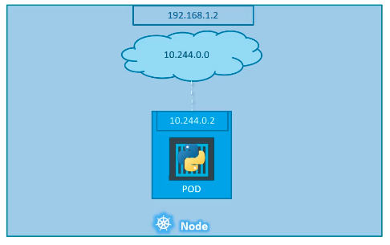


* In multiple Node clusters there will be IP address clashes by default. This is because by default each private internal network within each Node has the same IP address range. Nodes and Pods will have IP address conflicts.


* k8s does not natively supply any networking tools to handle the networking conflicts. When installing k8s, you must choose an external application (e.g. Calico) to handle the networking within the k8s cluster.
* The custom network manager creates a virtual network where all Pods and Nodes are assigned a unique IP address. It also manages the routing within this network.

https://kubernetes.io/docs/setup/production-environment/tools/kubeadm/create-cluster-kubeadm/#pod-network


* Some rules of k8s networking which are implemented by the external networking solution..
  * All Containers / Pods can communicate with one another without NAT.
  * All Nodes can communicate with all Containers / Pods without NAT.
  * All Containers / Pods can communicate with all Nodes without NAT.

### 1.8.1) k8s Services

* k8s **Services** is a k8s object that enable communications between various cluster components. They help us connect applications/users together by loosely coupling them together.


#### NodePort

* A **NodePort Service** makes an internal Pod accessible to external users by mapping a port on the Node to a port on the Pod.
* How do external users access a k8s application externally through a browser? They will connect to the external Node IP and the listening **NodePort Service** will forward the request to a Node's internal IP address by mapping a port on the Node to a port on a Pod. There are 3 ports involved here, from the perspective of the NodePort Service
  1. the port running on the Pod, called the TargetPort
  1. the port running on the Service, called the Port
  1. the port running on the Node, called the NodePort, 30000-32767 default range


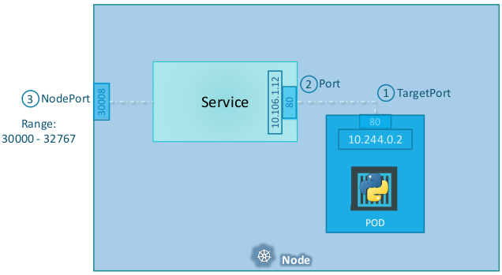
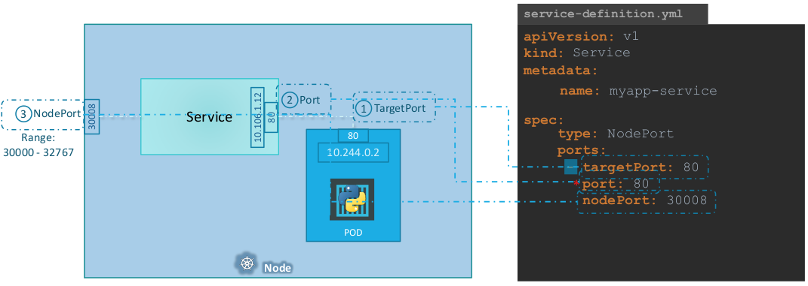

* The Pod label is used by Service Selector to find all Pods to apply the NodePort to. The Service uses a a random algorithm to select which Pod to send traffic to from all the Pods matched by the label.

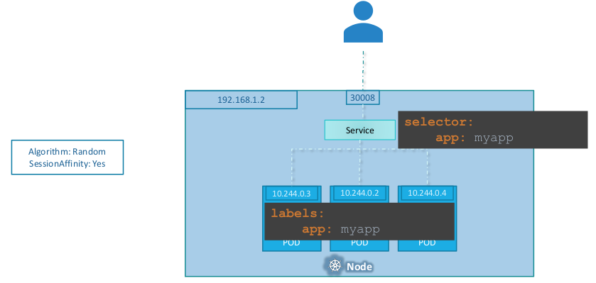

* For multiple Nodes, the Service is created across all the Nodes which will provide access to each Node via its own IP and the same port.

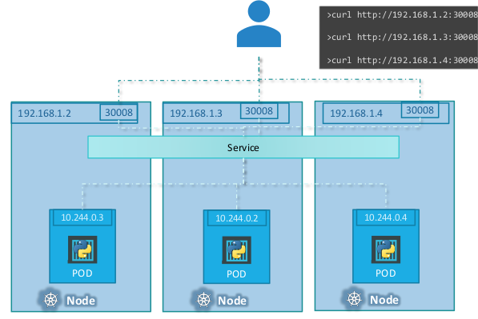

* Thus the Service is always created exactly the same no matter how many Pods or Nodes are involved. The Service is automatically updated if Pods and Nodes are removed.


```yaml
# https://kubernetes.io/docs/concepts/services-networking/service/#defining-a-service
# The version depends on what you are doing
apiVersion: v1

# The type of object, dictates the type of version
kind: Service

metadata:
  name: my-app-service
    
# The networking configuration of the Service
spec:
  # 3 types available here, NodePort, ClusterIP, LoadBalancer
  type: NodePort
  ports:
      # The Pod port(s), where we want to go
    - targetPort: 80
      # The Service object port
      port: 80
      # The Node port exposed externally. Use 30000-32767
      # If we leave this blank Kubernetes will provide it for us automatically.
      nodePort: 30008
  # Add the labels here of the Pods you want to link to the Service
  selector:
    # These are from pod|replicaset|deployment-definition.yml -> metadata: labels: and must match exactly.
    app: my-app
```

```bash
# Create a Service
kubectl create -f service-definition.yml
kubectl expose pod redis --port=6379 --name redis-service

 # Delete Service
kubectl delete service $SERVICE_NAME

# Get Service information
kubectl get services
kubectl get service $SERVICE_NAME
kubectl get all
kubectl describe service
```

#### ClusterIP

* The **ClusterIP Service** creates a virtual IP within the cluster and that is used for network communications. This can used when you have multiple Pods.
* A fullstack application typically has a multiple set of Pods running different tiers of the application (e.g, frontend web app, backend databases, messaging services, etc).
  * The ClusterIP Service helps up group Pods together and provides a single interface to access the different tiers of Pods.
  * Each ClusterIP Service gets a name and IP address and that is what is used to access the Pods grouped with the Service. The ClusterIP also handles scaling.


```yaml
# https://kubernetes.io/docs/concepts/services-networking/service/#defining-a-service
# The version depends on what you are doing
apiVersion: v1

# The type of object, dictates the type of version
kind: Service

metadata:
  name: backend
    
# The networking configuration of the Service
spec:
  # 3 types available here, NodePort, ClusterIP, LoadBalancer
  type: ClusterIP
  ports:
      # The Pod port(s), where we want to go
    - targetPort: 80
      # The Service object port
      port: 80
  # Add the labels here of the Pods you want to link to the Service
  selector:
    # These are from pod|replicaset|deployment-definition.yml -> metadata: labels: and must match exactly.
    app: my-app
    type: backend
```

```bash
# Create a Service
kubectl create -f service-definition.yml
kubectl expose pod redis --port=6379 --name redis-service

 # Delete Service
kubectl delete service $SERVICE_NAME

# Get Service information
kubectl get services
kubectl get service $SERVICE_NAME
kubectl get all
kubectl describe service
```

#### LoadBalancer

* The **LoadBalancer Service** delegates control to a cloud provider's (e.g. Google/AWS) load balancing agent. It can only be used when you are within a cloud envrionemnt that has this capability.


## 1.9) Imperative Commands

When doing the exam certification it is a good idea to use one time imperative commands rather than the declarative style of creating a YAML file.

```bash
# Create and run a Pod
kubectl run nginx-pod --image=nginx:alpine

# Create and run a Pod with a label
kubectl run redis --image=redis:alpine --labels='tier=db'

# Create a Service that exposes a port on an existing Pod
kubectl expose pod redis --port=6379 --name redis-service

# Create a deployment and scale it
kubectl create deployment webapp --image=kodekloud/webapp-color
kubectl scale --replicas=3 deployment webapp

# Create a Pod with a custom port
kubectl run custom-nginx --image=nginx --port=8080

# Create a Namespace
kubectl create namespace dev-ns

# Create a Deployment in a custom Namespace and scale it
kubectl create deployment redis-deploy --image=redis --namespace=dev-ns
kubectl scale deployment redis-deploy --replicas=2 --namespace=dev-ns

# Create a Pod with a custom port and a Service that exposes that port
kubectl run httpd --image=httpd:alpine --port=80 --expose

kubectl run httpd --image=httpd:alpine --port=80
kubectl expose pod httpd --port=80 --name=httpd

# Dump Pod YAML template to file
kubectl run nginx --image=nginx  --dry-run=client -o yaml > pod.yml

# Dump Deployment YAML template to file
kubectl create deployment --image=nginx nginx --dry-run=client -o yaml > deployment.yaml

# Dump ClusterIP Service YAML template to file, you will need to manually add the Node Port in the YAML
kubectl expose pod redis --port=6379 --name redis-service --dry-run=client -o yaml > clusterip.yml

# Dump NodePort Service YAML template to file, you will need to manually add the Node Port in the YAML
kubectl expose pod nginx --port=80 --name nginx-service --type=NodePort --dry-run=client -o yaml > nodeport.yml
```
# 2) Configuration

## 2.1) Commands & Arguments

### Docker

* Why do some Docker containers exit immediately? They are meant to run applications and not O/S. So an O/S image will exit immediately as nothing is running. The container lives only as long as the process it is running inside of it is alive.
* The `CMD` part of the Dockerfile determines what is running inside the container. The Ubuntu image has `CMD ["bash"]` which runs the bash shell. Bash will listen for a terminal and if none is found, it will exit. Docker doesn't attach a termianal by default.

```bash
# Run an Ubuntu container, which will exit immediately.
docker run ubuntu

# Show only running containers
docker ps 

# Show all containers, included the stopped on
docker ps -a

# Run the Ubuntu container and attach a terminal so bash won't exit
# -i to allow an interactive terminal and -t to attach the terminal
docker -it run ubuntu

# Run the Ubuntu container with a custom command
docker run ubuntu sleep 5
```

* Can create your own Dockerfile to update an existing image for custom commands. Use `docker build -t $MY_IMAGE_NAME $DOCKERFILE_PATH` to build it.
* Hard coding the command `CMD` to be run using JSON array format. The first argument must be the command to run.

```dockerfile
# Image to create a new layer from.
FROM ubuntu
# Command to run
CMD ["sleep", "5"]
```

* Hard coding the command `CMD` to be run using shell syntax.

```dockerfile
# Image to create a new layer from.
FROM ubuntu
# Command to run
CMD sleep 5
```

* Passing in a value from the command line, which will be appended to the `ENTRYPOINT` command. But a value must be passed in or an error will occur.

```dockerfile
# Image to create a new layer from.
FROM ubuntu
# Command to run
ENTRYPOINT ["sleep"]
```

* Passing in a value from the command line, which will be appended to the `ENTRYPOINT` command. A value is optional as a default value is hard coded into `CMD` to fall back onto when nothing is passed in.

```dockerfile
# Image to create a new layer from.
FROM ubuntu
# Command to run
ENTRYPOINT ["sleep"]
# Default value
CMD ["5"]
```

* You can use `docker run --entrypoint $NEW_COMMAND $IMAGE_NAME` to override the `ENTRYPOINT` command in a Dockerfile.

### k8s

* You can pass aurgments into Docker via k8s.

```yaml
apiVersion: v1
kind: Pod
metadata:
  name: ubuntu-sleeper
spec:
  containers:
    - name: ubuntu-sleeper
      image: ubuntu-sleeper
      command: ["sleep2.0"] # The new entry point command passed in to Docker, overriding ENTRYPOINT
      args: ["10"] # The argument passed in to Docker, overriding CMD
```

* Run this with `kubectl create -f pod.yml`

## 2.2) Enviroinment Variables

### Docker

* You can pass in environment variables to Docker with `docker run -e $ENV_NAME=$ENV_VALUE $IMAGE_NAME`

### k8s

* You can pass in environment variables to k8s and Docker with

```yaml
apiVersion: v1
kind: Pod
metadata:
  name: webapp-color
spec:
  containers:
    - name:  webapp-color
      image: webapp-color
      ports:
        - containerPort: 8080
      env:
        - name: APP_COLOR
          value: green
```
* You can also use ConfigMaps and Secrets to pass in environment variables.

## 2.3) ConfigMaps and Secrets

### ConfigMaps

* ConfigMaps are used to help manage lots of environment variables. Instead of storing them in lots of Pod definition files, you can store them centrally into a ConfigMap object. You then inject the values from the ConfigMap into the Pod definition files.
* There are 2 steps when working with ConfigMaps.
  1. Create the ConfigMap
  1. Inject it into a Pod

#### Creation

* Like all k8s objects, you can create ConfigMaps imperatively or declaratively. The imperative way : `kubectl create configmap --from-literal='APP_COLOR=green' --from-literal='APP_ENV=prod'` or `kubectl create configmap --from-file=$PATH_TO_FILE`

```yaml
# File contents, key: value
APP_COLOR: blue
APP_MODE: prod
```

* The declarative way: `kubectl create configmap --from-file=$PATH_TO_FILE`

```yaml
apiVersion: v1
kind: ConfigMap
metadata:
  # Give a meaningful name so its easier to undertand and use them later
  name: webapp-color-configmap
# Key: value paits of the ConfigMap
data:
  APP_COLOR: blue
  APP_ENV: prod
```

* Here are some common `kubectl` options for ConfigMaps.

```bash
# View all ConfigMaps
kubectl get configmaps

# Get detailed information about all ConfigMaps, such as key: value pairs
kubeclt describe configmaps

# View a specific ConfigMap
kubectl get configmaps $CONFIG_MAP_NAME

# Get detailed information about a ConfigMap, such as key: value pairs
kubeclt describe configmaps $CONFIG_MAP_NAME
```

#### Injection

* Injecting  a single environment variable.

```yaml
apiVersion: v1
kind: Pod
metadata:
  name: webapp-color
spec:
  containers:
    - image: webapp-color
      ports:
        - containerPort: 8080
      # A list where each item is a ConfigMap item.
      env:
        - name: APP_COLOR
          valueFrom:
          configMapKeyRef:
            # The name of the ConfigMap
            name: webapp-color-configmap
            # The key inside the ConfigMap
            key: APP_COLOR
```

* Injecting multiple environment variables

```yaml
apiVersion: v1
kind: Pod
metadata:
  name: webapp-color
spec:
  containers:
    - image: webapp-color
      ports:
        - containerPort: 8080
      # A list where each item is a ConfigMap item.
      envFrom:
        - configMapRef:
            # The name of the ConfigMap
            name: webapp-color-configmap
```

```yaml
# Using a volume
apiVersion: v1
kind: Pod
metadata:
  name: webapp-color
spec:
  containers:
    - image: webapp-color
      ports:
        - containerPort: 8080
      # A list where each item is a ConfigMap item.
      volumes:
        # The name of the volume
        - name: webapp-color-volume
          # The name of the ConfigMap
          configMap: webapp-color-configmap
```

### Secrets

* Secrets are used to help manage lots of environment variables that need obfuscating. Instead of storing them in plain text in lots of Pod definition files, you can store them centrally in base64 into a Secret object. You then inject the values from the Secret into the Pod definition files.
* There are 2 steps when working with Secret.
  1. Create the ConfigMap
  1. Inject it into a Pod
* **Secrets are NOT encrypted. They are encoded as base64 only. For better security you need to use something else.**

#### Creation

* Like all k8s objects, you can create Secrets imperatively or declaratively. The imperative way : `kubectl create secret generic --from-literal='APP_COLOR=green' --from-literal='APP_ENV=prod'` or `kubectl create secret generic --from-file=$PATH_TO_FILE`
  * The values provided here in plain text will automatically be encoded as base64. The file format is.

```yaml
# File contents, key: value
APP_COLOR: blue
APP_MODE: prod
```

* The declarative way: `kubectl create configmap --from-file=$PATH_TO_FILE`

```yaml
apiVersion: v1
kind: Secret
metadata:
  # Give a meaningful name so its easier to undertand and use them later
  name: webapp-color-secret
# Key: value paits of the Secret
data:
  # These are in base64, therefore plain text.
  APP_COLOR: Ymx1ZQo=
  APP_ENV: cHJvZAo=
```

* Linux has a command called `base64` which can be used to encode and decode data.

```bash
# Get the base64 encoding
echo 'blue' | base64
Ymx1ZQo=
# Decode the base64 encoded string
echo 'Ymx1ZQo=' | base64 --decode
blue
echo 'prod' | base64
cHJvZAo=
echo 'cHJvZAo=' | base64 --decode
prod
```

* Here are some common `kubectl` options for Secrets.

```bash
# View all Secrets
kubectl get secrets

# Get detailed information about all Secrets, such as key: value pairs
kubeclt describe secrets

# View a specific Secrets with no values
kubectl get secrets $SECRET_NAME

# View a specific Secrets with values
kubectl get secrets $SECRET_NAME -o yaml

# Get detailed information about a Secrets, such as key: value pairs
kubeclt describe secrets $SECRET_NAME
```

#### Injection

* Injecting  a single environment variable.

```yaml
apiVersion: v1
kind: Pod
metadata:
  name: webapp-color
spec:
  containers:
    - image: webapp-color
      ports:
        - containerPort: 8080
      env:
        - name: APP_COLOR
          valueFrom:
            secretKeyRef:
              name: webapp-color-secret
              key: APP_COLOR
```

* Injecting multiple environment variables

```yaml
apiVersion: v1
kind: Pod
metadata:
  name: webapp-color
spec:
  containers:
    - image: webapp-color
      ports:
        - containerPort: 8080
      # A list where each item is a Secret item.
      envFrom:
        - secretRef:
          # Read all key value pairs from this Secret
          name: webapp-color-secret
```

```yaml
# Using a volume
apiVersion: v1
kind: Pod
metadata:
  name: webapp-color
spec:
  containers:
    - image: webapp-color
      ports:
        - containerPort: 8080
      # A list where each item is a Secret item.
      volumes:
        # The name of the volume
        - name: webapp-color-secret-volume
          # The name of the Secret
          configMap: webapp-color-secret
```

* When using volumes, every key in the Secret has a file created with the key as the filename and the value as the file contents.

## 2.4) Security

### Docker Security

#### Process Isolation

* The host that has the Docker daemon installed on it has a variety of its own processes, including the Docker daemon. These are running in a variety of namespaces.
* The host and the Docker container share the same Linux kernel and use namespaces to separate each other.

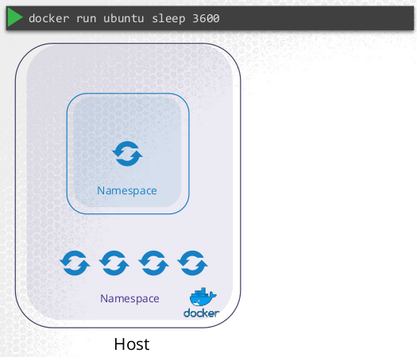

* Whenever a Docker container is running, it is running inside of its own namespace. The Docker container can only see processes within its container namespace. These processes will have their own process IDs, starting with PID 1. This PID is only relative to the container and the PID 1 inside a Docker container is not the PID 1 (initial process) of the host.

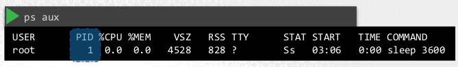

* The host will be able to see the processes running within the Docker container but will have a different process ID. This PID is only relative to the host. This is the 'real' PID as the Docker container is running within the host.


#### Users

* By default Docker runs its processes as the root user. This can be seen inside and outside the container.
* Docker uses Linux Capabilities to restrict what the root user can do inside and outside the Docker container.
  * The full list of Linux Capabilities can be seen at `/usr/include/linux/capability.h`
* You can adjust Linux Capabilities at run time via:
  * Add a Linux capability with `docker run --cap-add $CAPABILITY $IMAGE`
  * Remove a Linux capability with `docker run --cap-drop $CAPABILITY $IMAGE`
  * Use all Linux Capabilities with `docker run --privileged $IMAGE`
* You can change the runtime user that Docker uses from root to any other user. This can be done in the Docker Image or at runtime.
  * `docker run --user=$USER_ID $IMAGE`


### Security Contexts

* **Security Contexts** are the k8s way of implementing some Docker security features. Such as which use will run the process inside the container, and what Linux capabilities it has.

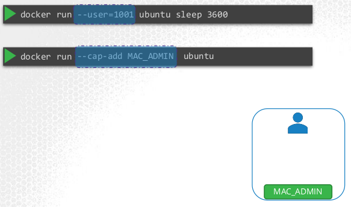

* Security Contexts can be configured at the Pod level or the container level.
  * If configured at the Pod level, all containers within the Pod will inherit these security settings.
  * If configured at the containter level, only those containers will have the security settings applied to them. This will override the settings on the Pod. Linux capabilities can only be set at the container level.


* Security Contexts are defined inside the Pod definition file.
* Pod level Security Context is inside the `spec:` section.
* Container level Security Context is inside the `containers:` section. Linux capabilities can only be set at the container level.

```yaml
apiVersion: v1
kind: Pod
metadata:
  name: multi-pod
spec:
  securityContext: # Pod level
    runAsUser: 1001
  containers:
  -  image: ubuntu # This container will have 1002
     name: web
     command: ["sleep", "5000"]
     securityContext: # Container level
      runAsUser: 1002 

  -  image: ubuntu # This container will have user 1001
     name: sidecar
     command: ["sleep", "5000"]
```

```bash
# Which user is running the command in the pod
kubectl exec ubuntu-sleeper -- whoami # root

# Get Pod YAML, edit it and replace it
kubectl get pod ubuntu-sleeper -o yaml > my-pod.yml
vi my-pod.yml
```

```bash
# Check which user is currently being used inside the container to launch processes
kubectl exec ubuntu-sleeper -- whoami
```

```
# Example update of Linux capability
master $ kubectl exec ubuntu-sleeper -- date -s '19 APR 2012 11:14:00'
date: cannot set date: Operation not permitted
Thu Apr 19 11:14:00 UTC 2012
command terminated with exit code 1
```

```yaml
spec:
  securityContext:
    runAsUser: 0 # Needed to change this to be root, uid 0 is root.
  ...
  containers:
  ...
    securityContext:
      capabilities: # Can only be set at the container level, must be run as root user
        add: ["SYS_TIME"]
```

```bash
master $ kubectl exec ubuntu-sleeper -- date -s '19 APR 2012 11:14:00'
Thu Apr 19 11:14:00 UTC 2012
```

* **When recreating a Pod from the `-o yaml` output, remember that everything exists in the file in alphabetical order. When I was trying to set a Security Context it was being overriden further down the file.**

### Service Accounts

* This concept is linked to other k8s security concepts, but they are covered in the CKA course and are out of scope here.
* There are 2 types of accounts in k8s:
  1. **User Accounts** are used by people - e.g. an admin / developer logging in to the k8s cluster.
  1. **Service Accounts** are used by an application to interact with the k8s cluster. - e.g. the monitoring application Prometheus uses a Service Account to query the k8s metrics API. Jenkins uses a Service Account to deploy applications to the cluster.

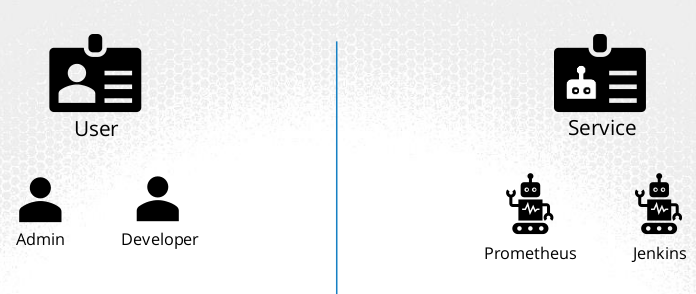

* When a Service Account is created an access token is automatically created and associated with it. This is used by internal and external cluster applications to authenticate with the k8s API.

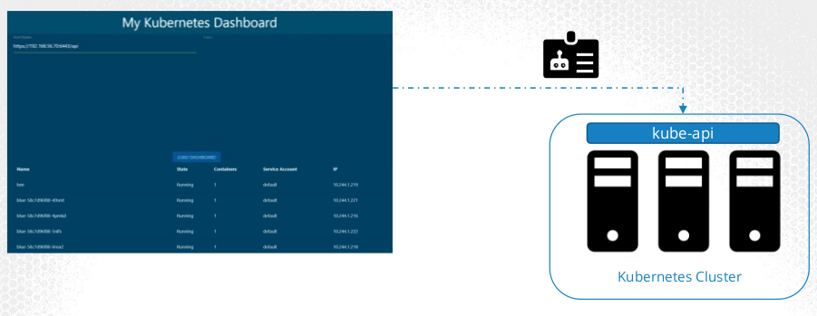

* The token is stored as a k8s Secret object.


* The token can be supplied as an authentication bearer token in `curl` when an external application is communicating with the k8s API. `curl $URL --header "Authorization: Bearer "$TOKEN`
* When using Service Account tokens with applications inside the k8s cluster, the token secret is mounted inside the Pod.
* For every namespace in k8s a Service Account named default is automatically created.
  * k8s automatically mounts the default Service Account if you don't specify a custom Service Account. The default Service Account can only do basic k8s API queries.
  * You can disable this by setting `automountServiceAccountToken: false` inside `containers:` in the POD definition file.

```yaml
apiVersion: v1
kind: Pod
metadata:
  name: my-nginx-pod
  labels:
    app: my-nginx-app
    type: front-end
spec:
  containers:
    - name: nginx-container
      image: nginx
  automountServiceAccountToken: false # Don't mount the default Service Account automatically.
```

* You cannot edit a Service Account of an existing Pod, you must delete and recreate the Pod. Remember that Deployments will do this automatically for you.

```yaml
# Use a custom Service Account within the Pod definition file.
apiVersion: v1
kind: Pod
metadata:
  name: my-nginx-pod
  labels:
    app: my-nginx-app
    type: front-end
spec:
  containers:
    - name: nginx-container
      image: nginx
  serviceAccount: nginx-service-account # Specify custom Service Account
```

```bash
# Create a Service Account and an access Token
kubectl create serviceaccount $SERVICE_ACCOUNT_NAME

# View all Service Accounts
kubectl get serviceaccount

# View details about a Service Account
kubectl describe serviceaccount $SERVICE_ACCOUNT_NAME

# View the Service Account token
kubectl describe secret $SERVICE_ACCOUNT_TOKEN_NAME

# View the Pod's Service Account token details
kubectl describe pod $POD_NAME

# Look inside the container's filesystem to see the Service Account Token files
kubectl exec -it $POD_NAME ls /var/run/secrets/kubernetes.io/serviceaccount
ca.crt namespace token

# Display the container's Service Account Token
kubectl exec -it $POD_NAME cat /var/run/secrets/kubernetes.io/serviceaccount/token
```