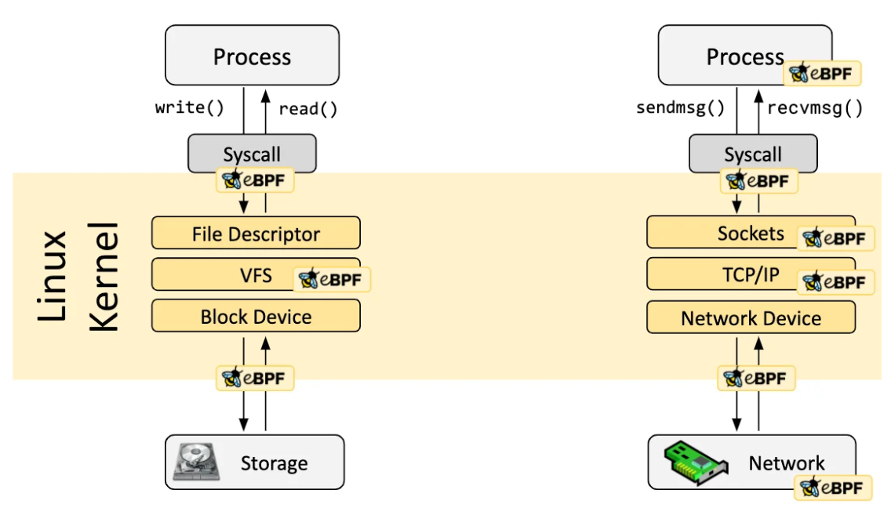
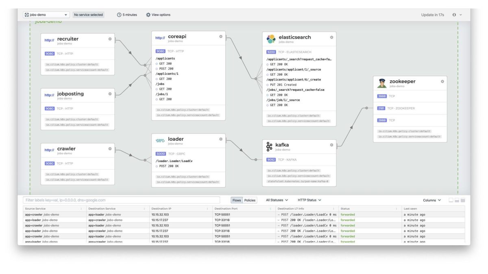
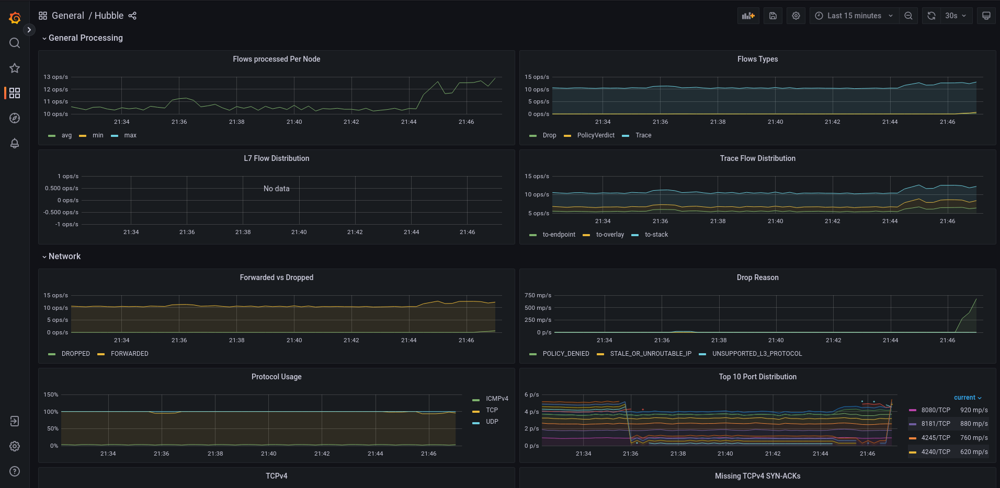
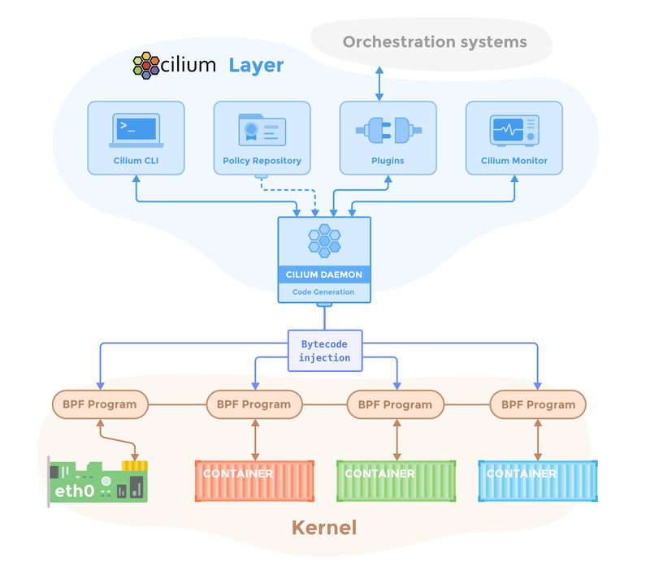
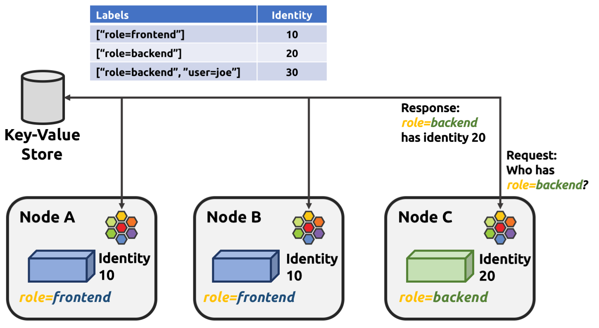

# Introduciton To Cilium <!-- omit in toc -->

https://trainingportal.linuxfoundation.org/learn/course/introduction-to-cilium-lfs146

- [1. Overview](#1-overview)
  - [What Is Cilium?](#what-is-cilium)
  - [Solving Container Networking Challenges](#solving-container-networking-challenges)
  - [Built With eBPF](#built-with-ebpf)
  - [Capabilities](#capabilities)
    - [Networking](#networking)
    - [Identity Aware](#identity-aware)
    - [Transparent Encryption](#transparent-encryption)
    - [Multi-cluster Networking](#multi-cluster-networking)
    - [Load Balancing](#load-balancing)
    - [Network Observability](#network-observability)
    - [Prometheus Metrics](#prometheus-metrics)
    - [Service Mesh](#service-mesh)
- [2. Installation](#2-installation)
  - [Installation Methods](#installation-methods)
    - [Prerequisites](#prerequisites)
    - [Prepare k8s Cluster](#prepare-k8s-cluster)
    - [Install Cilium CLI](#install-cilium-cli)
    - [Install Cilium](#install-cilium)
    - [Validate Installation](#validate-installation)
  - [Architecture Overview](#architecture-overview)
    - [Cilium Operator](#cilium-operator)
    - [Cilium Agent](#cilium-agent)
    - [Cilium Client](#cilium-client)
    - [Cilium CNI Plugin](#cilium-cni-plugin)
    - [Hubble Server](#hubble-server)
    - [Hubble Relay](#hubble-relay)
    - [Hubble CLI \& GUI](#hubble-cli--gui)
    - [Cluster Mesh API Server](#cluster-mesh-api-server)
  - [Endpoints \& Identity](#endpoints--identity)
    - [Cilium Endpoints](#cilium-endpoints)
    - [Cilium Identity](#cilium-identity)
- [3. Network Policy](#3-network-policy)
  - [Types Of Network Policy](#types-of-network-policy)
  - [k8s Network Policy](#k8s-network-policy)
  - [Cilium Network Policy](#cilium-network-policy)

## 1. Overview

### What Is Cilium?

[Cilium](https://cilium.io/) is an open-source, cloud-native solution for providing, securing, and observing network connectivity between workloads.

In Kubernetes, Cilium acts as a networking plugin that connects pods, enforces network policies, and provides transparent encryption.

The Hubble component offers deep visibility into network traffic flows.

Powered by [eBPF](https://ebpf.io/what-is-ebpf/), Cilium programs networking, security, and observability logic directly into the Linux kernel.

This makes Cilium’s capabilities transparent to containerized workloads in Kubernetes as well as traditional workloads like virtual machines and standard Linux processes.

### Solving Container Networking Challenges

[Cilium addresses](https://cilium.io/blog/2018/04/24/cilium-security-for-age-of-microservices/) inefficient and limited traditional networking tools for dynamic microservice environments.

Designed for large-scale, dynamic containerized environments.

Natively understands container and Kubernetes identities.

Parses API protocols like HTTP, gRPC, and Kafka.

Provides simpler and more powerful visibility and security than traditional firewalls.

### Built With eBPF

Cilium uses eBPF to create a networking stack optimized for microservices on platforms like Kubernetes.

eBPF enables Cilium’s security, visibility, and control logic to be inserted dynamically within the Linux kernel.

eBPF allows Cilium to apply and update security policies without changing application code or container configuration.

eBPF programs hook into the Linux network datapath, enabling packet filtering based on network policy as packets enter network sockets.



eBPF provides granular and efficient visibility and control transparently, without requiring application changes.

Cilium leverages eBPF by layering Kubernetes contextual identity, such as metadata labels, into eBPF-powered networking logic.

### Capabilities

#### Networking

Cilium provides network connectivity, enabling communication between pods and other components inside or outside Kubernetes.

Implements a flat Layer 3 network that can span multiple clusters, connecting all application containers.

Default mode is overlay, where traffic is encapsulated for transport between hosts, requiring minimal infrastructure.

Also offers a native routing model, using the host's routing table to route traffic directly to pod or external IPs.

The native routing mode requires knowledge of the network infrastructure and works well with IPv6, cloud routers, or existing routing daemons.

#### Identity Aware

Network policies define which workloads can communicate, securing deployments by preventing unexpected traffic.

Cilium enforces both native Kubernetes NetworkPolicies and enhanced CiliumNetworkPolicy resource types.

Traditional firewalls rely on filtering IP addresses and ports, requiring firewall rule updates on all nodes when pods start anywhere, which doesn’t scale well.

Cilium assigns identities to groups of application containers based on Kubernetes metadata, associating these identities with emitted network packets.

eBPF programs validate identities at receiving nodes without using Linux firewall rules.

New pods sharing existing identities do not require policy updates when scaled up.

Cilium secures Layers 3, 4, and 7, including protocols like REST/HTTP, gRPC, and Kafka.

Allows fine-grained network policies such as allowing HTTP GET requests to specific paths and requiring specific HTTP headers.

#### Transparent Encryption

In-flight data encryption between services is required by some regulation frameworks.

Cilium supports simple-to-configure transparent encryption using IPSec or WireGuard.

When enabled, this encryption secures traffic between nodes without requiring any workload reconfiguration.

#### Multi-cluster Networking

Cilium’s Cluster Mesh capabilities make it easy for workloads to communicate with services hosted in different Kubernetes clusters.

You can make services highly available by running them in clusters in different regions, using Cilium Cluster Mesh to connect them.

#### Load Balancing

Cilium implements distributed load balancing for traffic between application containers and external services.

It can [fully replace](https://cilium.io/blog/2020/06/22/cilium-18/#kubeproxy-removal) components such as kube-proxy and be used as a [standalone load balancer](https://cilium.io/blog/2022/04/12/cilium-standalone-L4LB-XDP/).

Load balancing is implemented in eBPF using efficient hash tables, allowing for almost unlimited scale.

#### Network Observability

Cilium includes a dedicated network observability component called Hubble, built on eBPF.

Hubble provides visibility into network traffic at Layer 3/4 (IP address and port) and Layer 7 (API protocols).

It offers event monitoring with metadata, including source/destination IPs and labels.

Hubble exports configurable Prometheus metrics and provides a graphical UI for visualization.

It enables deep insight into network flows, packet drops, and security events within Kubernetes clusters.

Hubble uses eBPF for high-performance, distributed, real-time network monitoring without modifying applications.



#### Prometheus Metrics

Cilium and Hubble export metrics about network performance and latency via Prometheus so that you can integrate Cilium metrics into your existing dashboards.



#### Service Mesh

Cilium supports load balancing, application layer visibility, Kubernetes Ingress and Gateway API, and security features typical of a Kubernetes service mesh.

It provides service mesh features without requiring sidecar containers injected into every pod.

## 2. Installation

Cilium is under active development, and the labs in this course were developed using Cilium 1.16.x releases.

### Installation Methods

Cilium supports two installation methods:

* Cilium CLI tool: Eases getting started by using the Kubernetes API to detect cluster context and pick installation options automatically. Recommended for learning and most labs.
* [Helm chart](https://docs.cilium.io/en/stable/installation/k8s-install-helm/#installation-using-helm): Intended for advanced or production use, offering granular control of datapath and IPAM selections. Used for advanced features in later courses.

#### Prerequisites

You need a Kubernetes cluster configured for an external CNI.

Instructions are included for optionally configuring a local [kind](https://kind.sigs.k8s.io/) cluster.

You can use any Kubernetes implementation you prefer. The Cilium documentation provides [quick start instructions](https://docs.cilium.io/en/latest/gettingstarted/k8s-install-default/#cilium-quick-installation) for common Kubernetes environments.

[kubectl](https://kubernetes.io/docs/tasks/tools/install-kubectl-linux/) must be installed to manage the Kubernetes cluster.

#### Prepare k8s Cluster

I used `go install sigs.k8s.io/kind@v0.30.0` from https://kind.sigs.k8s.io/#installation-and-usage and also updated my `PATH` to include the output of `$(go env GOPATH)/bin`

```shell
# ~/.bashrc updated with
PATH="$HOME/go/bin:$PATH"
export PATH
```

Based on [Cilium create cluster](https://docs.cilium.io/en/latest/gettingstarted/k8s-install-default/#cilium-quick-installation)

```yaml
kind: Cluster
apiVersion: kind.x-k8s.io/v1alpha4
nodes:
  - role: control-plane
  - role: worker
  - role: worker
networking:
  disableDefaultCNI: true
```

**NOTE:** I had to run this as root for it to work.

```bash
/home/dallas/go/bin/kind create cluster --config=kind-config.yaml
cp ~/.kube/config ~dallas/.kube/config
chown dallas: ~dallas/.kube/config
```

Kind will create the cluster and will configure an associated kubectl context. Confirm your new kind cluster is the default kubectl context:

```
k config current-context

kind-kind
```

Now you should be able to use kubectl and the Cilium CLI tool and interact with your newly minted kind cluster.

**Note:** Because you have created the cluster without a default CNI, the Kubernetes nodes are in a NotReady state:

```
k get no

NAME                 STATUS     ROLES           AGE     VERSION
kind-control-plane   NotReady   control-plane   5m40s   v1.34.0
kind-worker          NotReady   <none>          5m31s   v1.34.0
kind-worker2         NotReady   <none>          5m30s   v1.34.0
```

#### Install Cilium CLI

Follow [these steps](https://docs.cilium.io/en/stable/gettingstarted/k8s-install-default/#install-the-cilium-cli).

#### Install Cilium

```bash
# Use the Cilium CLI tool to install Cilium.
cilium install

# Wait for the deploayment to finish.
cilium status --wait
```

```
    /¯¯\
 /¯¯\__/¯¯\    Cilium:             OK
 \__/¯¯\__/    Operator:           OK
 /¯¯\__/¯¯\    Envoy DaemonSet:    OK
 \__/¯¯\__/    Hubble Relay:       disabled
    \__/       ClusterMesh:        disabled

DaemonSet              cilium                   Desired: 3, Ready: 3/3, Available: 3/3
DaemonSet              cilium-envoy             Desired: 3, Ready: 3/3, Available: 3/3
Deployment             cilium-operator          Desired: 1, Ready: 1/1, Available: 1/1
Containers:            cilium                   Running: 3
                       cilium-envoy             Running: 3
                       cilium-operator          Running: 1
                       clustermesh-apiserver
                       hubble-relay
Cluster Pods:          3/3 managed by Cilium
Helm chart version:    1.18.2
Image versions         cilium             quay.io/cilium/cilium:v1.18.2@sha256:858f807ea4e20e85e3ea3240a762e1f4b29f1cb5bbd0463b8aa77e7b097c0667: 3
                       cilium-envoy       quay.io/cilium/cilium-envoy:v1.34.7-1757592137-1a52bb680a956879722f48c591a2ca90f7791324@sha256:7932d656b63f6f866b6732099d33355184322123cfe1182e6f05175a3bc2e0e0: 3
                       cilium-operator    quay.io/cilium/operator-generic:v1.18.2@sha256:cb4e4ffc5789fd5ff6a534e3b1460623df61cba00f5ea1c7b40153b5efb81805: 1
```

```bash
# Enable the Hubble UI.
cilium hubble enable --ui
```

This command reconfigures and restarts the Cilium agents to ensure they have enabled the embedded Hubble services. The command will also install the cluster-wide Hubble components to enable cluster-wide network observability.

```bash
# Wait for the deploayment to finish.
cilium status --wait
```

```
    /¯¯\
 /¯¯\__/¯¯\    Cilium:             OK
 \__/¯¯\__/    Operator:           OK
 /¯¯\__/¯¯\    Envoy DaemonSet:    OK
 \__/¯¯\__/    Hubble Relay:       OK
    \__/       ClusterMesh:        disabled

DaemonSet              cilium                   Desired: 3, Ready: 3/3, Available: 3/3
DaemonSet              cilium-envoy             Desired: 3, Ready: 3/3, Available: 3/3
Deployment             cilium-operator          Desired: 1, Ready: 1/1, Available: 1/1
Deployment             hubble-relay             Desired: 1, Ready: 1/1, Available: 1/1
Deployment             hubble-ui                Desired: 1, Ready: 1/1, Available: 1/1
Containers:            cilium                   Running: 3
                       cilium-envoy             Running: 3
                       cilium-operator          Running: 1
                       clustermesh-apiserver
                       hubble-relay             Running: 1
                       hubble-ui                Running: 1
Cluster Pods:          5/5 managed by Cilium
Helm chart version:    1.18.2
Image versions         cilium             quay.io/cilium/cilium:v1.18.2@sha256:858f807ea4e20e85e3ea3240a762e1f4b29f1cb5bbd0463b8aa77e7b097c0667: 3
                       cilium-envoy       quay.io/cilium/cilium-envoy:v1.34.7-1757592137-1a52bb680a956879722f48c591a2ca90f7791324@sha256:7932d656b63f6f866b6732099d33355184322123cfe1182e6f05175a3bc2e0e0: 3
                       cilium-operator    quay.io/cilium/operator-generic:v1.18.2@sha256:cb4e4ffc5789fd5ff6a534e3b1460623df61cba00f5ea1c7b40153b5efb81805: 1
                       hubble-relay       quay.io/cilium/hubble-relay:v1.18.2@sha256:6079308ee15e44dff476fb522612732f7c5c4407a1017bc3470916242b0405ac: 1
                       hubble-ui          quay.io/cilium/hubble-ui-backend:v0.13.3@sha256:db1454e45dc39ca41fbf7cad31eec95d99e5b9949c39daaad0fa81ef29d56953: 1
                       hubble-ui          quay.io/cilium/hubble-ui:v0.13.3@sha256:661d5de7050182d495c6497ff0b007a7a1e379648e60830dd68c4d78ae21761d: 1

```

#### Validate Installation

Note: I had to run the following to [fix a crashing pod](https://kind.sigs.k8s.io/docs/user/known-issues/#pod-errors-due-to-too-many-open-files).

```bash
# Temporarily increase inotify resources
sudo sysctl fs.inotify.max_user_watches=524288
sudo sysctl fs.inotify.max_user_instances=512
```

The Cilium CLI tool also provides a command to install a set of connectivity tests in a dedicated Kubernetes namespace. We can run these tests to validate that the Cilium install is fully operational:

`cilium connectivity test --request-timeout 30s --connect-timeout 10s`

The Cilium connectivity test suite has dozens of tests that verify network and policy enforcement functions. Expect the tests to take at least 10 minutes including image downloads. The connectivity tests require a cluster with at least two worker nodes. The test pods will not run on control-plane nodes. If you don't have two worker nodes, the test may stall waiting for deployments to complete.

### Architecture Overview



#### Cilium Operator

The Cilium operator manages cluster duties that should run once per cluster instead of on every node. It is not in the critical path for forwarding or network policy decisions, so the cluster will generally continue to function if the operator is temporarily unavailable.

#### Cilium Agent

The Cilium agent runs as a daemonset with a pod on every Kubernetes node and performs most of Cilium’s work. It synchronizes cluster state with the Kubernetes API server, manages eBPF programs and maps in the Linux kernel, communicates with the Cilium CNI plugin via a filesystem socket to detect new workloads, creates DNS and Envoy proxies on demand based on network policy, and creates Hubble gRPC services when Hubble is enabled.

#### Cilium Client

The Cilium client is included with each pod of the Cilium agent daemonset and enables inspection of the Cilium agent’s state and eBPF map resources on that node. It communicates with the Cilium agent's REST API from within the daemonset pod.

#### Cilium CNI Plugin

The Cilium agent daemonset installs the separate Cilium CNI plugin executable into the Kubernetes host filesystem and reconfigures the node’s CNI to use this plugin. The CNI plugin executable is installed during the agent daemonset initialization and communicates with the running Cilium agent via a host filesystem socket when needed.

#### Hubble Server

The Hubble server runs on each node and is embedded within the Cilium agent for high performance and low overhead. It retrieves visibility data using eBPF and provides a gRPC service for accessing flow information and Prometheus metrics.

#### Hubble Relay

When Hubble is enabled in a Cilium-managed cluster, the Cilium agents on each node restart to activate the Hubble gRPC service for node-local observability. For cluster-wide observability, the deployment adds a Hubble Relay along with the Hubble Observer and Hubble Peer services. The Hubble Relay aggregates data from all node-local Hubble gRPC services, while the Hubble Peer detects new active Cilium agents with Hubble enabled. Users interact primarily with the Hubble Observer service through the Hubble CLI or UI to gain insights into network flows across the cluster. There is one intance of Hubble Relay in the cluster.

#### Hubble CLI & GUI

The Hubble CLI (hubble) is a command line tool able to connect to either the gRPC API of hubble-relay or the local server to retrieve flow events.

The graphical user interface (hubble-ui) utilizes relay-based visibility to provide a graphical service dependency and connectivity map.

#### Cluster Mesh API Server

The Cilium Cluster Mesh API server is an optional deployment enabled with the Cilium Cluster Mesh feature, which allows sharing Kubernetes services across multiple clusters. Each cluster in the mesh deploys an etcd key-value store to hold Cilium identity information and exposes a proxy service for these etcd stores. Cilium agents in any cluster member use these proxies to read cluster-wide identity state, enabling the creation and access of global services spanning the Cluster Mesh. By securely reading from each cluster’s etcd proxy, Cilium agents gain global identity awareness across the mesh, facilitating multi-cluster service connectivity.

### Endpoints & Identity

#### Cilium Endpoints

Cilium assigns IP addresses to application containers and groups containers sharing an IP address into an Endpoint. In Kubernetes, pods naturally map to Cilium Endpoints because pods are groups of containers sharing Linux namespaces and an IP address. Therefore, Cilium creates an Endpoint for each Kubernetes pod running in the cluster to manage container connectivity efficiently.

#### Cilium Identity



A key concept enabling Cilium’s efficiency is its notion of [Identity](https://docs.cilium.io/en/latest/gettingstarted/terminology/#what-is-an-identity), where all [Endpoints](https://docs.cilium.io/en/latest/gettingstarted/terminology/#endpoints) are assigned a cluster-wide unique, [label](https://docs.cilium.io/en/latest/gettingstarted/terminology/#labels)-based identity matching their [Security Relevant Labels](https://docs.cilium.io/en/latest/gettingstarted/terminology/#security-relevant-labels). Endpoints sharing the same set of labels share the same identity. This numeric identifier allows eBPF programs to perform fast lookups in the network datapath and enables Hubble’s Kubernetes-aware network observability.

As packets enter or leave a node, Cilium’s eBPF programs map source and destination IPs to numeric identities and apply datapath actions based on policies referencing those identities. Each Cilium agent updates identity-relevant eBPF maps for endpoints on its node by monitoring Kubernetes resource changes.

## 3. Network Policy

### Types Of Network Policy

Network Policies in Kubernetes define permitted traffic using identity information like label selectors, namespace names, and fully-qualified domain names, unlike traditional IP-based firewalls. Cilium supports three network policy formats: the standard Kubernetes [NetworkPolicy](https://docs.cilium.io/en/latest/network/kubernetes/policy/#networkpolicy) (L3/L4), [CiliumNetworkPolicy](https://docs.cilium.io/en/latest/network/kubernetes/policy/#ciliumnetworkpolicy) (L3, L4, and L7), and [CiliumClusterwideNetworkPolicy](https://docs.cilium.io/en/latest/network/kubernetes/policy/#ciliumclusterwidenetworkpolicy) (cluster-wide policies). Cilium agents watch for policy updates and apply necessary eBPF programs and maps to enforce them. While all policy types can be used simultaneously, care is advised to avoid unintended behavior. The focus is on the CiliumNetworkPolicy resource as it offers the most comprehensive capabilities.

### k8s Network Policy

The NetworkPolicy resource is a standard Kubernetes resource that lets you control traffic flow at the IP address or port level (Open Systems Interconnection(OSI) model layer 3 or 4). The NetworkPolicy capabilities include:
* L3/L4 Ingress and Egress policy using label matching;
* L3 IP/CIDR Ingress and Egress policy using IP/CIDR for cluster external endpoints;
* L4 TCP and ICMP port Ingress and Egress policy.

### Cilium Network Policy

CiliumNetworkPolicy extends the standard Kubernetes NetworkPolicy by adding advanced features including:
* L7 HTTP protocol policy rules, limiting Ingress and Egress to specific HTTP paths
* Support for additional L7 protocols such as [DNS](https://docs.cilium.io/en/latest/security/policy/language/#dns-policy-and-ip-discovery), [Kafka](https://docs.cilium.io/en/stable/security/kafka/#gs-kafka) and [gRPC](https://docs.cilium.io/en/stable/security/grpc/)
* Service name-based Egress policy for internal cluster communications
* L3/L4 Ingress and Egress policy using [Entity matching](https://docs.cilium.io/en/latest/security/policy/language/#entities-based) for special entities
* L3 Ingress and Egress policy using DNS FQDN matching.

Examples of CiliumNetworkPolicy manifests are available in the [documentation])(https://docs.cilium.io/en/latest/security/policy/). Because reading policy YAML can be complex, the visual policy editor at [networkpolicy.io](https://editor.networkpolicy.io/?id=iqFBmqinwsQku5ir) helps understand and craft effective policies.
