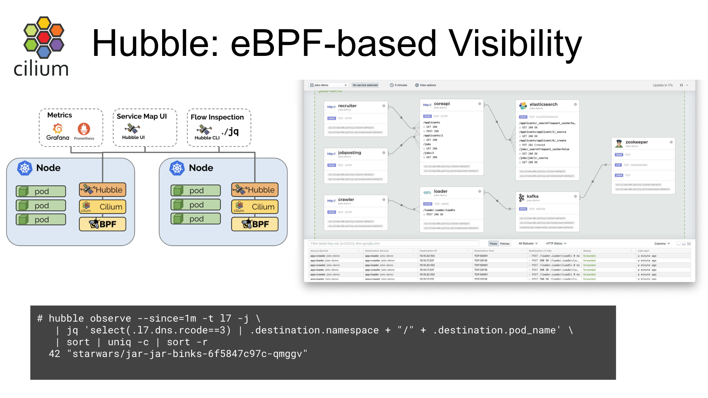
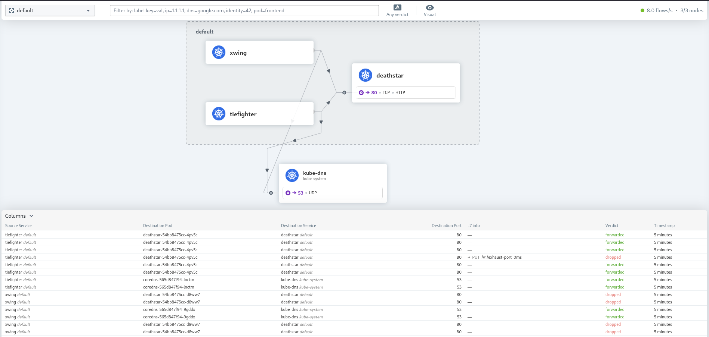
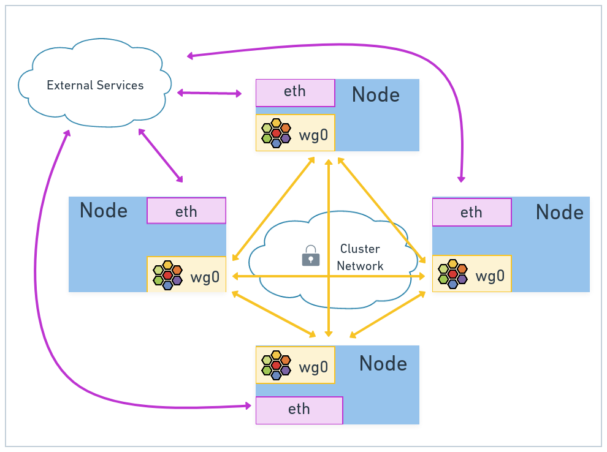

# Introduciton To Cilium <!-- omit in toc -->

https://trainingportal.linuxfoundation.org/learn/course/introduction-to-cilium-lfs146

- [1. Overview](#1-overview)
  - [What Is Cilium?](#what-is-cilium)
  - [Solving Container Networking Challenges](#solving-container-networking-challenges)
  - [Built With eBPF](#built-with-ebpf)
  - [Capabilities](#capabilities)
    - [Networking](#networking)
    - [Identity Aware](#identity-aware)
    - [Transparent Encryption](#transparent-encryption)
    - [Multi-cluster Networking](#multi-cluster-networking)
    - [Load Balancing](#load-balancing)
    - [Network Observability](#network-observability)
    - [Prometheus Metrics](#prometheus-metrics)
    - [Service Mesh](#service-mesh)
- [2. Installation](#2-installation)
  - [Installation Methods](#installation-methods)
    - [Prerequisites](#prerequisites)
    - [Prepare k8s Cluster](#prepare-k8s-cluster)
    - [Install Cilium CLI](#install-cilium-cli)
    - [Install Cilium](#install-cilium)
    - [Validate Installation](#validate-installation)
  - [Architecture Overview](#architecture-overview)
    - [Cilium Operator](#cilium-operator)
    - [Cilium Agent](#cilium-agent)
    - [Cilium Client](#cilium-client)
    - [Cilium CNI Plugin](#cilium-cni-plugin)
    - [Hubble Server](#hubble-server)
    - [Hubble Relay](#hubble-relay)
    - [Hubble CLI \& GUI](#hubble-cli--gui)
    - [Cluster Mesh API Server](#cluster-mesh-api-server)
  - [Endpoints \& Identity](#endpoints--identity)
    - [Cilium Endpoints](#cilium-endpoints)
    - [Cilium Identity](#cilium-identity)
- [3. Network Policy](#3-network-policy)
  - [Types Of Network Policy](#types-of-network-policy)
  - [k8s Network Policy](#k8s-network-policy)
  - [Cilium Network Policy](#cilium-network-policy)
  - [Online Policy Editor](#online-policy-editor)
  - [L7 Cilium Network Policy Capabiliites](#l7-cilium-network-policy-capabiliites)
  - [L7 HTTP Policy](#l7-http-policy)
  - [Labs](#labs)
    - [Setup](#setup)
    - [No Security](#no-security)
    - [Applying L3/L4 Security](#applying-l3l4-security)
    - [Applying L7 Security](#applying-l7-security)
- [4. Network Observability](#4-network-observability)
  - [Hubble](#hubble)
    - [Installing Hubble CLI](#installing-hubble-cli)
    - [Introduction](#introduction)
    - [Insightful](#insightful)
    - [Components](#components)
  - [Network Flows](#network-flows)
    - [Single Node Flows](#single-node-flows)
    - [Cluster Wide Flows](#cluster-wide-flows)
    - [Denying DNS](#denying-dns)
- [5. Metrics](#5-metrics)
  - [Operator Metrics](#operator-metrics)
  - [Agent Metrics](#agent-metrics)
  - [Hubble Metrics](#hubble-metrics)
    - [Context Options](#context-options)
  - [Enabling Metrics](#enabling-metrics)
  - [Labs](#labs-1)
    - [Dashboards](#dashboards)
- [6. Transparent Encryption](#6-transparent-encryption)
  - [Why Use WireGuard or IPsec?](#why-use-wireguard-or-ipsec)
  - [Enabling Transparent Encryption](#enabling-transparent-encryption)
- [7. Replacing Kube-Proxy](#7-replacing-kube-proxy)
  - [Benefits Of Replacing Kube-Proxy](#benefits-of-replacing-kube-proxy)
  - [Kube-Proxy Functionality](#kube-proxy-functionality)
  - [Enabling Kube-Proxy Replacement](#enabling-kube-proxy-replacement)
- [8. Cilium Cluster Mesh](#8-cilium-cluster-mesh)

## 1. Overview

### What Is Cilium?

[Cilium](https://cilium.io/) is an open-source, cloud-native solution for providing, securing, and observing network connectivity between workloads.

In Kubernetes, Cilium acts as a networking plugin that connects pods, enforces network policies, and provides transparent encryption.

The Hubble component offers deep visibility into network traffic flows.

Powered by [eBPF](https://ebpf.io/what-is-ebpf/), Cilium programs networking, security, and observability logic directly into the Linux kernel.

This makes Cilium’s capabilities transparent to containerized workloads in Kubernetes as well as traditional workloads like virtual machines and standard Linux processes.

### Solving Container Networking Challenges

[Cilium addresses](https://cilium.io/blog/2018/04/24/cilium-security-for-age-of-microservices/) inefficient and limited traditional networking tools for dynamic microservice environments.

Designed for large-scale, dynamic containerized environments.

Natively understands container and Kubernetes identities.

Parses API protocols like HTTP, gRPC, and Kafka.

Provides simpler and more powerful visibility and security than traditional firewalls.

### Built With eBPF

Cilium uses eBPF to create a networking stack optimized for microservices on platforms like Kubernetes.

eBPF enables Cilium’s security, visibility, and control logic to be inserted dynamically within the Linux kernel.

eBPF allows Cilium to apply and update security policies without changing application code or container configuration.

eBPF programs hook into the Linux network datapath, enabling packet filtering based on network policy as packets enter network sockets.


eBPF provides granular and efficient visibility and control transparently, without requiring application changes.

Cilium leverages eBPF by layering Kubernetes contextual identity, such as metadata labels, into eBPF-powered networking logic.

### Capabilities

#### Networking

Cilium provides network connectivity, enabling communication between pods and other components inside or outside Kubernetes.

Implements a flat Layer 3 network that can span multiple clusters, connecting all application containers.

Default mode is overlay, where traffic is encapsulated for transport between hosts, requiring minimal infrastructure.

Also offers a native routing model, using the host's routing table to route traffic directly to pod or external IPs.

The native routing mode requires knowledge of the network infrastructure and works well with IPv6, cloud routers, or existing routing daemons.

#### Identity Aware

Network policies define which workloads can communicate, securing deployments by preventing unexpected traffic.

Cilium enforces both native Kubernetes NetworkPolicies and enhanced CiliumNetworkPolicy resource types.

Traditional firewalls rely on filtering IP addresses and ports, requiring firewall rule updates on all nodes when pods start anywhere, which doesn’t scale well.

Cilium assigns identities to groups of application containers based on Kubernetes metadata, associating these identities with emitted network packets.

eBPF programs validate identities at receiving nodes without using Linux firewall rules.

New pods sharing existing identities do not require policy updates when scaled up.

Cilium secures Layers 3, 4, and 7, including protocols like REST/HTTP, gRPC, and Kafka.

Allows fine-grained network policies such as allowing HTTP GET requests to specific paths and requiring specific HTTP headers.

#### Transparent Encryption

In-flight data encryption between services is required by some regulation frameworks.

Cilium supports simple-to-configure transparent encryption using IPSec or WireGuard.

When enabled, this encryption secures traffic between nodes without requiring any workload reconfiguration.

#### Multi-cluster Networking

Cilium’s Cluster Mesh capabilities make it easy for workloads to communicate with services hosted in different Kubernetes clusters.

You can make services highly available by running them in clusters in different regions, using Cilium Cluster Mesh to connect them.

#### Load Balancing

Cilium implements distributed load balancing for traffic between application containers and external services.

It can [fully replace](https://cilium.io/blog/2020/06/22/cilium-18/#kubeproxy-removal) components such as kube-proxy and be used as a [standalone load balancer](https://cilium.io/blog/2022/04/12/cilium-standalone-L4LB-XDP/).

Load balancing is implemented in eBPF using efficient hash tables, allowing for almost unlimited scale.

#### Network Observability

Cilium includes a dedicated network observability component called Hubble, built on eBPF.

Hubble provides visibility into network traffic at Layer 3/4 (IP address and port) and Layer 7 (API protocols).

It offers event monitoring with metadata, including source/destination IPs and labels.

Hubble exports configurable Prometheus metrics and provides a graphical UI for visualization.

It enables deep insight into network flows, packet drops, and security events within Kubernetes clusters.

Hubble uses eBPF for high-performance, distributed, real-time network monitoring without modifying applications.


#### Prometheus Metrics

Cilium and Hubble export metrics about network performance and latency via Prometheus so that you can integrate Cilium metrics into your existing dashboards.


#### Service Mesh

Cilium supports load balancing, application layer visibility, Kubernetes Ingress and Gateway API, and security features typical of a Kubernetes service mesh.

It provides service mesh features without requiring sidecar containers injected into every pod.

## 2. Installation

Cilium is under active development, and the labs in this course were developed using Cilium 1.16.x releases.

### Installation Methods

Cilium supports two installation methods:

* Cilium CLI tool: Eases getting started by using the Kubernetes API to detect cluster context and pick installation options automatically. Recommended for learning and most labs.
* [Helm chart](https://docs.cilium.io/en/stable/installation/k8s-install-helm/#installation-using-helm): Intended for advanced or production use, offering granular control of datapath and IPAM selections. Used for advanced features in later courses.

#### Prerequisites

You need a Kubernetes cluster configured for an external CNI.

Instructions are included for optionally configuring a local [kind](https://kind.sigs.k8s.io/) cluster.

You can use any Kubernetes implementation you prefer. The Cilium documentation provides [quick start instructions](https://docs.cilium.io/en/latest/gettingstarted/k8s-install-default/#cilium-quick-installation) for common Kubernetes environments.

[kubectl](https://kubernetes.io/docs/tasks/tools/install-kubectl-linux/) must be installed to manage the Kubernetes cluster.

#### Prepare k8s Cluster

I used `go install sigs.k8s.io/kind@v0.30.0` from https://kind.sigs.k8s.io/#installation-and-usage and also updated my `PATH` to include the output of `$(go env GOPATH)/bin`

```shell
# ~/.bashrc updated with
PATH="$HOME/go/bin:$PATH"
export PATH
```

Based on [Cilium create cluster](https://docs.cilium.io/en/latest/gettingstarted/k8s-install-default/#cilium-quick-installation).

```yaml
kind: Cluster
apiVersion: kind.x-k8s.io/v1alpha4
nodes:
  - role: control-plane
  - role: worker
  - role: worker
networking:
  disableDefaultCNI: true
```

**NOTE:** I had to run this as root for it to work.

```bash
# Install Kind
/home/dallas/go/bin/kind create cluster --config=kind-config.yaml

# Copy over KUBECONFIG
cp ~/.kube/config ~dallas/.kube/config
chown dallas: ~dallas/.kube/config
```

Kind will create the cluster and will configure an associated kubectl context. Confirm your new kind cluster is the default kubectl context:

```bash
# Check our KUBECONFIG
k config current-context
```

```
kind-kind
```

Now you should be able to use kubectl and the Cilium CLI tool and interact with your newly minted kind cluster.

**Note:** Because you have created the cluster without a default CNI, the Kubernetes nodes are in a NotReady state:

```bash
# Check the k8s nodes
k get no
```

```
NAME                 STATUS     ROLES           AGE     VERSION
kind-control-plane   NotReady   control-plane   5m40s   v1.34.0
kind-worker          NotReady   <none>          5m31s   v1.34.0
kind-worker2         NotReady   <none>          5m30s   v1.34.0
```

#### Install Cilium CLI

Follow [these steps](https://docs.cilium.io/en/stable/gettingstarted/k8s-install-default/#install-the-cilium-cli).

#### Install Cilium

```bash
# Use the Cilium CLI tool to install Cilium.
cilium install --version 1.18.4

# Wait for the deploayment to finish.
cilium status --wait
```

```
    /¯¯\
 /¯¯\__/¯¯\    Cilium:             OK
 \__/¯¯\__/    Operator:           OK
 /¯¯\__/¯¯\    Envoy DaemonSet:    OK
 \__/¯¯\__/    Hubble Relay:       disabled
    \__/       ClusterMesh:        disabled

DaemonSet              cilium                   Desired: 3, Ready: 3/3, Available: 3/3
DaemonSet              cilium-envoy             Desired: 3, Ready: 3/3, Available: 3/3
Deployment             cilium-operator          Desired: 1, Ready: 1/1, Available: 1/1
Containers:            cilium                   Running: 3
                       cilium-envoy             Running: 3
                       cilium-operator          Running: 1
                       clustermesh-apiserver
                       hubble-relay
Cluster Pods:          3/3 managed by Cilium
Helm chart version:    1.18.2
Image versions         cilium             quay.io/cilium/cilium:v1.18.2@sha256:858f807ea4e20e85e3ea3240a762e1f4b29f1cb5bbd0463b8aa77e7b097c0667: 3
                       cilium-envoy       quay.io/cilium/cilium-envoy:v1.34.7-1757592137-1a52bb680a956879722f48c591a2ca90f7791324@sha256:7932d656b63f6f866b6732099d33355184322123cfe1182e6f05175a3bc2e0e0: 3
                       cilium-operator    quay.io/cilium/operator-generic:v1.18.2@sha256:cb4e4ffc5789fd5ff6a534e3b1460623df61cba00f5ea1c7b40153b5efb81805: 1
```

[Followed these steps.](https://docs.cilium.io/en/stable/observability/hubble/setup/#hubble-setup)

```bash
# Enable the Hubble and its UI.
cilium hubble enable
cilium hubble enable --ui
```

This command reconfigures and restarts the Cilium agents to ensure they have enabled the embedded Hubble services. The command will also install the cluster-wide Hubble components to enable cluster-wide network observability.

```bash
# Wait for the deploayment to finish.
cilium status --wait
```

```
    /¯¯\
 /¯¯\__/¯¯\    Cilium:             OK
 \__/¯¯\__/    Operator:           OK
 /¯¯\__/¯¯\    Envoy DaemonSet:    OK
 \__/¯¯\__/    Hubble Relay:       OK
    \__/       ClusterMesh:        disabled

DaemonSet              cilium                   Desired: 3, Ready: 3/3, Available: 3/3
DaemonSet              cilium-envoy             Desired: 3, Ready: 3/3, Available: 3/3
Deployment             cilium-operator          Desired: 1, Ready: 1/1, Available: 1/1
Deployment             hubble-relay             Desired: 1, Ready: 1/1, Available: 1/1
Deployment             hubble-ui                Desired: 1, Ready: 1/1, Available: 1/1
Containers:            cilium                   Running: 3
                       cilium-envoy             Running: 3
                       cilium-operator          Running: 1
                       clustermesh-apiserver
                       hubble-relay             Running: 1
                       hubble-ui                Running: 1
Cluster Pods:          5/5 managed by Cilium
Helm chart version:    1.18.2
Image versions         cilium             quay.io/cilium/cilium:v1.18.2@sha256:858f807ea4e20e85e3ea3240a762e1f4b29f1cb5bbd0463b8aa77e7b097c0667: 3
                       cilium-envoy       quay.io/cilium/cilium-envoy:v1.34.7-1757592137-1a52bb680a956879722f48c591a2ca90f7791324@sha256:7932d656b63f6f866b6732099d33355184322123cfe1182e6f05175a3bc2e0e0: 3
                       cilium-operator    quay.io/cilium/operator-generic:v1.18.2@sha256:cb4e4ffc5789fd5ff6a534e3b1460623df61cba00f5ea1c7b40153b5efb81805: 1
                       hubble-relay       quay.io/cilium/hubble-relay:v1.18.2@sha256:6079308ee15e44dff476fb522612732f7c5c4407a1017bc3470916242b0405ac: 1
                       hubble-ui          quay.io/cilium/hubble-ui-backend:v0.13.3@sha256:db1454e45dc39ca41fbf7cad31eec95d99e5b9949c39daaad0fa81ef29d56953: 1
                       hubble-ui          quay.io/cilium/hubble-ui:v0.13.3@sha256:661d5de7050182d495c6497ff0b007a7a1e379648e60830dd68c4d78ae21761d: 1

```

#### Validate Installation

Note: I had to run the following to [fix a crashing pod](https://kind.sigs.k8s.io/docs/user/known-issues/#pod-errors-due-to-too-many-open-files).

```bash
# Temporarily increase inotify resources
sudo sysctl fs.inotify.max_user_watches=524288
sudo sysctl fs.inotify.max_user_instances=512
```

The Cilium CLI tool also provides a command to install a set of connectivity tests in a dedicated Kubernetes namespace. We can run these tests to validate that the Cilium install is fully operational:

```bash
# Test the installation.
cilium connectivity test --request-timeout 3s --connect-timeout 3s
```

The Cilium connectivity test suite has dozens of tests that verify network and policy enforcement functions. Expect the tests to take at least 10 minutes including image downloads. The connectivity tests require a cluster with at least two worker nodes. The test pods will not run on control-plane nodes. If you don't have two worker nodes, the test may stall waiting for deployments to complete.

### Architecture Overview


#### Cilium Operator

The Cilium operator manages cluster duties that should run once per cluster instead of on every node. It is not in the critical path for forwarding or network policy decisions, so the cluster will generally continue to function if the operator is temporarily unavailable.

#### Cilium Agent

The Cilium agent runs as a daemonset with a pod on every Kubernetes node and performs most of Cilium’s work. It synchronizes cluster state with the Kubernetes API server, manages eBPF programs and maps in the Linux kernel, communicates with the Cilium CNI plugin via a filesystem socket to detect new workloads, creates DNS and Envoy proxies on demand based on network policy, and creates Hubble gRPC services when Hubble is enabled.

#### Cilium Client

The Cilium client is included with each pod of the Cilium agent daemonset and enables inspection of the Cilium agent’s state and eBPF map resources on that node. It communicates with the Cilium agent's REST API from within the daemonset pod.

#### Cilium CNI Plugin

The Cilium agent daemonset installs the separate Cilium CNI plugin executable into the Kubernetes host filesystem and reconfigures the node’s CNI to use this plugin. The CNI plugin executable is installed during the agent daemonset initialization and communicates with the running Cilium agent via a host filesystem socket when needed.

#### Hubble Server

The Hubble server runs on each node and is embedded within the Cilium agent for high performance and low overhead. It retrieves visibility data using eBPF and provides a gRPC service for accessing flow information and Prometheus metrics.

#### Hubble Relay

When Hubble is enabled in a Cilium-managed cluster, the Cilium agents on each node restart to activate the Hubble gRPC service for node-local observability. For cluster-wide observability, the deployment adds a Hubble Relay along with the Hubble Observer and Hubble Peer services. The Hubble Relay aggregates data from all node-local Hubble gRPC services, while the Hubble Peer detects new active Cilium agents with Hubble enabled. Users interact primarily with the Hubble Observer service through the Hubble CLI or UI to gain insights into network flows across the cluster. There is one intance of Hubble Relay in the cluster.

#### Hubble CLI & GUI

The Hubble CLI (hubble) is a command line tool able to connect to either the gRPC API of hubble-relay or the local server to retrieve flow events.

The graphical user interface (hubble-ui) utilizes relay-based visibility to provide a graphical service dependency and connectivity map.

#### Cluster Mesh API Server

The Cilium Cluster Mesh API server is an optional deployment enabled with the Cilium Cluster Mesh feature, which allows sharing Kubernetes services across multiple clusters. Each cluster in the mesh deploys an etcd key-value store to hold Cilium identity information and exposes a proxy service for these etcd stores. Cilium agents in any cluster member use these proxies to read cluster-wide identity state, enabling the creation and access of global services spanning the Cluster Mesh. By securely reading from each cluster’s etcd proxy, Cilium agents gain global identity awareness across the mesh, facilitating multi-cluster service connectivity.

### Endpoints & Identity

#### Cilium Endpoints

Cilium assigns IP addresses to application containers and groups containers sharing an IP address into an Endpoint. In Kubernetes, pods naturally map to Cilium Endpoints because pods are groups of containers sharing Linux namespaces and an IP address. Therefore, Cilium creates an Endpoint for each Kubernetes pod running in the cluster to manage container connectivity efficiently.

#### Cilium Identity


A key concept enabling Cilium’s efficiency is its notion of [Identity](https://docs.cilium.io/en/latest/gettingstarted/terminology/#what-is-an-identity), where all [Endpoints](https://docs.cilium.io/en/latest/gettingstarted/terminology/#endpoints) are assigned a cluster-wide unique, [label](https://docs.cilium.io/en/latest/gettingstarted/terminology/#labels)-based identity matching their [Security Relevant Labels](https://docs.cilium.io/en/latest/gettingstarted/terminology/#security-relevant-labels). Endpoints sharing the same set of labels share the same identity. This numeric identifier allows eBPF programs to perform fast lookups in the network datapath and enables Hubble’s Kubernetes-aware network observability.

As packets enter or leave a node, Cilium’s eBPF programs map source and destination IPs to numeric identities and apply datapath actions based on policies referencing those identities. Each Cilium agent updates identity-relevant eBPF maps for endpoints on its node by monitoring Kubernetes resource changes.

## 3. Network Policy

### Types Of Network Policy

Network Policies in Kubernetes define permitted traffic using identity information like label selectors, namespace names, and fully-qualified domain names, unlike traditional IP-based firewalls. Cilium supports three network policy formats: the standard Kubernetes [NetworkPolicy](https://docs.cilium.io/en/latest/network/kubernetes/policy/#networkpolicy) (L3/L4), [CiliumNetworkPolicy](https://docs.cilium.io/en/latest/network/kubernetes/policy/#ciliumnetworkpolicy) (L3, L4, and L7), and [CiliumClusterwideNetworkPolicy](https://docs.cilium.io/en/latest/network/kubernetes/policy/#ciliumclusterwidenetworkpolicy) (cluster-wide policies). Cilium agents watch for policy updates and apply necessary eBPF programs and maps to enforce them. While all policy types can be used simultaneously, care is advised to avoid unintended behavior. The focus is on the CiliumNetworkPolicy resource as it offers the most comprehensive capabilities.

### k8s Network Policy

The NetworkPolicy resource is a standard Kubernetes resource that lets you control traffic flow at the IP address or port level (Open Systems Interconnection(OSI) model layer 3 or 4). The NetworkPolicy capabilities include:
* L3/L4 Ingress and Egress policy using label matching;
* L3 IP/CIDR Ingress and Egress policy using IP/CIDR for cluster external endpoints;
* L4 TCP and ICMP port Ingress and Egress policy.

### Cilium Network Policy

CiliumNetworkPolicy extends the standard Kubernetes NetworkPolicy by adding advanced features including:
* L7 HTTP protocol policy rules, limiting Ingress and Egress to specific HTTP paths
* Support for additional L7 protocols such as [DNS](https://docs.cilium.io/en/latest/security/policy/language/#dns-policy-and-ip-discovery), [Kafka](https://docs.cilium.io/en/stable/security/kafka/#gs-kafka) and [gRPC](https://docs.cilium.io/en/stable/security/grpc/)
* Service name-based Egress policy for internal cluster communications
* L3/L4 Ingress and Egress policy using [Entity matching](https://docs.cilium.io/en/latest/security/policy/language/#entities-based) for special entities
* L3 Ingress and Egress policy using DNS FQDN matching.

Examples of CiliumNetworkPolicy manifests are available in the [documentation](https://docs.cilium.io/en/latest/security/policy/). Because reading policy YAML can be complex, the visual policy editor at [networkpolicy.io](https://editor.networkpolicy.io/?id=iqFBmqinwsQku5ir) helps understand and craft effective policies.

### Online Policy Editor

The https://networkpolicy.io policy editor provides a graphical interface for creating and exploring L3 and L4 network policies, supporting both Kubernetes NetworkPolicy and CiliumNetworkPolicy resources.


Across the top, an interactive service map visualizes cluster traffic, with green lines for allowed and red lines for denied flows. Users can configure Ingress and Egress policies for internal or external endpoints through this UI.

The lower left displays a read-only YAML version of the policy, viewable as either a Kubernetes or Cilium specification, which can be downloaded for use with kubectl. You can uploaded a policy to update the visualization and see how the policy works.

The lower right offers a tutorial interface with common policy scenarios and supports uploading Hubble flows to generate policies based on observed traffic.

### L7 Cilium Network Policy Capabiliites

A key difference between CiliumNetworkPolicy and standard NetworkPolicy is support for L7 protocol-aware rules. Cilium enables crafting protocol-specific L7 policies for HTTP, Kafka, and DNS.

These rules extend the Layer 4 `toPorts` section for both ingress and egress, making them easy to add to CiliumNetworkPolicy YAML manifests created with the NetworkPolicy.io editor.

The attributes of L7 policy rules vary by protocol, with Cilium providing [detailed documentation](https://docs.cilium.io/en/latest/security/policy/language/#layer-7-examples).

### L7 HTTP Policy

When an L7 HTTP policy is active, the Cilium agent starts a local HTTP proxy on the node, and eBPF programs forward packets to it. This proxy interprets L7 rules and forwards packets if permitted. It also enables L7 observability in Hubble flows.

L7 HTTP policies use several matching fields:

* **Path**: POSIX regex for URL paths; if empty, all paths are allowed.
* **Method**: HTTP method such as GET or POST; if empty, all methods are allowed.
* **Host**: POSIX regex for the host header; if empty, all hosts are allowed.
* **Headers**: Required HTTP headers; if empty, any headers are allowed.

The following example policy extends an L4 rule for endpoints labeled `app=myService`, limiting them to TCP traffic on port 80 while allowing only specific HTTP API endpoints.

* `GET /v1/path1` - This matches the exact path `/v1/path1`.
* `PUT /v2/path2.*` - This matches all paths starting with `/v2/path2`.
* `POST .*/path3` - This matches all paths ending in `/path3` with the additional constraint that the HTTP header `X-My-Header` must be set to true.

 The `rules` block defines L7 logic that refines L4 ingress policy, adding fine-grained HTTP control through entries in the `toPorts` list.

```yaml
apiVersion: "cilium.io/v2"
kind: CiliumNetworkPolicy
metadata:
  name: "l7-rule"
spec:
  endpointSelector:
    matchLabels:
      app: myService
  ingress:
  - toPorts:
    - ports:
      - port: '80'
        protocol: TCP
      rules:
        http:
        - method: GET
          path: "/v1/path1"
        - method: PUT
          path: "/v2/path2.*"
        - method: POST
          path: ".*/path3"
          headers:
          - 'X-My-Header: true'
```

### Labs

The following labs use the [official Cilium demo](https://docs.cilium.io/en/stable/gettingstarted/demo/).

#### Setup

```bash
# Deploy the Cilium Death Star application demo,
k create -f https://raw.githubusercontent.com/cilium/cilium/1.18.4/examples/minikube/http-sw-app.yaml
```

```
ervice/deathstar created
deployment.apps/deathstar created
pod/tiefighter created
pod/xwing created
```

```bash
# Check the deployment.
k get po,svc,CiliumEndpoints
```

```
NAME                             READY   STATUS    RESTARTS   AGE
pod/deathstar-74c8f5ff5c-64cxm   1/1     Running   0          95s
pod/deathstar-74c8f5ff5c-r6kf6   1/1     Running   0          95s
pod/tiefighter                   1/1     Running   0          95s
pod/xwing                        1/1     Running   0          95s

NAME                 TYPE        CLUSTER-IP     EXTERNAL-IP   PORT(S)   AGE
service/deathstar    ClusterIP   10.96.76.196   <none>        80/TCP    95s
service/kubernetes   ClusterIP   10.96.0.1      <none>        443/TCP   11m

NAME                                                  SECURITY IDENTITY   ENDPOINT STATE   IPV4           IPV6
ciliumendpoint.cilium.io/deathstar-74c8f5ff5c-64cxm   6443                ready            10.244.2.65
ciliumendpoint.cilium.io/deathstar-74c8f5ff5c-r6kf6   6443                ready            10.244.1.50
ciliumendpoint.cilium.io/tiefighter                   40273               ready            10.244.1.101
ciliumendpoint.cilium.io/xwing                        48010               ready            10.244.2.38
```

Each pod will get its own endpoint. Both `deathstar-*` endpoints share the same Identity ID because they have identical security-relevant labels. Cilium agents use this Identity ID to match endpoints with the relevant network policy, enabling efficient key-value lookups for eBPF programs in the network datapath.

We will eventually create network policies to deny X-wings access to the Death Star.

#### No Security

```bash
# Tiefighters should be able to land.
k exec tiefighter -- curl --connect-timeout 3 -s -XPOST deathstar.default.svc.cluster.local/v1/request-landing
```

```
Ship landed
```

```bash
# X-wings shouldn't be able to land.
k exec xwing -- curl --connect-timeout 3 -s -XPOST deathstar.default.svc.cluster.local/v1/request-landing
```

```
Ship landed
```

The *deathstar* service allows only ships labeled `org=empire` to connect and request landing. However, without any enforced network policy rules, both *xwing* and *tiefighter* can currently request landing.

```bash
# View labels.
k get po --show-labels
```

```
NAME                         READY   STATUS    RESTARTS   AGE   LABELS
deathstar-74c8f5ff5c-64cxm   1/1     Running   0          12m   app.kubernetes.io/name=deathstar,class=deathstar,org=empire,pod-template-hash=74c8f5ff5c
deathstar-74c8f5ff5c-r6kf6   1/1     Running   0          12m   app.kubernetes.io/name=deathstar,class=deathstar,org=empire,pod-template-hash=74c8f5ff5c
tiefighter                   1/1     Running   0          12m   app.kubernetes.io/name=tiefighter,class=tiefighter,org=empire
xwing                        1/1     Running   0          12m   app.kubernetes.io/name=xwing,class=xwing,org=alliance
```

#### Applying L3/L4 Security

In Cilium, security policies are defined using pod labels rather than IP addresses, ensuring policies apply to the correct pods regardless of their location or timing in the cluster.

A basic policy limits deathstar landing requests to ships with the label `org=empire`, blocking any others from connecting. This L3/L4 network security policy filters traffic by IP and TCP protocols.

Cilium also performs stateful connection tracking, automatically allowing reply packets from backend to frontend within the same TCP/UDP connection.

```yaml
apiVersion: "cilium.io/v2"
kind: CiliumNetworkPolicy
metadata:
  name: "rule1"
spec:
  description: "L3-L4 policy to restrict deathstar access to empire ships only"
  endpointSelector:
    matchLabels:
      org: empire
      class: deathstar
  ingress:
  - fromEndpoints:
    - matchLabels:
        org: empire
    toPorts:
    - ports:
      - port: "80"
        protocol: TCP
```

CiliumNetworkPolicies use an endpointSelector to match pod labels and define applicable sources and destinations. The policy allows traffic from pods labeled `org=empire` to deathstar pods labeled `org=empire, class=deathstar` on TCP port 80.

```bash
# Apply the network policy.
k create -f https://raw.githubusercontent.com/cilium/cilium/1.18.4/examples/minikube/sw_l3_l4_policy.yaml
```

```
ciliumnetworkpolicy.cilium.io/rule1 created
```

```bash
# Tiefighters should be able to land.
k exec tiefighter -- curl --connect-timeout 3 -s -XPOST deathstar.default.svc.cluster.local/v1/request-landing
```

```
Ship landed
```

```bash
# X-wings shouldn't be able to land. Press ^C or wait for timeout as the traffic is blocked.
k exec xwing -- curl --connect-timeout 3 -s -XPOST deathstar.default.svc.cluster.local/v1/request-landing
```

```
command terminated with exit code 28
```

To restrict a pod’s egress access to a limited number of services, create an egress policy for the client pod that references allowed services by name in the `toServices` attribute of the Egress policy. In this case, that would mean writing Egress for both xwing and tiefighter pods with differing `toServices` information. However, it’s much easier to meet the goal with a single Ingress policy that just allows Imperial units access to the Death Star API, and deny everything else access.

Whether you should write Ingress or Egress policy comes down to a matter of intent. If you are trying to control what a pod is allowed to send information to, Egress is probably the policy you want to write. If you are trying to control which pods can initiate communication with a particular service or endpoint, then Ingress policy is most likely the simplest way to address that intent.

```bash
# Check the netpol.
k -n kube-system exec cilium-49xf8 -- cilium-dbg endpoint list
```

```
ENDPOINT   POLICY (ingress)   POLICY (egress)   IDENTITY   LABELS (source:key[=value])                                                         IPv6   IPv4           STATUS
           ENFORCEMENT        ENFORCEMENT
339        Enabled            Disabled          6443       k8s:app.kubernetes.io/name=deathstar                                                       10.244.2.65    ready
                                                           k8s:class=deathstar
                                                           k8s:io.cilium.k8s.namespace.labels.kubernetes.io/metadata.name=default
                                                           k8s:io.cilium.k8s.policy.cluster=kind-kind
                                                           k8s:io.cilium.k8s.policy.serviceaccount=default
                                                           k8s:io.kubernetes.pod.namespace=default
                                                           k8s:org=empire
...
```

```bash
# Check the netpol.
k describe cnp
```

```
Name:         rule1
Namespace:    default
Labels:       <none>
Annotations:  <none>
API Version:  cilium.io/v2
Kind:         CiliumNetworkPolicy
Metadata:
  Creation Timestamp:  2025-12-10T05:10:38Z
  Generation:          1
  Resource Version:    4016
  UID:                 f3aa0176-262e-486b-8233-adc8c7ea83d2
Spec:
  Description:  L3-L4 policy to restrict deathstar access to empire ships only
  Endpoint Selector:
    Match Labels:
      Class:  deathstar
      Org:    empire
  Ingress:
    From Endpoints:
      Match Labels:
        Org:  empire
    To Ports:
      Ports:
        Port:      80
        Protocol:  TCP
Status:
  Conditions:
    Last Transition Time:  2025-12-10T05:10:38Z
    Message:               Policy validation succeeded
    Status:                True
    Type:                  Valid
Events:                    <none>
```

#### Applying L7 Security

In the simple scenario above, it was sufficient to either give tiefighter or xwing full access to deathstar’s API or no access at all. But to provide the strongest security (i.e., enforce least-privilege isolation) between microservices, each service that calls deathstar’s API should be limited to making only the set of HTTP requests it requires for legitimate operation.

```bash
# Break stuff.
k exec tiefighter -- curl --connect-timeout 3 -s -XPUT deathstar.default.svc.cluster.local/v1/exhaust-port
```

```
Panic: deathstar exploded

goroutine 1 [running]:
main.HandleGarbage(0x2080c3f50, 0x2, 0x4, 0x425c0, 0x5, 0xa)
        /code/src/github.com/empire/deathstar/
        temp/main.go:9 +0x64
main.main()
        /code/src/github.com/empire/deathstar/
        temp/main.go:5 +0x85
```

```yaml
apiVersion: "cilium.io/v2"
kind: CiliumNetworkPolicy
metadata:
  name: "rule1"
spec:
  description: "L7 policy to restrict access to specific HTTP call"
  endpointSelector:
    matchLabels:
      org: empire
      class: deathstar
  ingress:
  - fromEndpoints:
    - matchLabels:
        org: empire
    toPorts:
    - ports:
      - port: "80"
        protocol: TCP
      rules:
        http:
        - method: "POST"
          path: "/v1/request-landing"
```

```bash
# Update the existing rule.
k apply -f https://raw.githubusercontent.com/cilium/cilium/1.18.4/examples/minikube/sw_l3_l4_l7_policy.yaml
```

```
ciliumnetworkpolicy.cilium.io/rule1 configured
```

```bash
# Test new rule by trying to break stuff.
k exec tiefighter -- curl --connect-timeout 3 -s -XPUT deathstar.default.svc.cluster.local/v1/exhaust-port
```

```
Access denied
```

```bash
# Tiefighters should still be able to land. But for me it just wouldn't work on this request, it would just timeout. I tried with Kind and CLI or Helm, and Minikube with CLI or Helm and they all just timed out.
k exec tiefighter -- curl --connect-timeout 3 -s -XPOST deathstar.default.svc.cluster.local/v1/request-landing
```

```
Ship landed
```

```bash
# X-wings shouldn't be able to land. Press ^C or wait for timeout as the traffic is blocked.
k exec xwing -- curl --connect-timeout 3 -s -XPOST deathstar.default.svc.cluster.local/v1/request-landing
```

```
command terminated with exit code 28
```

L3/L4 policy drops packets through eBPF programs in the Linux network datapath, effectively discarding them. L7 policy, using an embedded HTTP proxy, denies requests by returning an HTTP status response with a reason to the client. In both cases, packet drops can be tracked at the Death Star endpoint ingress using Hubble to inspect network flows.

## 4. Network Observability

### Hubble

#### Installing Hubble CLI

[Follow these steps.](https://docs.cilium.io/en/stable/observability/hubble/setup/index.html#install-the-hubble-client)

```bash
# Check the version.
hubble version
```

```
hubble v1.18.3@HEAD-c568539 compiled with go1.25.3 on linux/amd64
```

```bash
# Check the status.
hubble status
```

```
Healthcheck (via localhost:4245): Ok
Current/Max Flows: 9,526/12,285 (77.54%)
Flows/s: 8.55
Connected Nodes: 3/3
```

#### Introduction

Hubble is a fully distributed networking observability platform built on Cilium and eBPF, providing deep, transparent visibility into service communication and network behavior. By leveraging eBPF, it offers programmable, low-overhead observability designed to maximize the capabilities of eBPF.

#### Insightful

Hubble can quickly help you answer many questions.

Service dependencies & communication map
* What services are communicating with each other? How frequently? What does the service dependency graph look like?
* What HTTP calls are being made? What Kafka topics does a service consume from or produce to?

Network monitoring & alerting
* Is any network communication failing? Why is communication failing? Is it DNS? Is it an application or network problem? Is the communication broken on layer 4 (TCP) or layer 7 (HTTP)?
* Which services have experienced a DNS resolution problem in the last 5 minutes? Which services have experienced an interrupted TCP connection recently or have seen connections timing out? What is the rate of unanswered TCP SYN requests?

Application monitoring
* What is the rate of 5xx or 4xx HTTP response codes for a particular service or across all clusters?
* What is the 95th and 99th percentile latency between HTTP requests and responses in my cluster? Which services are performing the worst? What is the latency between services?

Security observability
* Which services had connections blocked due to network policy? What services have been accessed from outside the cluster? Which services have resolved a particular DNS name?

All of this is made possible by eBPF, which provides deep visibility into the network datapath for all the application workloads running in your Kubernetes cluster. With Hubble, you are able to tap into this flow of information and filter it using contextual Kubernetes metadata.



#### Components

Hubble Server
* Runs on each Kubernetes node as part of Cilium agent operations.
* Implements the gRPC observer service, which provides access to network flows on a node.
* Implements the gRPC peer service used by Hubble Relay to discover peer Hubble servers.

Hubble Peer Kubernetes Service
* Used by Hubble Relay to discover available Hubble servers in the cluster.

Hubble Relay Kubernetes Deployment
* Communicates with Cluster-wide Hubble Peer service to discover Hubble servers in the cluster.
* Keeps persistent connections with Hubble server gRPC API.
* Exposes API for cluster-wide observability.

Hubble Relay Kubernetes Service
* Used by the Hubble UI service.
* Can be exposed for use by Hubble CLI tool.

Hubble UI Kubernetes Deployment
* Act as a service backend for Hubble UI Kubernetes service.

Hubble UI Kubernetes Service
* Used for cluster networking visualizations.

### Network Flows

Network flows are central to Hubble’s value, providing visibility into how packets move through a Cilium-managed Kubernetes cluster without analyzing packet contents. Flows include contextual metadata that identifies packet sources, destinations, and outcomes, overcoming the limitations of ephemeral pod IPs for filtering or metrics. This durable context can be exposed as Prometheus metric labels, enabling network dashboards to reflect application performance dynamically. This is an advantage of Cilium’s identity model in Cloud Native environments.

#### Single Node Flows

To view event flows on a specific Kubernetes node, run `hubble observe --follow` in the Cilium agent container on that node to see Cilium datapath verdicts for all packets entering and leaving that node. e.g.

```bash
k -n kube-system exec -it pod/cilium-49xf8 -c cilium-agent -- hubble observe --from-label "class=tiefighter" --to-label "class=deathstar"
```

You can get a quick reference of the available filter options using `hubble observe --help`.

#### Cluster Wide Flows

The Hubble client in the Cilium agent container is limited to showing network flows local to its node, so running it on the wrong node yields no results. To view all flows for multi-endpoint services like Death Star, it must be run on every node hosting a pod. For cluster-wide observability, the Hubble Relay service must be enabled and exposed to local workstations (e.g. with [kubectl port-forwarding](https://kubernetes.io/docs/tasks/access-application-cluster/port-forward-access-application-cluster/) or Cilium CLI). With the Hubble CLI tool, users can view and filter flows across all Death Star endpoints, including dropped packets, without knowing which nodes to query, as Hubble Relay coordinates data from all node APIs.

```bash
# Forward Hubble Relay service.
cilium hubble port-forward &
```

```
ℹ️  Hubble Relay is available at 127.0.0.1:4245
```

```bash
# Check logs.
hubble observe --from-label "class=tiefighter" --to-label "class=deathstar"
```

An easier way is to use the UI.

```bash
# Run the Hubble UI
cilium hubble ui
```

```
ℹ️  Opening "http://localhost:12000" in your browser...
```

This will port-forward the service to a local port on your machine and open up a browser window to the local port. The Hubble UI service provides an interactive service map view that you can drill down into and see specific parts of the network flow.



Click the Visual button to toggle on and off the display of some services, e.g. CoreDNS.

#### Denying DNS

```bash
# Deny xwing DNS.
k apply -f netpol-deny-xwing-dns.yaml
```

```
ciliumnetworkpolicy.cilium.io/xwing-dns-deny created
```

```bash
# Test connectivity.
k exec xwing -- curl --connect-timeout 3 -s -XPOST deathstar.default.
svc.cluster.local/v1/request-landing
```

```
command terminated with exit code 28
```

```bash
# Check logs.
hubble observe --label="class=xwing" --to-namespace "kube-system" --last 1
```

```bash
Dec 11 00:42:44.081: default/xwing:46786 (ID:49170) -> kube-system/coredns-66bc5c9577-vqjl5:53 (ID:16036) to-endpoint FORWARDED (UDP)
Dec 11 00:52:43.025: default/xwing:32940 (ID:49170) <> kube-system/coredns-66bc5c9577-qxtdw:53 (ID:16036) Policy denied DROPPED (UDP)
```

An EgressDeny policy on X-wing pods can be equivalently achieved with an IngressDeny policy on kube-dns service endpoint pods. Policy approaches offer flexibility when both source and destination are Cilium-managed endpoints.

## 5. Metrics

### Operator Metrics

Cilium operator Prometheus metrics are enabled via a Helm chart option during installation. They provide observability for diagnosing and alerting on degraded operator performance. When enabled through supported methods, operator pods are annotated for Prometheus endpoint discovery. These metrics reflect the operator’s state and use the prefix "cilium_operator_".

### Agent Metrics

Cilium agent metrics cover operational aspects of Cilium. When enabled, cilium-agent pods start an embedded Prometheus metrics server and are annotated for Prometheus endpoint discovery.

A headless cilium-agent Kubernetes service points to all Prometheus metrics endpoints from each agent’s embedded Envoy proxy. This service enables exposure of additional metrics endpoints, as a pod can only be annotated for a single Prometheus endpoint, allowing discovery via DNS requests.

Cilium agent metrics are grouped into several [categories](https://docs.cilium.io/en/stable/observability/metrics/#id6), some important ones are:

* **Cluster Health** - Statistics on unreachable nodes and agent health endpoints
* **Node Connectivity** - Statistics covering latency to nodes across the network
* **Cluster Mesh** - Statistics concerning peer clusters
* **Datapath** - Statistics related to garbage collection of connection tracking
* **IPSec** - Statistics associated with IPSec errors
* **eBPF** - Statistics on eBPF map operations and memory use
* **Drops/Forwards (L3/L4)** - Statistics on packet drops/forwards.
* **Policy** - Statistics on active policy
* **Policy L7 (HTTP/Kafka)** - Statistics for L7 policy redirects to embedded HTTP proxy
* **Identity** - Statistics concerning Identity to IP address mapping
* **Kubernetes** - Statistics concerning received Kubernetes events
* **IPAM** - IP address allocation statistics

These metrics, like the operator metrics, are provided primarily to help diagnose and alert on Cilium performance and are not associated with a particular workload.

### Hubble Metrics

Hubble metrics are based on network flow information and are used for understanding traffic flows. Hubble metric [categories](https://docs.cilium.io/en/stable/observability/metrics/#hubble-exported-metrics) include:

* **DNS** - Statistics about DNS requests made
* **Drop** - Statistics about packet drops
* **Flow** - Statistics concerning total flows processed
* **HTTP** - Statistics concerning HTTP requests
* **TCP** - Statistics concerning TCP packets
* **ICMP** - Statistics concerning ICMP packets
* **Port Distribution** - Statistics concerning destination ports

When Hubble metrics are enabled during installation, an annotated headless Kubernetes service named `hubble-metrics` is created to support Prometheus endpoint discovery. As no metrics are enabled by default, you must explicitly configure the desired Hubble metrics and their flow context mapped to Prometheus labels for the required granularity.

#### Context Options

Because flows contain extensive context, mapping all information to Prometheus metrics can cause high cardinality issues. You can select which flow details to include as labels and configure source and destination labels using the `sourceContext` and `destinationContext` options set to supported flow attributes such as pod-name or IP address. Consistent label use enables effective dashboarding and PromQL queries. Additional labels from flow data can be added through the `labelContext` option when higher cardinality is needed.

### Enabling Metrics

Each of the metric endpoints is associated with two annotations:

1. `prometheus.io/port`
2. `prometheus.io/scrape`

The scrape config for the Prometheus server running in your cluster can be configured to find these annotations in pods and headless services that have them. The [Prometheus scrape config](https://prometheus.io/docs/prometheus/latest/configuration/configuration/#scrape_config) and [Cilium Prometheus deployment](https://github.com/cilium/cilium/tree/main/examples/kubernetes/addons/prometheus) can be used to help configure.

You must use Helm chart options to configure the Cilium and Hubble Prometheus metrics.

### Labs

[Follow steps from here.](https://docs.cilium.io/en/stable/installation/k8s-install-helm/#install-cilium)

```bash
# Add Cilium Helm repo.
helm repo add cilium https://helm.cilium.io/
```

```
"cilium" has been added to your repositories
```

```bash
# Install Cilium with Helm.
helm install cilium cilium/cilium --version 1.18.4 --namespace kube-system
```

```
NAME: cilium
LAST DEPLOYED: Thu Dec 11 14:47:14 2025
NAMESPACE: kube-system
STATUS: deployed
REVISION: 1
TEST SUITE: None
NOTES:
You have successfully installed Cilium with Hubble.

Your release version is 1.18.4.

For any further help, visit https://docs.cilium.io/en/v1.18/gettinghelp
```

```bash
# Wait for Cilium to finish installing.
cilium status --wait

# Reinstall the demo app.
k apply -f https://raw.githubusercontent.com/cilium/cilium/refs/heads/main/examples/minikube/http-sw-app.yaml

# I skipped the L7 netpol as it just wasn't working for me. I tried with Kind and Minikube and it just didn't work. So I just used the L3/L4 instead.
k create -f https://raw.githubusercontent.com/cilium/cilium/1.18.4/examples/minikube/sw_l3_l4_policy.yaml
```

At this point we need to enable Hubble, we will do that with Helm.

```bash
# Enable Hubble - https://docs.cilium.io/en/stable/observability/hubble/setup/#hubble-setup
helm upgrade cilium cilium/cilium --version 1.18.4 \
   --namespace kube-system \
   --reuse-values \
   --set hubble.relay.enabled=true

# Wait for Cilium to finish upgrading.
cilium status --wait

# Run Hubble
cilium hubble port-forward &
```

Now we need to enable Cilium metrics with Helm.

NOTE: We need to make sure the previous flags are provided during the upgrade too.

```bash
# Enable Ciliumn metrics - https://docs.cilium.io/en/stable/observability/metrics/#cilium-metrics
helm upgrade cilium cilium/cilium --version 1.18.4 \
  --namespace kube-system \
  --reuse-values \
  --set hubble.relay.enabled=true \
  --set prometheus.enabled=true \
  --set operator.prometheus.enabled=true

# Wait for Cilium to finish upgrading.
cilium status --wait
```

Now we need to enable Hubble metrics with Helm.

```bash
# Enable Hubble metrics - https://docs.cilium.io/en/stable/observability/metrics/#cilium-metrics
helm upgrade cilium cilium/cilium --version 1.18.4 \
  --namespace kube-system \
  --reuse-values \
  --set hubble.relay.enabled=true \
  --set prometheus.enabled=true \
  --set operator.prometheus.enabled=true \
  --set hubble.enabled=true \
  --set hubble.metrics.enableOpenMetrics=true \
  --set hubble.metrics.enabled="{dns,drop:sourceContext=pod;destinationContext=pod,tcp,flow,port-distribution,icmp,httpV2:exemplars=true;labelsContext=source_ip\,source_namespace\,source_workload\,destination_ip\,destination_namespace\,destination_workload\,traffic_direction}"

# Wait for Cilium to finish upgrading.
cilium status --wait

# Check the upgrades
k get -n kube-system pod/cilium-4skp4 -o json | jq .metadata.annotations
```

```json
{
  "kubectl.kubernetes.io/default-container": "cilium-agent",
  "prometheus.io/port": "9962",
  "prometheus.io/scrape": "true"
}
```

#### Dashboards

The Cilium project provides an example of a Prometheus and Grafana dashboard service that you can install into your lab cluster right now so you can experience the joy of seeing Hubble metrics appearing in a dashboard.

```bash
# Install Prometheus and Grafana dashboards
k apply -f https://raw.githubusercontent.com/cilium/cilium/refs/heads/main/examples/kubernetes/addons/prometheus/monitoring-example.yaml
```

```
namespace/cilium-monitoring created
serviceaccount/prometheus-k8s created
configmap/grafana-config created
configmap/grafana-cilium-dashboard created
configmap/grafana-cilium-operator-dashboard created
configmap/grafana-hubble-dashboard created
configmap/grafana-hubble-l7-http-metrics-by-workload created
configmap/prometheus created
clusterrole.rbac.authorization.k8s.io/prometheus created
clusterrolebinding.rbac.authorization.k8s.io/prometheus created
service/grafana created
service/prometheus created
deployment.apps/grafana created
deployment.apps/prometheus created
```

```bash
# Port forward for browser access
k -n cilium-monitoring port-forward service/grafana --address 0.0.0.0 --address :: 3000:3000
```

```
Forwarding from 0.0.0.0:3000 -> 3000
Forwarding from [::]:3000 -> 3000
```

## 6. Transparent Encryption

Microservices in a Kubernetes cluster communicate across nodes on networks that may not be fully trusted. Encrypting node-to-node traffic prevents exposure of sensitive data and helps meet regulatory requirements. Since Kubernetes lacks built-in data-in-transit encryption, cluster administrators must implement it. Cilium provides an easy way to enable transparent node-to-node encryption using [WireGuard or IPSec](https://isovalent.com/blog/post/tutorial-transparent-encryption-with-ipsec-and-wireguard/) without changing application code or configuration.



### Why Use WireGuard or IPsec?

WireGuard and IPsec are in-kernel protocols that provide transparent traffic encryption. WireGuard is a simple, lightweight, peer-based VPN built into the Linux kernel that connects peers by exchanging public keys. IPsec is an older, FIPS-compliant alternative. When either protocol is enabled in Cilium, the Cilium agent on each node establishes secure tunnels to other Cilium-managed nodes in the cluster.

### Enabling Transparent Encryption

It is incredibly easy to set up transparent encryption in an existing Cilium-managed cluster. Use `cilium install --encryption wireguard` or added the Helm flags `--set encryption.enabled=true` and `--set encryption.type=wireguard`.

```bash
# Enable WireGuard - https://docs.cilium.io/en/latest/security/network/encryption-wireguard/
helm upgrade cilium cilium/cilium --version 1.18.4 \
  --namespace kube-system \
  --set encryption.enabled=true \
  --set encryption.type=wireguard

# View Cilium-managed Kubernetes nodes (CiliumNode) and its new annotation holding the WireGuard public key for that node.
k get -n kube-system CiliumNodes
```

```
NAME                 CILIUMINTERNALIP   INTERNALIP   AGE
kind-control-plane   10.0.0.177         10.89.0.7    49s
kind-worker          10.0.1.84          10.89.0.6    50s
kind-worker2         10.0.2.199         10.89.0.5    49s
```

```bash
k get -n kube-system CiliumNode kind-worker -o json | jq .metadata.annotations
```

```json
{
  "network.cilium.io/wg-pub-key": "LNNETE70BctpdRHmFeTtHGCmZjZ8z7lhrvVZCh5Fpms="
}
```

We can use the Cilium agent clients available in the Cilium agent pods to check if the Agent has enabled encryption.

```bash
# Use the Cilium agent clients available in the Cilium agent pods to check if the agent has enabled encryption.
k exec -n kube-system -ti ds/cilium -- cilium status | grep -i encryption
```

This agent has WireGuard enabled, and it sees the expected number of peers (e.g. 2 peers in a 3-node cluster).

```
Encryption:              Wireguard       [NodeEncryption: Disabled, cilium_wg0 (Pubkey: Z0o7KkpLEh5t6Ztaa9OlujhUIEaZ7tpQFqdkyosioE0=, Port: 51871, Peers: 2)]
```

```bash
# Look for the Cilium WireGuard interface
k exec -n kube-system -ti ds/cilium -- ip link | grep cilium
```

```
3: cilium_net@cilium_host: <BROADCAST,MULTICAST,NOARP,UP,LOWER_UP> mtu 1500 qdisc noqueue state UP mode DEFAULT group default
4: cilium_host@cilium_net: <BROADCAST,MULTICAST,NOARP,UP,LOWER_UP> mtu 1500 qdisc noqueue state UP mode DEFAULT group default qlen 1000
5: cilium_wg0: <POINTOPOINT,NOARP,UP,LOWER_UP> mtu 1420 qdisc noqueue state UNKNOWN mode DEFAULT group default
6: cilium_vxlan: <BROADCAST,MULTICAST,UP,LOWER_UP> mtu 1500 qdisc noqueue state UNKNOWN mode DEFAULT group default
```

```bash
# Connect to a Cilium agent so we can test WireGuard.
k exec -n kube-system -ti pod/cilium-l97x2 -- /bin/bash

# View traffic over the WireGuard link
tcpdump -n -i cilium_wg0
```

```
tcpdump: verbose output suppressed, use -v[v]... for full protocol decode
listening on cilium_wg0, link-type RAW (Raw IP), snapshot length 262144 bytes
03:30:58.287339 IP 10.89.0.5.59844 > 10.89.0.7.8472: OTV, flags [I] (0x08), overlay 0, instance 30869
IP 10.0.2.31.46243 > 10.0.0.178.53: 53859+ A? deathstar.default.svc.cluster.local.default.svc.cluster.local. (79)
03:30:58.287352 IP 10.89.0.5.59844 > 10.89.0.7.8472: OTV, flags [I] (0x08), overlay 0, instance 30869
IP 10.0.2.31.46243 > 10.0.0.178.53: 27493+ AAAA? deathstar.default.svc.cluster.local.default.svc.cluster.local. (79)
...
```

## 7. Replacing Kube-Proxy

### Benefits Of Replacing Kube-Proxy

CNI plugins like Cilium aren’t the only components that modify container networking, kube-proxy also interacts with the Linux networking stack. It uses iptables rules to load balance Kubernetes [services](https://kubernetes.io/docs/concepts/services-networking/service/) across pod endpoints using forwarding rules of [virtual IP addresses](https://kubernetes.io/docs/reference/networking/virtual-ips/), adding multiple rules per backend. As services grow, the number of rules increases exponentially, impacting performance at scale. Using eBPF, Cilium can replace kube-proxy to handle service load balancing more efficiently, reducing iptables churn, resource overhead, and improving cluster scaling speed.

### Kube-Proxy Functionality

By default, Cilium performs in-cluster load balancing for ClusterIP services, while kube-proxy handles NodePort, LoadBalancer, and ExternalIP services. When Cilium’s eBPF-based kube-proxy replacement is enabled, it manages all service types, including ExternalIPs, and also handles HostPort allocations for containers with HostPort defined.

### Enabling Kube-Proxy Replacement

The easiest way to enable Cilium’s kube-proxy replacement is to install Cilium with the Cilium CLI on a cluster set up without kube-proxy. The CLI detects the absence of kube-proxy and automatically updates the Helm template configuration in the installation manifests.

If you are using Helm to facilitate the Cilium install, you’ll need to explicitly set a few Helm chart options that the Cilium CLI tool can auto-detect:

```bash
# Remove kube-proxy and replace with Cilium
API_SERVER_IP=<your_api_server_ip>
API_SERVER_PORT=<your_api_server_port>

helm install cilium cilium/cilium --version 1.18.4 \
     --namespace kube-system \
     --set kubeProxyReplacement=strict \
     --set k8sServiceHost=${API_SERVER_IP} \
     --set k8sServicePort=${API_SERVER_PORT}
```

If kube-proxy is already installed, you must remove it from the cluster along with any iptables rules it created on the nodes. Follow [these steps](https://docs.cilium.io/en/stable/network/kubernetes/kubeproxy-free/#kubernetes-without-kube-proxy) to remove it completely.

But there are advanced workloads where operators may use kube-proxy for some functions and Cilium for others. Cilium can be configured as a partial kube-proxy replacement, defining which functions it handles. Follow [these steps](https://docs.cilium.io/en/stable/network/kubernetes/kubeproxy-free/#kube-proxy-hybrid-modes) to partially remove it.

This is the updated Kind YAML config to remove kube-proxy.

```yaml
kind: Cluster
apiVersion: kind.x-k8s.io/v1alpha4
nodes:
  - role: control-plane
  - role: worker
  - role: worker
networking:
  disableDefaultCNI: true
  kubeProxyMode: none
```

```bash
# Install a k8s cluster with Cilium and without kube-proxy
/home/dallas/go/bin/kind create cluster --config=kind-config-remove-kube-config.yaml

# Check that kube-proxy doesn't exist, there should be no output.
k get ds,po,cm -A | grep -i kube-proxy

# Use the Cilium CLI tool to install Cilium.
cilium install --version 1.18.4

# Wait for the deploayment to finish.
cilium status --wait
```

We can see in the output that kube-proxy has not been installed and Cilium will take over the functionality of it.

```
🔮 Auto-detected Kubernetes kind: kind
ℹ️  Using Cilium version 1.18.4
🔮 Auto-detected cluster name: kind-kind
ℹ️  Detecting real Kubernetes API server addr and port on Kind
🔮 Auto-detected kube-proxy has not been installed
ℹ️  Cilium will fully replace all functionalities of kube-proxy
I1215 14:12:45.264138  426180 warnings.go:110] "Warning: spec.SessionAffinity is ignored for headless services"
```

```bash
# Check that Cilium is now kube-proxy
 -n kube-system exec ds/cilium -- cilium status | grep KubeProxyReplacement
```

```
KubeProxyReplacement:    True   [eth0    10.89.0.8 fc00:f853:ccd:e793::8 fe80::7023:d6ff:fea6:faac (Direct Routing)]
```

The Cilium CLI connectivity tests include NodePort tests, which run only if Cilium is configured to handle NodePort allocations through kube-proxy replacement. To verify kube-proxy replacement, run the full connectivity tests with the Cilium CLI to confirm NodePort services are created for testing.

```bash
# Run the NodePort test
cilium connectivity test --request-timeout 3s --connect-timeout 3s
```

```
⌛ [kind-kind] Waiting for NodePort 10.89.0.10:32004 (cilium-test-1/echo-other-node) to become ready...
⌛ [kind-kind] Waiting for NodePort 10.89.0.10:31916 (cilium-test-1/echo-same-node) to become ready...
⌛ [kind-kind] Waiting for NodePort 10.89.0.8:31916 (cilium-test-1/echo-same-node) to become ready...
⌛ [kind-kind] Waiting for NodePort 10.89.0.8:32004 (cilium-test-1/echo-other-node) to become ready...
⌛ [kind-kind] Waiting for NodePort 10.89.0.9:31916 (cilium-test-1/echo-same-node) to become ready...
⌛ [kind-kind] Waiting for NodePort 10.89.0.9:32004 (cilium-test-1/echo-other-node) to become ready...
```

## 8. Cilium Cluster Mesh
